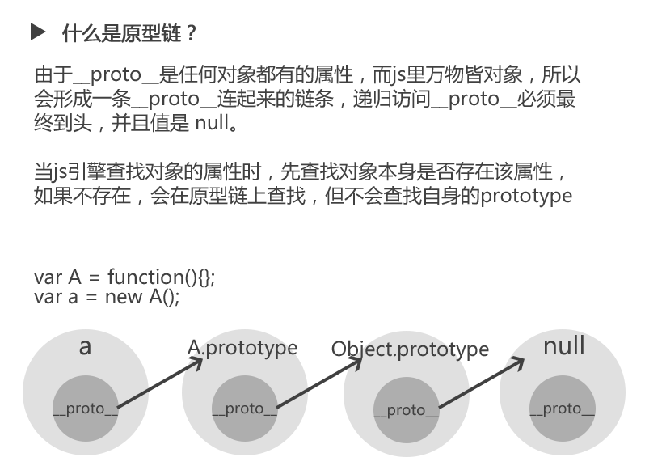
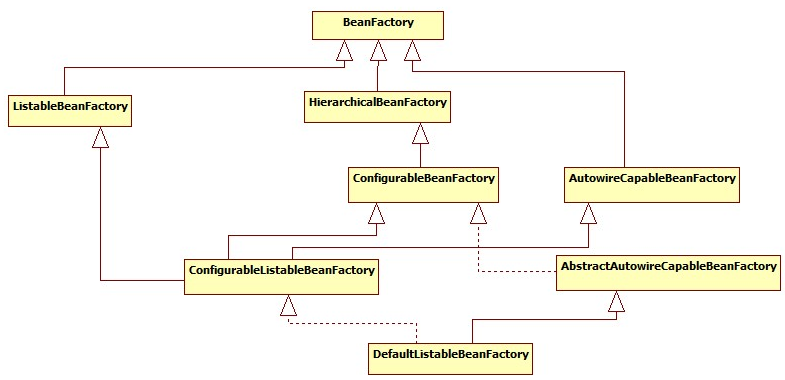
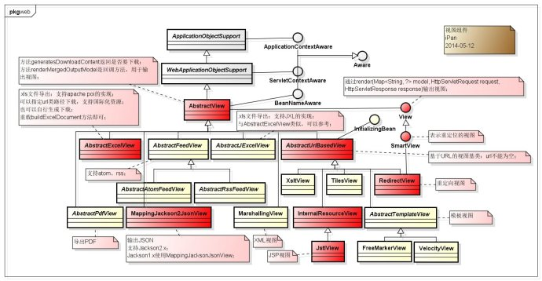
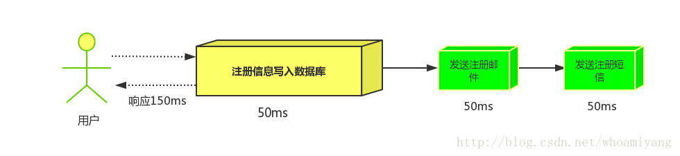
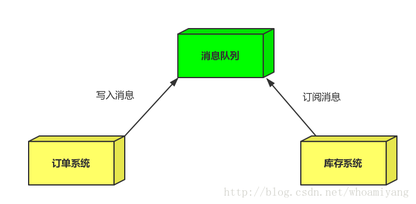
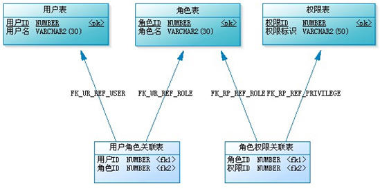
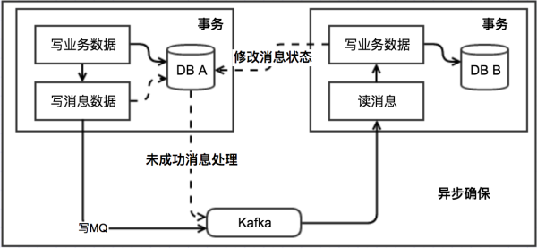

# JavaEE / 互联网架构

# 第一阶段：Java基础

## 第一章、Java开发入门

### 1、Java语言特点

Java是一门简单的，面向对象，分布式，解释性，健壮的，安全的，结构中立的， 便捷的， 高性能的， 多线程的， 动态的语言。

面向对象：Java是纯面向对象的语言。《编程思想》里面描述：Everything is object，它能够直接反映现实生活中的对象，比如火车， 人， 动物等，因此，开发人员更容易编写程序。

健壮性：强类型、垃圾回收机制（GC）、异常处理和安全检查

平台无关性：可以做到一次编译，到处运行。因为Java为解释型语言，编译器将Class文件编译成与平台无关的字节码，然后在虚拟机上解释执行，所以有很好的移植性。

### 2、JDK安装 【重点】

#### JDK8新特性

##### 1. default

##### 2. Lambda表达式

##### 3. 函数式接口

##### 4. Date API更新

　1.8之前JDK自带的日期处理类非常不方便，我们处理的时候经常是使用的第三方工具包，比如commons-lang包等。不过1.8出现之后这个改观了很多，比如日期时间的创建、比较、调整、格式化、时间间隔等。这些类都在java.time包下。比原来实用了很多。

4.1	LocalDate/LocalTime/LocalDateTime

　　LocalDate为日期处理类、LocalTime为时间处理类、LocalDateTime为日期时间处理类，方法都类似，具体可以看API文档或源码，选取几个代表性的方法做下介绍。

　　now相关的方法可以获取当前日期或时间，of方法可以创建对应的日期或时间，parse方法可以解析日期或时间，get方法可以获取日期或时间信息，with方法可以设置日期或时间信息，plus或minus方法可以增减日期或时间信息；

4.2	TemporalAdjusters

 　　这个类在日期调整时非常有用，比如得到当月的第一天、最后一天，当年的第一天、最后一天，下一周或前一周的某天等。

4.3	DateTimeFormatter

 　　以前日期格式化一般用SimpleDateFormat类，但是不怎么好用，现在1.8引入了DateTimeFormatter类，默认定义了很多常量格式（ISO打头的），在使用的时候一般配合LocalDate/LocalTime/LocalDateTime使用，比如想把当前日期格式化成yyyy-MM-dd hh:mm:ss的形式:

**JDK -- Java Development Kit**

又称J2SDK(Java2 Software Development Kit)，是Java开发工具包，它提供了Java的开发环境(提供了编译器javac等工具，用于将java文件编译为class文件)和运行环境(提 供了JVM和Runtime辅助包，用于解析class文件使其得到运行)。如果你下载并安装了JDK，那么你不仅可以开发Java程序，也同时拥有了运 行Java程序的平台。JDK是整个Java的核心，包括了Java运行环境(JRE)，一堆Java工具tools.jar和Java标准类库 (rt.jar)。

**JRE -- Java Runtime Enviroment**

是Java的运行环境。面向Java程序的使用者，而不是开发者。如果你仅下载并安装了JRE，那么你的系统只能运行Java程序。JRE是运行Java程序所必须环境的集合，包含JVM标准实现及 Java核心类库。它包括Java虚拟机、Java平台核心类和支持文件。它不包含开发工具(编译器、调试器等)。

**JVM -- java virtual machine**

JVM就是我们常说的java虚拟机，它是整个java实现跨平台的最核心的 部分，所有的java程序会首先被编为.class的类文件，这种类文件可以在虚拟机上执行，也就是说class并不直接与机器的操作系统相对应，而是 经过虚拟机间接与操作系统交互，由虚拟机将程序解释给本地系统执行。

### 3、JDK目录结构 

bin：最主要的是编译器(javac.exe)

include：java和JVM交互用的头文件

lib：类库

jre：java运行环境

注意：这里的bin、lib文件夹和jre里的bin、lib是不同的）总的来说JDK是用于java程序的开发，而jre则是只能运行class而没有编译的功能。

### 4、系统环境变量配置【重点】

JAVA_HOME：JDK安装目录

CLASSPATH：.;%JAVA_HOME%\lib\tools.jar;%JAVA_HOME%\lib\dt.jar;（JDK1.5之后不再需要配置）

path：%JAVA_HOME%\bin

### 5、Java运行机制【难点】

**那些类被回收：**

a.该类的所有实例都已经被回收；
b.加载该类的ClassLoad已经被回收；
c.该类对应的反射类java.lang.Class对象没有被任何地方引用。

**内存泄漏检查：**

内存泄漏和系统超负荷两者是有区别的，虽然可能导致的最终结果是一样的。内存泄漏是**用完的资源没有回收引起错误**，而系统超负荷则是系统确实没有那么多资源可以分配了（其他的资源都在使用）。

1. **年老代堆空间被占满：（异常： java.lang.OutOfMemoryError: Java heap space）**

   **说明：**

   这是最典型的内存泄漏方式，简单说就是所有堆空间都被无法回收的垃圾对象占满，虚拟机无法再在分配新空间。
   如上图所示，这是非常典型的内存泄漏的垃圾回收情况图。所有峰值部分都是一次垃圾回收点，所有谷底部分表示是一次垃圾回收后剩余的内存。连接所有谷底的点，可以发现一条由底到高的线，这说明，随时间的推移，系统的堆空间被不断占满，最终会占满整个堆空间。因此可以初步认为系统内部可能有内存泄漏。（上面的图仅供示例，在实际情况下收集数据的时间需要更长，比如几个小时或者几天）

   **解决：**

   这种方式解决起来也比较容易，一般就是根据垃圾回收前后情况对比，同时根据对象引用情况（常见的集合对象引用）分析，基本都可以找到泄漏点。

2. **持久代被占满：（异常：java.lang.OutOfMemoryError: PermGen space）**

   **说明：**

   Perm空间被占满。无法为新的class分配存储空间而引发的异常。这个异常以前是没有的，但是在Java反射大量使用的今天这个异常比较常见了。主要原因就是大量动态反射生成的类不断被加载，最终导致Perm区被占满。

   更可怕的是，不同的classLoader即便使用了相同的类，但是都会对其进行加载，相当于同一个东西，如果有N个classLoader那么他将会被加载N次。因此，某些情况下，这个问题基本视为无解。当然，存在大量classLoader和大量反射类的情况其实也不多。

   **解决：**

   1. -XX:MaxPermSize=16m
   2. 换用JDK。比如JRocket。

3. **堆栈溢出：（异常：java.lang.StackOverflowError）**

   说明：这个就不多说了，一般就是递归没返回，或者循环调用造成

4. **线程堆栈满：（异常：Fatal: Stack size too small）**

   **说明：**

   java中一个线程的空间大小是有限制的。JDK5.0以后这个值是1M。与这个线程相关的数据将会保存在其中。但是当线程空间满了以后，将会出现上面异常。

5. **系统内存被占满：（异常：java.lang.OutOfMemoryError: unable to create new native thread）**

   **说明：**

   这个异常是由于操作系统没有足够的资源来产生这个线程造成的。系统创建线程时，除了要在Java堆中分配内存外，操作系统本身也需要分配资源来创建线程。因此，当线程数量大到一定程度以后，堆中或许还有空间，但是操作系统分配不出资源来了，就出现这个异常了。

   分配给Java虚拟机的内存愈多，系统剩余的资源就越少，因此，当系统内存固定时，分配给Java虚拟机的内存越多，那么，系统总共能够产生的线程也就越少，两者成反比的关系。同时，可以通过修改-Xss来减少分配给单个线程的空间，也可以增加系统总共内生产的线程数。

   **解决：**

   1. 重新设计系统减少线程数量。
   2. 线程数量不能减少的情况下，通过-Xss减小单个线程大小。以便能生产更多的线程。

#### 5.1 内存区域

​	Java 虚拟机在执行 Java 程序的过程中会把他所管理的内存划分为若干个不同的数据区域。Java 虚拟机规范将 JVM 所管理的内存分为以下几个运行时数据区：程序计数器、Java 虚拟机栈、本地方法栈、Java 堆、方法区。

​	线程共享内存区域(**会抛出OutOfMemoryError**): java堆, 方法区;

​	线程私有内存区域(**会抛出StackOutOfError**): 虚拟机栈, 本地方法栈, 程序计数器

#### 5.2 GC 算法

​	**GC回收的原理**

​	对于GC来说, 当创建对象时,GC就开始监控这个对象的地址,大小以及使用情况; 通常来说, GC采用有向图的方式记录和管理heap的所有对象; 通过这种方式确定哪些对象是"可达的"或者"不可达的";

​	当GC确定一些对象为"不可达"时,GC就有责任回收这些内存空间.

##### 	5.3.1 标记—清除算法

​	标记—清除算法包括两个阶段：“标记”和“清除”。在标记阶段，确定所有要回收的对象，并做标记。清除阶段紧随标记阶段，将标记阶段确定不可用的对象清除。

​	标记—清除算法是基础的收集算法，标记和清除阶段的效率不高，而且清除后回产生大量的**不连续空间**，这样当程序需要分配大内存对象时，可能无法找到足够的连续空间

##### 	5.3.2 复制算法

​	复制算法是把内存分成大小相等的两块，每次使用其中一块，当垃圾回收的时候，把存活的对象复制到另一块上，然后把这块内存整个清理掉。这种方式听上去确实是非常不错的方案，但是总的来说对**内存的消耗十分高**。

​	复制算法实现简单，运行效率高，但是由于每次只能使用其中的一半，造成内存的利用率不高。现在的**JVM用复制方法收集新生代**，由于新生代中大部分对象（98%）都是朝生夕死的，所以两块内存的比例不是1:1(大概是8:1)，也就是常提到的一块Eden(80%)和两块Survivor(20%)。当然也会存在10%不够用的情况，这个后面在进行梳理，会有一个补偿机制，也就是分配担保.

##### 	5.3.3 标记—整理算法

​	复制收集算法会存在一种极端情况，就是对象都没死。这种情况会在老年代有几率的出现，所以根据老年代的特点提出了`标记—整理算法`。 标记—整理算法和标记—清除算法一样，但是标记—整理算法不是把存活对象复制到另一块内存，而是**把存活对象往内存的一端移动，然后直接回收边界以外的内存**

##### 	5.3.4 分代收集算法

​	分代收集是根据对象的存活时间把内存分为新生代和老年代，根据各代对象的存活特点，每个代采用不同的垃圾回收算法。**新生代采用标记—复制算法**，**老年代采用标记—整理算法**。

​	垃圾算法的实现涉及大量的程序细节，而且不同的虚拟机平台实现的方法也各不相同。上面介绍的只不过是基本思想。

#### 5.3 垃圾回收的新生代Eden与两个Survivor区(聊聊JVM的年轻代)

##### 	JVM堆分代

​	分代的唯一理由就是优化GC性能。你先想想，如果没有分代，那我们所有的对象都在一块，GC的时候我们要找到哪些对象没用，这样就会对堆的所有区域进行扫描。而我们的很多对象都是朝生夕死的，如果分代的话，我们把新创建的对象放到某一地方，当GC的时候先把这块存“朝生夕死”对象的区域进行回收，这样就会腾出很大的空间出来。

1、JVM堆被分为了年轻代和老年代。**年轻代的GC过程称为Minor GC**，速度快较频繁。**老年代的GC过程称为Full GC，速度较慢应该尽量避免。**

2、对象被创建后，除了少部分大对象会在老年代分配内存外，大部分的对象首先都是在年轻代进行内存分配，而且大部分的对象都是“朝生夕死”，很快就会被年轻代的Yong GC回收掉。

3、老年代的内存空间一般会比年轻代的内存空间大，能存放的对象多，老年代的空间不足后会进行Full GC操作，比Yong GC耗时，所以应**尽量避免频繁的Full GC操作。**

##### 	年轻代的GC

​	HotSpot JVM把年轻代分为了三部分：1个Eden区和2个Survivor区（分别叫from和to）,默认比例为8：1,;

​	一般情况下，新创建的对象都会被分配到Eden区(一些大对象特殊处理),这些对象经过第一次Minor GC后，如果仍然存活，将会被移到Survivor区。对象在Survivor区中每熬过一次Minor GC，年龄就会增加1岁，当它的年龄增加到一定程度时，就会被移动到年老代中。

​	在GC开始的时候，对象只会存在于Eden区和名为“From”的Survivor区，Survivor区“To”是空的。紧接着进行GC，Eden区中所有存活的对象都会被复制到“To”，而在“From”区中，仍存活的对象会根据他们的年龄值来决定去向。年龄达到一定值(年龄阈值，可以通过-XX:MaxTenuringThreshold来设置)的对象会被移动到年老代中，没有达到阈值的对象会被复制到“To”区域。经过这次GC后，Eden区和From区已经被清空。这个时候，“From”和“To”会交换他们的角色，也就是新的“To”就是上次GC前的“From”，新的“From”就是上次GC前的“To”。不管怎样，都会保证**名为To的Survivor区域是空的**。Minor GC会一直重复这样的过程，直到“To”区被填满，“To”区被填满之后，会将所有对象移动到年老代中。

​	**注意: To区域在每次GC前都是空的.**


##### 	一个对象的一辈子:

​	我是一个普通的java对象，我出生在Eden区，在Eden区我还看到和我长的很像的小兄弟，我们在Eden区中玩了挺长时间。有一天Eden区中的人实在是太多了，我就被迫去了Survivor区的“From”区，自从去了Survivor区，我就开始漂了，有时候在Survivor的“From”区，有时候在Survivor的“To”区，居无定所。直到我18岁的时候，爸爸说我成人了，该去社会上闯闯了。于是我就去了年老代那边，年老代里，人很多，并且年龄都挺大的，我在这里也认识了很多人。在年老代里，我生活了20年(每次GC加一岁)，然后被回收。

##### 	有关年轻代的JVM参数

1)-XX:NewSize和-XX:MaxNewSize

用于设置年轻代的大小，建议设为整个堆大小的1/3或者1/4,两个值设为一样大。

2)-XX:SurvivorRatio

用于设置Eden和其中一个Survivor的比值，这个值也比较重要。

3)-XX:+PrintTenuringDistribution

这个参数用于显示每次Minor GC时Survivor区中各个年龄段的对象的大小。

4).-XX:InitialTenuringThreshol和-XX:MaxTenuringThreshold

用于设置晋升到老年代的对象年龄的最小值和最大值，每个对象在坚持过一次Minor GC之后，年龄就加1

### 6、JVM垃圾回收器的种类及各自的优缺点

新生代收集器

##### 6.1	Serial收集器

​	Serial收集器是一个新生代收集器，单线程执行，使用复制算法。它在进行垃圾收集时，必须暂停其他所有的工作线程(用户线程)也就是传说中的`Stop The World`。是Jvm client模式下默认的新生代收集器。对于限定单个CPU的环境来说，Serial收集器由于没有线程交互的开销，专心做垃圾收集自然可以获得最高的单线程收集效率。

##### 6.2	ParNew收集器

​	ParNew收集器其实就是serial收集器的多线程版本，除了使用多条线程进行垃圾收集之外，其余行为与Serial收集器一样。 使用方式可以使用`-XX:+UseConcMarkSweepGC`，或者是使用`-XX:+UseParNewGC`来强制开启，可以通过`-XX:ParallelGCThreads` 来调整或者限制垃圾收集的线程数量。	

##### 6.3	Parallel Scavenge收集器

​	Parallel Scavenge收集器也是一个新生代收集器，它也是使用复制算法的收集器，又是并行多线程收集器。

​	parallel Scavenge收集器的特点是它的关注点与其他收集器不同，CMS等收集器的关注点是尽可能地缩短垃圾收集时用户线程的停顿时间，而parallel Scavenge收集器的目标则是达到一个可控制的吞吐量。**吞吐量= 程序运行时间/(程序运行时间 + 垃圾收集时间)**，虚拟机总共运行了100分钟。其中垃圾收集花掉1分钟，那吞吐量就是99%。

​	MaxGCPauseMillis参数允许的值是一个大于0的毫秒数，收集器将尽可能地保证内存回收花费的时间不超过设定值。不过大家不要认为如果把这个参数的值设置得稍小一点就能使得系统的垃圾收集速度变得更快，GC停顿时间缩短是以牺牲吞吐量和新生代空间来换取的：系统把新生代调小一些，收集300MB新生代肯定比收集500MB快吧，这也直接导致垃圾收集发生得更频繁一些，原来10秒收集一次、每次停顿100毫秒，现在变成5秒收集一次、每次停顿70毫秒。停顿时间的确在下降，但吞吐量也降下来了。

​	GCTimeRatio参数的值应当是一个大于0且小于100的整数，也就是垃圾收集时间占总时间的比率，相当于是吞吐量的倒数。如果把此参数设置为19，那允许的最大GC时间就占总时间的5%（即1 /（1+19）），默认值为99，就是允许最大1%（即1 /（1+99））的垃圾收集时间;

​	Parallel Scavenge收集器也经常称为“吞吐量优先”收集器。除上述两个参数之外，Parallel Scavenge收集器还有一个参数`-XX:+UseAdaptiveSizePolicy`值得关注。这是一个开关参数，当这个参数打开之后，就不需要手工指定新生代的大小`（-Xmn）、Eden与Survivor区的比例（-XX:SurvivorRatio）、晋升老年代对象年龄（-XX:PretenureSizeThreshold）`等细节参数了，虚拟机会根据当前系统的运行情况收集性能监控信息，动态调整这些参数以提供最合适的停顿时间或者最大的吞吐量，这种调节方式称为GC自适应的调节策略（GC Ergonomics）

​	老年代收集器

##### 6.4	Serial Old 收集器

​	Serial Old是Serial收集器的老年代版本，它同样是一个单线程收集器，使用“标记－整理”算法。这个收集器的主要意义也是在于给Client模式下的虚拟机使用。如果在Server模式下，那么它主要还有两大用途：一种用途是在JDK 1.5以及之前的版本中与Parallel Scavenge收集器搭配使用，另一种用途就是作为CMS收集器的后备预案，在并发收集发生Concurrent Mode Failure时使用。

##### 6.5	Parallel Old 收集器

​	Parallel Old是Parallel Scavenge收集器的老年代版本，使用多线程和“标记－整理”算法。这个收集器是在JDK 1.6中才开始提供的.

​	直到Parallel Old收集器出现后，“吞吐量优先”收集器终于有了比较名副其实的应用组合，在注重吞吐量以及CPU资源敏感的场合，都可以优先考虑Parallel Scavenge加Parallel Old收集器。

##### 6.6	CMS(Concurrent Mark-Sweep)收集器

​	CMS收集器是一种以**获取最短回收停顿时间为目标的收集器**。目前很大一部分的Java应用集中在互联网站或者B/S系统的服务端上，这类应用尤其重视服务的响应速度，希望系统停顿时间最短，以给用户带来较好的体验。CMS收集器就非常符合这类应用的需求。

​	CMS收集器是基于“标记—清除”算法实现的，它的运作过程相对于前面几种收集器来说更复杂一些，整个过程分为4个步骤，包括：

- 初始标记(CMSinitial mark) *** 暂停 应用

  在这个阶段，需要虚拟机停顿正在执行的任务，官方的叫法STW(Stop The Word)。这个过程从垃圾回收的"根对象"开始，只扫描到能够和"根对象"直接关联的对象，并作标记。所以这个过程虽然暂停了整个JVM，但是很快就完成了。

- 并发标记(CMS Concurrent marking)

  这个阶段紧随初始标记阶段，在初始标记的基础上继续向下追溯标记。并发标记阶段，应用程序的线程和并发标记的线程并发执行，所以用户不会感受到停顿。

- 并发预清理(CMS Concurrent precleaning)

  并发预清理阶段仍然是并发的。在这个阶段，虚拟机查找在执行并发标记阶段新进入老年代的对象(可能会有一些对象从新生代晋升到老年代， 或者有一些对象被分配到老年代)。通过重新扫描，减少下一个阶段"重新标记"的工作，因为下一个阶段会Stop The World

- 重新标记(CMS remark) *** 暂停 应用

  这个阶段会暂停虚拟机，收集器线程扫描在CMS堆中剩余的对象。扫描从"跟对象"开始向下追溯，并处理对象关联。

- 并发清理(CMS Concurrent sweeping)

  清理垃圾对象，这个阶段收集器线程和应用程序线程并发执行。

- 并发重置(Concurrent reset)

  这个阶段，重置CMS收集器的数据结构，等待下一次垃圾回收。

###### CMS缺点

- CMS回收器采用的基础算法是Mark-Sweep。所有CMS不会整理、压缩堆空间。这样就会有一个问题：**经过CMS收集的堆会产生空间碎片**。 CMS不对堆空间整理压缩节约了垃圾回收的停顿时间，但也带来的堆空间的浪费。为了解决堆空间浪费问题，CMS回收器不再采用简单的指针指向一块可用堆空 间来为下次对象分配使用。而是把一些未分配的空间汇总成一个列表，当JVM分配对象空间的时候，会搜索这个列表找到足够大的空间来hold住这个对象。
- 需要更多的CPU资源。从上面的图可以看到，为了让应用程序不停顿，CMS线程和应用程序线程并发执行，这样就需要有更多的CPU，单纯靠线程切 换是不靠谱的。并且，重新标记阶段，为空保证STW快速完成，也要用到更多的甚至所有的CPU资源。当然，多核多CPU也是未来的趋势！
- CMS的另一个缺点是它需要更大的堆空间。因为CMS标记阶段应用程序的线程还是在执行的，那么就会有堆空间继续分配的情况，为了保证在CMS回 收完堆之前还有空间分配给正在运行的应用程序，必须预留一部分空间。也就是说，CMS不会在老年代满的时候才开始收集。相反，它会尝试更早的开始收集，已 避免上面提到的情况：在回收完成之前，堆没有足够空间分配！默认当老年代使用68%的时候，CMS就开始行动了。 – XX:CMSInitiatingOccupancyFraction =n 来设置这个阀值。

**总得来说，CMS回收器减少了回收的停顿时间，但是降低了堆空间的利用率。**

如果你的应用程序对停顿比较敏感，并且在应用程序运行的时候可以提供更大的内存和更多的CPU(也就是硬件牛逼)，那么使用CMS来收集会给你带来好处。还有，如果在JVM中，有相对较多存活时间较长的对象(老年代比较大)会更适合使用CMS.

##### 6.7 G1收集器

​	G1是一款面向服务端应用的垃圾收集器。HotSpot开发团队赋予它的使命是（在比较长期的）未来可以替换掉JDK 1.5中发布的CMS收集器。与其他GC收集器相比，G1具备如下特点。

​	并行与并发：G1能充分利用多CPU、多核环境下的硬件优势，使用多个CPU（CPU或者CPU核心）来缩短Stop-The-World停顿的时间，部分其他收集器原本需要停顿Java线程执行的GC动作，G1收集器仍然可以通过并发的方式让Java程序继续执行。

​	分代收集：与其他收集器一样，分代概念在G1中依然得以保留。虽然G1可以不需要其他收集器配合就能独立管理整个GC堆，但它能够采用不同的方式去处理新创建的对象和已经存活了一段时间、熬过多次GC的旧对象以获取更好的收集效果。

​	空间整合：与CMS的“标记—清理”算法不同，G1从整体来看是基于“标记—整理”算法实现的收集器，从局部（两个Region之间）上来看是基于“复制”算法实现的，但无论如何，这两种算法都意味着G1运作期间不会产生内存空间碎片，收集后能提供规整的可用内存。这种特性有利于程序长时间运行，分配大对象时不会因为无法找到连续内存空间而提前触发下一次GC。

​	可预测的停顿：这是G1相对于CMS的另一大优势，降低停顿时间是G1和CMS共同的关注点，但G1除了追求低停顿外，还能建立可预测的停顿时间模型，能让使用者明确指定在一个长度为M毫秒的时间片段内，消耗在垃圾收集上的时间不得超过N毫秒，这几乎已经是实时Java（RTSJ）的垃圾收集器的特征了。

​	在G1之前的其他收集器进行收集的范围都是整个新生代或者老年代，而G1不再是这样。使用G1收集器时，Java堆的内存布局就与其他收集器有很大差别，它将整个Java堆划分为多个大小相等的独立区域（Region），虽然还保留有新生代和老年代的概念，但新生代和老年代不再是物理隔离的了，它们都是一部分Region（不需要连续）的集合。

##### 6.8 总结

​	各个收集器都有自己适应的业务场景，一般来说在**生产中都会使用`ParNew＋CMS`的方式分代收集回收**。针对于新生代来说，根据其特性，总的来说还是使用复制算法。而针对于老年代来说算法一般会使用两种，标记－清除和标记－整理，每一种都有自己适用的场景。但是在目前我遇到的生产中还是使用CMS 标记清除的这种比较多，也是比较常用的，虽然标记－清除这种算法会导致大量的内存碎片，但是也是可以通过一种暴力的方式解决，就是FULL GC，G1收集器是比较完美的一种收集器，但是在目前的生产中依旧用得很少。

#### 7、JVM参数详解

https://wangkang007.gitbooks.io/jvm/content/jvmcan_shu_xiang_jie.html

#### 8、JVM调优

https://wangkang007.gitbooks.io/jvm/content/4jvmdiao_you.html

### 作业：

1、编写一个 Java程序，并在屏幕上打印出以下图形： 


## 第二章：Java编程基础

### 1、Java的标识符

凡是自己取的名字就是标识符，如类名、方法名、变量名、包名

**标识符命名规则：**

- java中能用作标识符的有：26个英文字母（大、小写），数字，下划线（_），美元符号（$）；
- 不能以数字开头；
- 不能使用关键字和保留字；

**命名规范：** 

类名：首个字母必须大写，多个单词组成的，每个单词首字母都要大写。如 Customer，CustomerController。 
方法名、变量名：一般首个字母小写（构造方法例外），多个单词组成方法名，后面单词首字母大写。 （驼峰式），如 addCustomer()，userName。

常量名：多个单词组成，全部大写，每个单词用 _ 分割，如 CUSTOMER_VIP_LEVEL = "VIP1"。

包名：全部小写，开头一般使用公司域名，如 com.xinyan.java.*。

### 2、Java常量与变量【重点】

#### 2.1、变量的作用域

在一对 { }里面有效

按位置划分：全局变量，局部变量（方法内）

```java
public class Hello{
    static int age; //成员变量
    public void method{
        String name; //局部变量
    }
    
    public static void main(String[] args){
        //age 可以使用
        //name 无法调用
    }
}
```

#### 2.2、Java的数据类型

1）、基本数据类型（8个）：

整型：byte、int、short、long

浮点型：float、double

字符：char

布尔型：boolean

2）、引用数据类型：数组、String、自定义类型（class、interface）

#### 2.3、深拷贝与浅拷贝

* 浅拷贝是指在拷贝对象时，对于基本数据类型的变量会重新复制一份，而对于引用类型的变量只是对引用进行拷贝，没有对引用指向的对象进行拷贝。
* 而深拷贝是指在拷贝对象时，同时会对引用指向的对象进行拷贝。

### 3、Java运算符

**算术运算符**

```java
+ - * / % ++ --
```

++（--）在前：先运算后取值

++（--）在后：先赋值再运算

**关系运算符**

```java
> < >= <= == !=
```

逻辑运算符返回值：boolean

**逻辑运算符**

```java
&& || !
```

短路逻辑比较：

&&：找到一个false，后面的就不再比较

||：找一个true，后面就不再比较

**三元运算符**

```java
int age = 20;
System.out.println(age >= 18 ? "成年" : "未成年"); //成年
```

### 4、选择结构【重点】

if，if...else，if...else if...else

```java
int age = 20;
if(age >= 18){
    System.out.pringln("成年");
}else{
    System.out.pringln("未成年");
}
```

switch

```java
//switch 支持的表达式：byte、short、int、char
//enum、String 从JDK7 开始支持
int day = 1;
switch(day){
    case 1:
        System.out.println("星期一");
        break;
    case 2:
        System.out.println("星期二");
        break;
     case 3:
        System.out.println("星期三");
        break;
    default:
        break;
}
```

### 5、循环结构【重点】

for，增强for

```java
//遍历1~10
for(int i = 1; i <= 10; i++){
    System.out.println(i);
    //i ==5 跳出循环
    if(i == 5){
        break; //跳出循环
        //continue; //跳过本次循环，从下一次开始。
    }
}
//增强for，可以遍历数据和集合
List<String> list = new ArrayList<>();
for(String str : list){
    System.out.println(str);
}
//基于索引遍历
for(int i = 0; i < list.size(); i++){
    System.out.println(list.get(i));
}
```

while

```java
//遍历1 ~ 10
int i = 1;
while(i <= 10){
    System.out.println(i);
    i++;
}
```

do...while

```java
//遍历1 ~ 10
int i = 1;
do{
    System.out.println(i);
    i++;
}while(i <= 10);
```

### 6、数组的定义与使用【难点】

数组：数据存储容器，只能存储同一数据类型的数据。数组属于引用数据类型。

数组分类：一维数组、二维数组

一维数组

```java
//初始化：静态初始化、动态初始化
//静态初始化
int[] scores = {10,20,30}；
//动态初始化
String[] names = new String[3]; //只用默认值
//单个赋值
names[0] = "Tom"; //数据的索引从 0 开始
names[1] = "Jerry";
names[2] = "Jack";
//循环赋值
for(int i = 0; i < names.length; i++){
    names[i] = "aaa" + i;
}

//遍历数组：循环
for(int score : scores){
    System.out.println(score);
}
//
for(int i = 0; i < scores.length; i++){
    System.out.println(scores[i]);
}
```

二维数组

```java
//二维数组初始化
//静态初始化
int[][] arrs = {{1}, {2,3}, {4, 5, 6}};
//动态初始化
int[][] arrs = new int[3][];
//初始化第一行
arrs[0] = new int[1];
arrs[0][0] = 1;
//循环初始化
int num = 1;
for(int i = 0; i < arrs.length; i++){
    arrs[i] = new int[i + 1];
    for(int j = 0; j < arrs[i].length; j++){
        arrs[i][j] = num;
        num++;
    }
}
//遍历二维数组
for(int i = 0; i < arrs.length; i++) {
    for(int j = 0; j < arrs[i].length; j++) {
        System.out.print(arrs[i][j]);
    }
    System.out.println();
}
```

### 7、数组与链表的优缺点和区别

​	**数组**　是将元素在内存中**连续存放**，由于每个元素占用内存相同，可以通过下标迅速访问数组中任何元素。但是如果要在数组中增加一个元素，需要移动大量元素，在内存中空出一个元素的空间，然后将要增加的元素放在其中。同样的道理，如果想删除一个元素，同样需要移动大量元素去填掉被移动的元素。如果应用需要**快速访问数据，很少插入和删除元素，就应该用数组。**

​	**链表**　中的元素在内存中不是顺序存储的，而是通过存在元素中的指针联系到一起，每个结点包括两个部分：一个是存储数据元素的数据域，另一个是存储下一个结点地址的 指针。 如果要访问链表中一个元素，需要从第一个元素开始，一直找到需要的元素位置。但是增加和删除一个元素对于链表数据结构就非常简单了，只要修改元素中的指针就可以了。如果应用需要**经常插入和删除元素你就需要用链表**

#### 内存存储区别

* 数组从**栈**中分配空间, 对于程序员方便快速,但自由度小。
* 链表从**堆**中分配空间, 自由度大但申请管理比较麻烦.

#### **逻辑结构区别**

* 数组必须事先定义**固定的长度**（元素个数），不能适应数据动态地增减的情况。当数据增加时，可能超出原先定义的元素个数；当数据减少时，造成内存浪费。
* 链表动态地进行存储分配，可以适应数据动态地增减的情况，且可以方便地插入、删除数据项。（数组中插入、删除数据项时，需要移动其它数据项）　

#### 总结:

1、存取方式上，数组可以顺序存取或者随机存取，而链表只能顺序存取；　

2、存储位置上，数组逻辑上相邻的元素在物理存储位置上也相邻，而链表不一定；　

3、存储空间上，链表由于带有指针域，存储密度不如数组大；　

4、按序号查找时，数组可以随机访问，时间复杂度为O(1)，而链表不支持随机访问，平均需要O(n)；　

5、按值查找时，若数组无序，数组和链表时间复杂度均为O(1)，但是当数组有序时，可以采用折半查找将时间复杂度降为O(logn)；　

6、插入和删除时，数组平均需要移动n/2个元素，而链表只需修改指针即可；　

7、空间分配方面： 
　　数组在静态存储分配情形下，存储元素数量受限制，动态存储分配情形下，虽然存储空间可以扩充，但需要移动大量元素，导致操作效率降低，而且如果内存中没有更大块连续存储空间将导致分配失败； 
　　链表存储的节点空间只在需要的时候申请分配，只要内存中有空间就可以分配，操作比较灵活高效；

### 8、 equals()和hashcode()的联系与区别

#### 8.1 hashcode()

​	hashcode（）方法提供了对象的hashCode值，是一个native方法，返回的默认值与System.identityHashCode(obj)一致。

​	通常这个值是对象头部的一部分二进制位组成的数字，具有一定的标识对象的意义存在，但绝不定于地址。

​	**作用是：**

​	用一个数字来标识对象。比如在HashMap、HashSet等类似的集合类中，如果用某个对象本身作为Key，即要基于这个对象实现Hash的写入和查找，那么对象本身如何实现这个呢？就是基于hashcode这样一个数字来完成的，只有数字才能完成计算和对比操作。

​	**hashcode是否唯一**

​	hashcode只能说是标识对象，在hash算法中可以将对象相对离散开，这样就可以在查找数据的时候根据这个key快速缩小数据的范围，但**hashcode不一定是唯一的，所以hash算法中定位到具体的链表后，需要循环链表，然后通过equals方法来对比Key是否是一样的**。

#### **8.2 equals()**

##### 	8.2.1 覆盖equals时需要遵守的通用约定

- **类的每个实例本质上都是唯一的**。对于代表活动实体而不是值的类来说却是如此，例如Thread。Object提供的equals实现对于这些类来说正是正确的行为。
- **不关心类是否提供了“逻辑相等”的测试功能**。假如Random覆盖了equals，以检查两个Random实例是否产生相同的随机数序列，但是设计者并不认为客户需要或者期望这样的功能。在这样的情况下，从Object继承得到的equals实现已经足够了。
- **超类已经覆盖了equals，从超类继承过来的行为对于子类也是合适的**。大多数的Set实现都从AbstractSet继承equals实现，List实现从AbstractList继承equals实现，Map实现从AbstractMap继承equals实现。
- **类是私有的或者是包级私有的，可以确定它的equals方法永远不会被调用**。在这种情况下，无疑是应该覆盖equals方法的，以防止它被意外调用：

  ##### 8.2.2 在覆盖equals方法的时候，你必须要遵守它的通用约定

- **自反性**。对于任何非null的引用值x，x.equals(x)必须返回true。
- **对称性**。对于任何非null的引用值x和y，当且仅当y.equals(x)返回true时，x.equals(y)必须返回true
- **传递性**。对于任何非null的引用值x、y和z，如果x.equals(y)返回true，并且y.equals(z)也返回true，那么x.equals(z)也必须返回true。
- **一致性**。对于任何非null的引用值x和y，只要equals的比较操作在对象中所用的信息没有被修改，多次调用该x.equals(y)就会一直地返回true，或者一致地返回false。
- 对于任何非null的引用值x，x.equals(null)必须返回false。

  ##### 8.2.3覆盖equals时总要覆盖hashCode

- 在应用程序的执行期间，只要对象的equals方法的比较操作所用到的信息没有被修改，那么对这同一个对象调用多次，hashCode方法都必须始终如一地返回同一个整数。在同一个应用程序的多次执行过程中，每次执行所返回的整数可以不一致。

- 如果两个对象根据equals()方法比较是相等的，那么调用这两个对象中任意一个对象的hashCode方法都必须产生同样的整数结果。

- 如果两个对象根据equals()方法比较是不相等的，那么调用这两个对象中任意一个对象的hashCode方法，则不一定要产生相同的整数结果。但是程序员应该知道，给不相等的对象产生截然不同的整数结果，有可能提高散列表的性能。

  ##### 8.2.4 结合以上要求，得出了以下实现高质量equals方法的诀窍：

- **使用==符号检查“参数是否为这个对象的引用”**。如果是，则返回true。这只不过是一种性能优化，如果比较操作有可能很昂贵，就值得这么做。

- **使用instanceof操作符检查“参数是否为正确的类型”**。如果不是，则返回false。一般来说，所谓“正确的类型”是指equals方法所在的那个类。

- **把参数转换成正确的类型。**因为转换之前进行过instanceof测试，所以确保会成功。

- **对于该类中的每个“关键”域，检查参数中的域是否与该对象中对应的域相匹配**。如果这些测试全部成功，则返回true;否则返回false。

- **当编写完成了equals方法之后，检查“对称性”、“传递性”、“一致性”**。

#### 8.3 equals与hashcode关系

equals相等两个对象，则hashcode一定要相等。但是hashcode相等的两个对象不一定equals相等。

### 作业：

1、编写程序，将某个小组 的成绩按照由低到高的顺序进行排列 。


2、编写程序，在屏幕上打印杨辉三角，要求按照输入的行数打印。


## 第三章：面向对象（上）【重点】

### 1、面向对象特征

封装、继承、多态：详细阐述

### 2、类和对象

什么是类？

什么是对象？

类和对象的关系？

### 3、类的封装

类的封装：（保护类的属性安全），属性私有化，对外提供公共的getter / setter 方法。

### 4、构造方法的定义与重载

构造方法？

​	没有返回值

​	与类名同名

```java
public class Person{
    private String name;
    private int age;
    
    //构造方法
    public Person(){}
    
    //方法重载 Overload
    //1、必须在同一个类中
    //2、方法名一样
    //3、参数列表不一样（个数或者类型）
    //4、与返回值没有关系
    //构造方法重载
    public Person(String name){
        this.name = name;
    }
    public Person(int age){
        this.age = age;
    }
    public Person(String name, int age){
        this.name = name;
        this.age =age;
    }
    public Person(int age, String name){
        this.age = age;
        this.name = name;
    }
    
    public static void main(String args){
        //person == this
        Person person = new Person();
        Person person1 = new Person();
        System.out.println(person == person1); //false
    }
}
```

### 5、this关键字

this就是当前对象的（句柄）引用。

### 6、static关键字

static 可以修饰类、方法、属性。 static 是属于类级别的。

static 修饰的类是静态类（静态内部类）

static 修饰的方法是静态方法 （直接通过类名.方法名来调用）

static 修饰的属性是静态属性 （所有该类的对象共享这个属性）

```java
public class Account{
    //静态属性
    static long accountNo = 1000； //卡号
    
    //静态方法，直接通过类名调用： Account.staticMethod()
    public static String staticMethod(){}
}
```

### 7、内部类

```java
public class OutterClass{
    //OutterClass$InnerClass.class
    //内部类
    public class InnerClass{
        public void method1() {
    		System.out.println("OutterClass.InnerClass.method1()");
    	}
    }
    
    //OutterClass$StaticInnerClass.class
    //静态内部类
    public static class StaticInnerClass{
        public void method2() {
    		System.out.println("OutterClass.StaticInnerClass.method2()");
    	}
    }
}

//内部类调用
@Test
public void testInnerClass() {
	OutterClass outterClass = new OutterClass();
	OutterClass.InnerClass innerClass = outterClass.new InnerClass();
	innerClass.method1();
}
//静态内部类调用
@Test
public void testStaticInnerClass() {
	OutterClass.StaticInnerClass staticInnerClass = new OutterClass.StaticInnerClass();
	staticInnerClass.method2();
}

//匿名内部类
Proxy.newProxyInstance(null, null, new InvocationHandler() {		
    @Override
    public Object invoke(Object proxy, Method method, Object[] args) throws Throwable {
        // TODO Auto-generated method stub
        return null;
    }
});
```

## 第四章：面向对象（下）【重点】

### 1、类的继承

**Object类**，Java所有类的根。一个类若没有显示的继承，则默认继承 Object。

Java使用 extends 关键字

Java 只支持单继承，继承的类称为子类（扩展类），被继承的类称为父类（基类）。

子类拥有父类多有公共的（public）的方法和属性。

### 2、final 关键字

final 可以修饰类，属性，方法。

final 修饰的类不能被继承。

final 修饰的方法不能被重写。

final 修饰的变量为常量。常量只能赋值一次，在定义时初始化（推荐）或在构造方法中初始化。

### 3、抽象类和接口

抽象类 和 接口区别？

接口本质上就是一个特殊的抽象类。接口中方法都是抽象方法（Java 8 可以有默认实现），接口中的变量都是常量。接口可以多继承。

抽象类可以有抽象方法，也可以有实现方法。抽象类主要是用来扩展子类，将一些公共的可以实现的在抽象类中实现，不能具体实现的设计为抽象方法，给子类去重写实现。抽象类不能使用 new 来创建实例。

接口使用 interface 来定义。抽象类使用 abstract class 来定义。

### 4、多态

多态具备的条件：

- 必须有继承
- 必须有方法的重写
- 父类类型的变量指向子类的实例

```java
public abstract class Shape {
	public abstract double findArea();
}

public class Circle extends Shape{
	private double radius;
	
	@Override
	public double findArea() {
		return Math.PI * radius * radius;
	}
}

public class Rangle extends Shape {
	private double width;
	private double length;

	@Override
	public double findArea() {
		return width * length;
	}
}

//测试
//使用多态和动态方法绑定（虚拟方法调用），可以减少方法定义的数量
public double compareToAread(Shape s1, Shape s2) {
    //方法是在执行期间确定的
    //在编译期间s1属于 Shape 类型， findArea 方法属于 s1 对象方法
    //在执行期间s1指向实际传入的子类应用， findArea 方法属于子类对象的方法
    return s1.findArea() - s2.findArea();
}

@Test
public void testFindArea() {
    Circle c1 = new Circle();
    c1.setRadius(2);

    Rangle r1 = new Rangle();
    r1.setLength(2);
    r1.setWidth(2);

    System.out.println(compareToAread(c1, r1));
}
```

## 第五章：异常

### 1、异常机制

Exception 和 Error 区别？

* Throwable是所有异常的根，java.lang.Throwable
* Error是错误，java.lang.Error
* Exception是异常，java.lang.Exception

  ​一般分为Checked异常和Runtime异常，所有RuntimeException类及其子类的实例被称为Runtime异常，不属于该范畴的异常则被称为CheckedException。

#### Check异常

​	只有java语言提供了Checked异常，Java认为Checked异常都是可以被处理的异常，所以Java程序必须显示处理Checked异常。如果程序没有处理Checked异常，该程序在编译时就会发生错误无法编译,这体现了Java的设计哲学：**没有完善错误处理的代码根本没有机会被执行**。

​	对Checked异常处理方法有两种:

1 当前方法知道如何处理该异常，则用try...catch块来处理该异常。

2 当前方法不知道如何处理，则在定义该方法是声明抛出该异常。

#### RuntimeException

​	Runtime如除数是0和数组下标越界等，其产生频繁，处理麻烦，若显示申明或者捕获将会对程序的可读性和运行效率影响很大。所以由系统自动检测并将它们交给缺省的异常处理程序。当然如果你有处理要求也可以显示捕获它们。

​	我们比较熟悉的RumtimeException类的子类有

​	Java.lang.ArithmeticException

​	Java.lang.ArrayStoreExcetpion

​	Java.lang.ClassCastException

​	Java.lang.IndexOutOfBoundsException

​	Java.lang.NullPointerException

#### Error

* 当程序发生不可控的错误时，通常做法是通知用户并中止程序的执行。与异常不同的是Error及其子类的对象不应被抛出。
* Error是throwable的子类，代表编译时间和系统错误，用于指示合理的应用程序不应该试图捕获的严重问题。
* Error由Java虚拟机生成并抛出，包括动态链接失败，虚拟机错误等。程序对其不做处理。

#### Java中采用抓抛模型

### 2、异常的定义

```java
//抓
try{
    //放置程序在运行期间可能会出现异常的代码
}catch(Exception e){
    //处理异常
}
//抛
throws: 自动抛出异常给调用方
throw: 人工抛出异常
```

### 3、自定义异常

```java
public class BusinessException extends RuntimeException {
	public BusinessException(String message) {
		super(message);
	}
}
```

## 第六章：多线程【重点】

### 1、线程的创建

* 线程

  ​	作为独立运行和独立调度的基本单位，由于线程比进程更小，基本上不拥有系统资源，故对它的调度所付出的开销就会小得多，能更高效的提高系统多个程序间并发执行的程度.

* 进程

  ​	**广义定义**

  ​	进程是一个具有一定独立功能的程序关于某个数据集合的一次运行活动。它是操作系统动态执行的基本单元，在传统的操作系统中，进程既是基本的分配单元，也是基本的执行单元。

* 线程和进程的区别

  ​	a . 线程和进程的主要差别是操作系统不同的资源管路方式;

  ​	b.  一个程序至少有一个进程,一个进程至少有一个线程

  ​	c.  线程的划分尺度小于进程,是的多线程的程序并发性高;

  ​	d.  进程在执行过程中有独立的内存单元, 而多个线程共享内存, 从而极大地提高程序的圆形效率;

  ​	e.  线程在执行过程中与进程还是有区别的。每个独立的线程有一个程序运行的入口、顺序执行序列和程序的出口。但是线程不能够独立执行，必须依存在应用程序中，由应用程序提供多个线程执行控制;

  ​	f.  从逻辑角度来看，多线程的意义在于一个应用程序中，有多个执行部分可以同时执行。但操作系统并没有将多个线程看做多个独立的应用，来实现进程的调度和管理以及资源分配。这就是进程和线程的重要区别。

Java中有两种创建多线程的方式：

- 继承 Thread 类
- 实现 Runnable 接口（推荐），非常方便的做资源共享

```java
//第一种方式
 Thread t1 = new Thread(){
             
        @Override
        public void run() {
            System.out.println("new Thread 1");//输出:new Thread 1
            }
         };//创建线程
         
        t1.start();//启动线程
        System.out.println(t1.getName());//输出:Thread-0
//第二种方式
//线程目标类
public class PrintNumber implements Runnable {
	
	int i = 1; //共享资源

	@Override
	public void run() {
		for(; i <= 100; i++) {
			System.out.println(Thread.currentThread().getName() + " : " + i);
		}
	}

}

//测试
@Test
public void testRunnable() {
    //线程目标类
    PrintNumber printNumber = new PrintNumber();

    Thread t1 = new Thread(printNumber, "Thread-1");
    Thread t2 = new Thread(printNumber, "Thread-2");

    //启动线程
    t1.start();
    t2.start();
}
//通过实现Callable的方式，实现一个有返回值的线程
FutureTask<String> ft = new FutureTask<String>(new Callable<String>() {
             
             @Override
             public String call() throws Exception {
                 System.out.println("new Thread 3");//输出:new Thread 3
                 return "aaaa";
             }
         });
         
         Thread t3 = new Thread(ft);
         t3.start();

```

### 2、线程的生命周期


1、线程的实现有两种方式，一是继承Thread类，二是实现Runnable接口，但不管怎样，当我们new了这个对象后，线程就进入了初始状态；

2、当该对象调用了start()方法，就进入可运行状态；

3、进入可运行状态后，当该对象被操作系统选中，获得CPU时间片就会进入运行状态；

4、进入运行状态后情况就比较复杂了：

①run()方法或main()方法结束后，线程就进入终止状态；

②当线程调用了自身的sleep()方法或其他线程的join()方法，就会进入阻塞状态(该状态既停止当前线程，但并不释放所占有的资源)。当sleep()结束或join()结束后，该线程进入可运行状态，继续等待OS分配时间片；

③线程调用了yield()方法，意思是放弃当前获得的CPU时间片，回到可运行状态，这时与其他进程处于同等竞争状态，OS有可能会接着又让这个进程进入运行状态；

④当线程刚进入可运行状态(注意，还没运行)，发现将要调用的资源被synchroniza(同步)，获取不到锁标记，将会立即进入锁池状态，等待获取锁标记(这时的锁池里也许已经有了其他线程在等待获取锁标记，这时它们处于队列状态，既先到先得)，一旦线程获得锁标记后，就转入可运行状态，等待OS分配CPU时间片；

⑤当线程调用wait()方法后会进入等待队列(进入这个状态会释放所占有的所有资源，与阻塞状态不同)，进入这个状态后，是不能自动唤醒的，必须依靠其他线程调用notify()或notifyAll()方法才能被唤醒(由于notify()只是唤醒一个线程，但我们由不能确定具体唤醒的是哪一个线程，也许我们需要唤醒的线程不能够被唤醒，因此在实际使用时，一般都用notifyAll()方法，唤醒有所线程)，线程被唤醒后会进入锁池，等待获取锁标记。

### 4、线程的同步

解决多线程环境中（高并发）线程安全的问题。

使用 synchronized 来实现线程的同步，synchronized  可以修饰方法和代码块；

什么是线程的死锁？如何避免线程死锁？

- 为什么要同步？：

java允许多线程并发控制，当多个线程同时操作一个可共享的资源变量时（如数据的增删改查）， 将会导致数据不准确，相互之间产生冲突，因此加入同步锁以避免在该线程没有完成操作之前，被其他线程的调用， 从而保证了该变量的唯一性和准确性。


解决多线程环境中（高并发）线程安全的问题。

使用 synchronized 来实现线程的同步，synchronized  可以修饰方法和代码块；

什么是线程的死锁？如何避免线程死锁？

- **互斥条件**：每个资源要么已经分配给一个进程，要么就是可用。
- **占有和保持条件**：已经得到了某个资源的进程可以再请求新的资源。
- **不可抢占条件**：已经分配给一个进程的资源不可强制性的被占用，它只能被占有它的进程显示释放。
- **环路等待条件**：在发生死锁时，必然存在一个进程--资源的环形链。

**避免死锁的几种方式**：

- 设置加锁顺序
- 设置加锁时限
- 死锁检测

### 5、线程的通信

线程的通信一定是在线程同步情况下进行的。

wait() ---> notify() / notifyAll()

### 6、线程池的定义与参数讲解

 

### 7、线程池的饱和策略


​	当线程池中的任务缓存队列已满并且线程池中的线程数已经达到了最大线程数(MaximumPoolSize), 如果还有任务到来, 就采用任务拒绝策略, 通常有以下四种策略:

1. ThreadPoolExecutor.**AbortPolicy** : 

   ​	**Java线程池默认的阻塞策略;** executor抛出未检查RejectedExecutionException，调用者捕获这个异常，然后自己编写能满足自己需求的处理代码。

2. ThreadPoolExecutor.**DiscardRunsPolicy**:

   ​	遗弃最旧的，选择丢弃的任务，是本应接下来就执行的任务

3. ThreadPoolExecutor.**DiscardPolicy** :

   ​	遗弃会默认放弃最新提交的任务（这个任务不能进入队列等待执行时）

4. ThreadPoolExecutor.**CallerRunsPolicy**：

   ​	调用者运行，既不会丢弃哪个任务，也不会抛出任何异常，把一些任务推回到调用者那里，以此减缓新任务流。它不会在池线程中执行最新提交的任务，但它会在一个调用了execute的线程中执行

###  作业：

1、实现一个生产者（Provider）和消费者（Consumer）的多线程程序？


## 第七章：Java API

### 1、String、StringBuffer、StringBuilder

* String 字符串常量(final修饰，不可被继承)，String是常量，当创建之后即不能更改。
* StringBuffer 字符串变量（线程安全）,其也是final类别的，不允许被继承，其中的绝大多数方法都进行了同步处理，包括常用的Append方法也做了同步处理(synchronized修饰)。
* StringBuilder 字符串变量（非线程安全）其自jdk1.5起开始出现。与StringBuffer一样都继承和实现了同样的接口和类，方法除了没使用synch修饰以外基本一致，不同之处在于最后toString的时候，会直接返回一个新对象。 

### 2、Math、Random

### 3、包装类

​	Java为8种基本数据类型提供了对应的包装类。

​	自动装箱：基本数据类型 ---> 包装类

​	自动拆箱：包装类 ---> 基本数据类型

### 4、日期类

​	Date、DateFormat、SimpleDateFormat

## 第八章：集合&&泛型【重点】


### 1、Collection 接口

Java集合中的根接口。

子类：List、Set

### 2、List 接口

特点：有序，可以重复，可以有null值

**ArrayList（常用）、Vecotr（不推荐使用）、LinkedList**

```java
@Test
public void testList() {
    List<String> list = new ArrayList<>();
    list.add("AAA");
    list.add(null);
    list.add("AAA");

    System.out.println(list.size());

    for(String str : list) {
        System.out.println(str);
    }
}

//List 排序
@Test
public void testListSort() {
    List<Person> list = new ArrayList<>();
    list.add(new Person("Tom", 25));
    list.add(new Person("Jerry", 22));
    list.add(new Person("Jack", 30));

    //排序
    Collections.sort(list, new Comparator<Person>() {
        @Override
        public int compare(Person o1, Person o2) {
            return o1.getAge() - o2.getAge();
        }
    });

    for(Person person : list) {
        System.out.println(person);
    }
}
```

### 3、Set 接口

特点：无序、不可重复、可以有null值

#### **HashSet（常用）**

​	对于 HashSet 而言，它是基于 HashMap 实现的，HashSet 底层使用 HashMap 来保存所有元素，因此 HashSet 的实现比较简单，相关 HashSet 的操作，基本上都是直接调用底层 HashMap 的相关方法来完成，我们应该为保存到 HashSet 中的对象覆盖 hashCode() 和 equals();

**LinkedHashSet（有序的Set）、TreeSet（支持排序的Set）**

```java
@Test
public void testSet() {
    Set<String> set = new HashSet<>();
    set.add("AAA");
    set.add(null);
    set.add("AAA");

    System.out.println(set.size());

    for(String str : set) {
        System.out.println(str);
    }
}

/**
 * 排序：
 * 1、自然排序
 * 放入TreeSet中的元素必须要实现 Comparable 接口
 * 2、定制排序
 * 在构建TreeSet时，在其构造方法中初始化一个比较器Comparator
 */
@Test
public void testTreeSet() {
    //定制排序
    Set<Person> set = new TreeSet<>(new Comparator<Person>() {
        @Override
        public int compare(Person o1, Person o2) {
            return o1.getAge() - o2.getAge();
        }
    });

    set.add(new Person("Tom", 25));
    set.add(new Person("Jerry", 22));
    set.add(new Person("Jack", 30));

    for(Person person : set) {
        System.out.println(person);
    }
}
```

### 4、Map接口

特点：键值对（key - value：一对一），key 的集合是使用的Set，所有Key不能重复。value的集合是Collection。

**HashMap（常用）**

HashMap

**、linkedHashMap（有序的Map）、TreeMap（支持排序的Map）**

```java
@Test
public void testMap() {
    Map<String, Person> map = new HashMap<>();
    map.put("1001", new Person("Tom", 25));
    map.put("1002", new Person("Jerry", 22));
    map.put("1003", new Person("Jack", 30));

    //key 的集合
    Set<String> keys = map.keySet();
    //value 的集合
    Collection<Person> values = map.values();

    //根据key查找
    Person person = map.get("1001");
    System.out.println(person);

    //遍历
    //1、遍历key 的集合来得到对应的value
    for(String key : keys) {
        System.out.println(key + " : " + map.get(key));
    }

   //2、通过Map.entrySet遍历key和value，推荐，尤其是容量大时
    for(Map.Entry<String, Person> m : map.entrySet()) {
        System.out.println(m.getKey() + " : " + m.getValue());
    }
    //3、通过Map.entrySet使用iterator遍历key和value
    Iterator<Map.Entry<Integer, String>> it = map.entrySet().iterator();
	while (it.hasNext()) {
     	Map.Entry<Integer, String> entry = it.next();
       System.out.println("key= " + entry.getKey() + " and value= " + 				entry.getValue());
	}
    //4、通过Map.values()遍历所有的value，但不能遍历key
    for (String v : map.values()) {
    	System.out.println("value= " + v);
	}
}
```

### 5、泛型

1）、在集合中使用泛型，限制集中的元素类型，从集合中获取获取元素，不需要在进行类型转换（造型）。

```java
@Test
public void testList() {
    List<String> list = new ArrayList<>();
    list.add("AAA");
    list.add(null);
    list.add("AAA");

    for(String str : list) {
        System.out.println(str);
    }
}
```

2）、泛型类

```java
public interface Collection<E> extends Iterable<E> {
    boolean add(E e);
}
```

3）、泛型方法

```java
<T> T[] toArray(T[] a);
```

4）、通配符 ?

```java
 boolean addAll(Collection<? extends E> c);
```

### 6、Collections 工具类

用来操作Java集合的工具类，常用的方法：

sort()：List集合排序 、copy()：将一个集合中的元素拷贝到另外一个集合中

synchronizedXXX()：将集合包装为一个线程安全的集合。

```java
@Test
public void testListSort() {
    List<Person> list = new ArrayList<>();
    list.add(new Person("Tom", 25));
    list.add(new Person("Jerry", 22));
    list.add(new Person("Jack", 30));

    //排序
    Collections.sort(list, new Comparator<Person>() {
        @Override
        public int compare(Person o1, Person o2) {
            return o1.getAge() - o2.getAge();
        }
    });

    for(Person person : list) {
        System.out.println(person);
    }

    //返回一个线程安全的List
    list = Collections.synchronizedList(list);
}
```

### 7、Arrays 工具类

用来操作数据的工具类。

sort()：数组排序，asList()：将数组转换为List集合

## 第九章：IO【重点】

### 1、File 类

### 2、字节流

输入流：InputStream、FileInputStream、BufferedInputStream

输出流：OutputStream、FileOutputStream、BufferedOutputStream

```java
//图片拷贝
@Test
public void testCopyImage() throws Exception {
    BufferedInputStream bufferedInputStream = new BufferedInputStream(
        new FileInputStream("vim-2.png"));
    
    BufferedOutputStream bufferedOutputStream = new BufferedOutputStream(
        new FileOutputStream("D:\\vim-2.png"));
    
    int len = 0;
    byte[] buffer = new byte[1024];
    while((len = bufferedInputStream.read(buffer)) != -1) {
        bufferedOutputStream.write(buffer, 0, len);
    }

    bufferedOutputStream.close();
    bufferedInputStream.close();
}
```

### 3、字符流

输入流：Reader、FileReader、BufferedReader

输出流：Writer、FilterWriter、BufferedWriter

### 4、转换流

字节流转换为字符流：InputStreamReader、OutputStreamWriter

### 5、序列化

​	序列化 (Serialization)是将对象的状态信息转换为可以存储或传输的形式的过程。一般将一个对象存储至一个储存媒介，例如档案或是记亿体缓冲等。在网络传输过程中，可以是字节或是XML等格式。而字节的或XML编码格式可以还原成完全相等的对象。这个相反的过程又称为反序列化。

​	对象序列化机制（object serialization）是Java语言内建的一种对象持久化方式，通过对象序列化，可以把对象的状态保存为字节数组，并且可以在有需要的时候将这个字节数组通过反序列化的方式再转换成对象。对象序列化可以很容易的在JVM中的活动对象和字节数组（流）之间进行转换。

​	在Java中，对象的序列化与反序列化被广泛应用到RMI(远程方法调用)及网络传输中。

​	对于java对象的存储采用对象流的相关类

​	序列化：将内存中的Java对象保存到磁盘中，可以进行网络传输。

​	ObjectOutputStream

​	反序列化：将序列化的对象加载到内存中,并输出在控制台。

​	ObjectInputStream

```java
//被序列化对象必须要实现 Serializable 接口
public class Person implements Serializable {
    private static final long serialVersionUID = 1L;
    //...
}
//序列化
@Test
public void testObjectOutputStream() throws IOException {
    Person person = new Person("Tom", 25);
    //序列化：将内存中的对象保存到磁盘上
    ObjectOutputStream objectOut = new ObjectOutputStream(
        new FileOutputStream("Person.ser"));
    objectOut.writeObject(person);
    objectOut.close();
}
//反序列化
@Test
public void testObjectInputStream () throws Exception {
    //反序列化：将对象加载到内存中
    ObjectInputStream objectIn = new ObjectInputStream(
        new FileInputStream(
            new File("Person.ser")));
    Person person = (Person)objectIn.readObject();
    System.out.println(person);

    objectIn.close();
}
```

## 第十章：反射&&动态代理【重点】

### 1、类的加载机制？


- 加载：类加载过程的一个阶段：通过一个类的完全限定查找此类字节码文件，并利用字节码文件创建一个Class对象
- 链接：验证字节码的安全性和完整性，准备阶段正式为静态域分配存储空间，注意此时只是分配静态成员变量的存储空间，不包含实例成员变量，如果必要的话，解析这个类创建的对其他类的所有引用。
- 初始化：类加载最后阶段，若该类具有超类，则对其进行初始化，执行静态初始化器和静态初始化成员变量。
- **Class：类的类，当class二进制文件被加载到内存中，就会生成一个对应的Class对象。这个Class对象描述了类的元信息。**
- **ClassLoader（类加载器）  /  双亲委派机制**


```java
@Test
public void testClass() throws ClassNotFoundException {
    //Class clazz = Person.class;
    //Class clazz = new Person().getClass();
    Class clazz = Class.forName("com.xinyan.java.Person");

    //编译：自底向上来检查（语法检查）
    //执行：自上往下来执行
    //获取类的加载器
    ClassLoader classLoader = clazz.getClassLoader();
    //AppClassLoader：系统类加载器 （classpath）
    System.out.println(classLoader);
    //ExtClassLoader：扩展类加载器（JAVA_HOME\jre\lib\ext\）
    System.out.println(classLoader.getParent());
    //Bootrape ClassLoader：启动类加载器 （Java 核心类库）
    System.out.println(classLoader.getParent().getParent());

    //读取 classpath（类路径） 下的文件
    InputStream in = classLoader.getResourceAsStream("jdbc.properties");
    //反射实现的三种机制
    Person p1 = new Person();
		
	//2.先获取Class对象
	try {
		Class class1 = Class.forName("com.xykj.reflect.newObject.Person");
		Class<Person> class2 = Person.class;
		Class<?> class3 = (Class<Person>) new Person().getClass();
		Class<?> class4 = new Person().getClass().getClassLoader().loadClass("com.xykj.reflect.newObject.Person");
}
```

### 2、Java 反射 API

##### 	反射机制

​	指在运行状态中,对于任意一个类,都能够知道这个类的所有属性和方法,对于任意一个对象,都能调用它的任意一个方法.这种动态获取信息,以及动态调用对象方法的功能叫java语言的反射机制.

##### 	反射创建类实例的三种方式是什么

```java
// 第一种
Class<Person> clazz = Person.class;
System.out.println(clazz);

// 第二种
try {
  Class class1  = Class.forName("com.rsy.reflect.Person");
  System.out.println(class1);
} catch (ClassNotFoundException e) {
  // TODO Auto-generated catch block
  e.printStackTrace();
}

// 第三种
Person person = new Person();
Class class2 = person.getClass();
System.out.println(class2);
```

##### 反射中，Class.forName 和 ClassLoader 区别

​	Class.forName(className)方法，其实调用的方法是**Class.forName(className,true,classloader)**;注意看第2个boolean参数，它表示的意思，**在loadClass后必须初始化**。比较下我们前面准备jvm加载类的知识，我们可以清晰的看到在执行过此方法后，目标对象的 static块代码已经被执行，static参数也已经被初始化。

 	ClassLoader.loadClass(className)方法，其实他调用的方法是**ClassLoader.loadClass(className,false)**;还是注意看第2个 boolean参数，该参数表示**目标对象被装载后不进行链接**，这就意味这**不会去执行该类静态块中间的内**容。因此2者的区别就显而易见了。

##### 几大主要对象

* Class : 类对象
* Constructor：构造器对象
* Method：方法（函数）对象
* Field：属性对象

```java
import java.lang.reflect.*; //反射 API 包

@Test
public void testMethod() throws Exception {
    Class clazz = Class.forName("com.xinyan.java.Person");
    //获取所有的public方法，一直追溯到根父类（Object）
    //Method[] methods = clazz.getMethods();
    //for(Method method : methods) {
    //	System.out.println(method);
    //}
    //根据方法名来获取某一个方法
    //Method method = clazz.getMethod("setName", String.class);
    //System.out.println(method);

    //获取所有的方法（包括private），一直追溯到根父类（Object）
    //clazz.getDeclaredMethods();

    Method method = clazz.getDeclaredMethod("testMethod", String.class);
    System.out.println(method);
    //执行
    method.setAccessible(true);
    method.invoke(clazz.newInstance(), "Tom");
}
```

### 3、代理模式

#### 3.1	Java 动态代理

Java的动态代理，被代理的类必须有实现接口。

```java
/**
 * 返回一个代理对象
 */
public Object createProxyObject() {
    return Proxy.newProxyInstance(
        //被代理对象的类加载器
        target.getClass().getClassLoader(), 
        //被代理对象实现的所有接口的类型数组
        target.getClass().getInterfaces(), 
        //
        new InvocationHandler() {
            /**
			* method：被代理对象调用的实际方法
			* args：调用实际方法时，实际传入的参数
			*/
            @Override
            public Object invoke(Object proxy, Method method, Object[] args) throws Throwable {
                //日志
                //前置通知 连接点
                System.out.println(method.getName() + Arrays.asList(args));
                //调用实际方法
                Object result = null;
                try {
                    result = method.invoke(target, args); //连接点
                    //后置通知
                } catch (Exception e) {
                    //异常通知
                }
                //返回通知
                return result;
            }
        });
}
```

#### 3.2	Cglib代理

* Cglib代理,也叫作子类代理,它是在内存中构建一个子类对象从而实现对目标对象功能的扩展.
* Cglib是一个强大的高性能的代码生成包,它可以在运行期扩展java类与实现java接口.它广泛的被许多AOP的框架使用,例如Spring AOP和synaop,为他们提供方法的interception(拦截)
* Cglib包的底层是通过使用一个小而块的字节码处理框架ASM来转换字节码并生成新的类.不鼓励直接使用ASM,因为它要求你必须对JVM内部结构包括class文件的格式和指令集都很熟悉.

## 第十一章：设计模式

Java中提供了23中设计模式。

### 1、单例模式

使用场景：工具类 、spring中的Bean都是单例的、线程池也有单例的

```java
public class Test1 {
	//静态属性
	private static Test1 test1 = new Test1();
	//构造方法私有化
	private Test1()  {		
	}
	//方法为静态方法外面可以直接调用
	public static Test1 geTest1() {
		return test1;
	}
	
}
```


### 2、装饰模式

使用场景：IO、HttpServletRequestWarpper

### 3、代理模式

使用场景：AOP、Mybatis中实际执行CRUD的对象,是SqlSession的一个代理对象

### 4、工厂模式

使用场景：Spring IOC

### 5、观察者模式

使用场景：Listener

## 第十二章：网络编程 【理解】

### 1、TCP/IP 协议

### 2、InetAddress 对象

### 3、Socket 编程


# 第二阶段：数据库基础

## 一、Oracle (RDBMS)

### 1、SQL语句

​      DML：INSERT、UPDATE、DELETE、SELECT

```sql
--SQL语句骨架
SELECT 查询字段
FROM 表（table）、（SELECT 查询）、视图（view）
WHERE 条件
GROUP BY 分组字段（1...n）
HAVING 条件（对分组后的结果进行过滤）
ORDER BY 字段（排序：ASC升序、DESC降序）
```

### 2、查询：

​	等值连接、非等值连接、外连接（左外连接、右外连接）

​	子查询

### 3、Oracle 函数

### 4、Oracle PL/SQL编程

#### 4.1、PL/SQL 与 SQL 区别？

​	PL/SQL也是一种程序语言，叫做过程化SQL语言（Procedural Language/SQL）。PL/SQL是Oracle数据库对[SQL语句](https://www.baidu.com/s?wd=SQL%E8%AF%AD%E5%8F%A5&tn=SE_PcZhidaonwhc_ngpagmjz&rsv_dl=gh_pc_zhidao)的扩展。在普通[SQL语句](https://www.baidu.com/s?wd=SQL%E8%AF%AD%E5%8F%A5&tn=SE_PcZhidaonwhc_ngpagmjz&rsv_dl=gh_pc_zhidao)的使用上增加了编程语言的特点，所以PL/SQL就是把数据操作和查询语句组织在PL/SQL代码的过程性单元中，通过[逻辑判断](https://www.baidu.com/s?wd=%E9%80%BB%E8%BE%91%E5%88%A4%E6%96%AD&tn=SE_PcZhidaonwhc_ngpagmjz&rsv_dl=gh_pc_zhidao)、循环等操作实现复杂的功能或者计算的程序语言。

使用PL/SQL可以编写具有很多高级功能的程序，虽然通过多个[SQL语句](https://www.baidu.com/s?wd=SQL%E8%AF%AD%E5%8F%A5&tn=SE_PcZhidaonwhc_ngpagmjz&rsv_dl=gh_pc_zhidao)可能也能实现同样的功能，但是相比而言，PL/SQL具有更为明显的一些优点：
⒈能够使一组SQL语句的功能更具模块化程序特点；
⒉采用了过程性语言控制程序的结构；
⒊可以对程序中的错误进行自动处理，使程序能够在遇到错误的时候不会被中断；
⒋具有较好的[可移植性](https://www.baidu.com/s?wd=%E5%8F%AF%E7%A7%BB%E6%A4%8D%E6%80%A7&tn=SE_PcZhidaonwhc_ngpagmjz&rsv_dl=gh_pc_zhidao)，可以移植到另一个Oracle数据库中；
⒌集成在数据库中，调用更快；
⒍减少了网络的交互，有助于提高程序性能

#### 4.2、数据类型？（掌握）

​	1.文本类型

​	

​	2.数字类型

​	3.日期/时间类型

#### 4.3、存储过程？（掌握）

​	1.定义

```text
	存储过程（Stored Procedure）是在大型数据库系统中，一组为了完成特定功能的SQL 语句集，存储在数据库中，经过第一次编译后调用不需要再次编译，用户通过指定存储过程的名字并给出参数（如果该存储过程带有参数）来执行它。存储过程是数据库中的一个重要对象
```

#### 4.4、存储函数？（掌握）

​	

#### 4.5、触发器？（了解）

​	1.定义

​	触发器（trigger）是SQL server 提供给程序员和数据分析员来保证数据完整性的一种方法，它是与表事件相关的特殊的存储过程，它的执行不是由程序调用，也不是手工启动，而是由事件来触发，比如当对一个表进行操作（ **insert，delete， update**）时就会激活它执行。触发器经常用于加强数据的完整性约束和业务规则等。 触发器可以从 DBA_TRIGGERS ，USER_TRIGGERS 数据字典中查到。

​	2.作用

- 可在写入数据表前，强制检验或转换数据。

- 触发器发生错误时，异动的结果会被撤销。

- 部分数据库管理系统可以针对数据定义语言（DDL）使用触发器，称为DDL触发器。

- 可依照特定的情况，替换异动的指令 (INSTEAD OF)。

  ​

### 5、SQL语句优化？

- 避免 SELECT *
- SQL是从右往左处理的，那么选择数据量最小的表作为基表（from最后面的表 ），可加快查询速度，同时，如果有三张表，中间的那个交叉表（中间表），作为基表。
- WHERE 中少用NOT、!=、<>、!<、!>、NOT EXISTS、NOT IN、NOT LIKE，它们会引起全表扫描。
- 使用WHERE子句替换HAVING , HAVING 只会在检索出所有记录之后才对结果集进行过滤。
- 用EXISTS替代 IN 或者 NOT EXISTS替代 NOT IN 。Oracle中IN子查询返回的结果不能超过1000条，使用EXISTS为替代方案。
- 适当使用表的别名或者列的别名。

### 6、数据库优化？

- 索引INDEX，在索引的列上，不要使用 IS NULL 和 IS NOT NULL，避免在索引列上使用计算 等。

  1. 主键自动建立唯一索引；
  2. 频繁作为查询条件的字段应该创建索引；
  3. 查询中与其他表有关联的字段，例如外键关系；
  4. 频繁更新的字段不适合创建索引，因为每次更新不单单是更新记录，还会更新索引，保存索引文件；
  5. where 条件里用不到的字段，不创建索引；
  6. 高并发的情况下一般选择复合索引；
  7. 查询中排序的字段创建索引将大大提高排序的速度（索引就是排序加快速查找）；
  8. 查询中统计或者分组的字段；
  9. 表记录太少，不需要创建索引；
  10. 经常增删改的表；
  11. 数据重复且分布平均的字段，因此为经常查询的和经常排序的字段建立索引。注意某些数据包含大量重复数据，因此他建立索引就没有太大的效果，例如性别字段，只有男女，不适合建立索引。

- 分库分表

- Oracle数据库高可用集群方案 

  1. RAC(**real application clusters**)，译为“实时应用集群”， 是Oracle新版数据库中采用的一项新技术，是高可用性的一种，也是[Oracle数据库](https://baike.baidu.com/item/Oracle%E6%95%B0%E6%8D%AE%E5%BA%93)支持[网格计算](https://baike.baidu.com/item/%E7%BD%91%E6%A0%BC%E8%AE%A1%E7%AE%97/389651)环境的核心技术。

  ```JAVA
  多个Oracle服务器组成一个共享的Cache，而这些Oracle服务器共享一个基于网络的存储。这个系统可以容忍单机/或是多机失败。不过系统内部的多个节点需要高速网络互连，基本上也就是要全部东西放在在一个机房内，或者说一个数据中心内。如果机房出故障，比如网络不通，那就坏了。所以仅仅用RAC还是满足不了一般互联网公司的重要业务的需要，重要业务需要多机房来容忍单个机房的事故。
  ```

  2. DG(**Data Guard**)

  ```JAVA
  Data Guard这个方案就适合多机房的。某机房一个production的数据库，另外其他机房部署standby的数据库。Standby数据库分物理的和逻辑的。物理的standby数据库主要用于production失败后做切换。而逻辑的standby数据库则在平时可以分担production数据库的读负载。
  ```

  MMA(**Maximum Availability Architecture**)

  ```JAVA
    MAA(Maximum Availability Architecture)其实不是独立的第三种，而是前面两种的结合，来提供最高的可用性。每个机房内部署RAC集群，多个机房间用Data Guard同步.
  ```
  OCR (**oracle Cluster Register**)

  ### 7,  **数据库隔离级别**

  #### 1.1  	READ UNCIMMITTED（未提交读）

  　　事务中的修改，即使没有提交，其他事务也可以看得到，比如说上面的两步这种现象就叫做脏读，这种隔离级别会引起很多问题，如无必要，不要随便使用

  　　例子:还是售票系统，小明和小花是售票员，他们分别是两个不同窗口的员工，现在售票系统只剩下3张票，此时A来小华这里买3张票，B来小明买票，小华查到余票还有就给接了订单，就要执行第三步的时候，小明接到B的请求查询有没有余票。看到小华卖出了3张票，于是拒绝卖票。但是小华系统出了问题，第三步执行失败，数据库为保证原子性，数据进行了回滚，也就是说一张票都没卖出去。

  　　总结:这就是事务还没提交，而别的事务可以看到他其中修改的数据的后果，也就是脏读。　　

  #### 2.2  EAD COMMITTED（提交读）

  　　大多数数据库系统的默认隔离级别是READ COMMITTED，这种隔离级别就是一个事务的开始，只能看到已经完成的事务的结果，正在执行的，是无法被其他事务看到的。这种级别会出现读取旧数据的现象

  　　例子:还是小明小华销售员，余票3张，A来小华那里请求3张订票单，小华接受订单，要卖出3张票，上面的销售步骤执行中的时候，B也来小明那里买票，由于小华的销售事务执行到一半，小明事务没有看到小华的事务执行，读到的票数是3，准备接受订单的时候，小华的销售事务完成了，此时小明的系统变成显示0张票，小明刚想按下鼠标点击接受订单的手又连忙缩了回去。

  　　总结:这就是小华的事务执行到一半，而小明看不到他执行的操作，所以看到的是旧数据，也就是无效的数据 

  #### 3.REPEATABLE READ（可重复读）

   　　REPEATABLE READ解决了脏读的问题，该级别保证了每行的记录的结果是一致的，也就是上面说的读了旧数据的问题，但是却无法解决另一个问题，幻行，顾名思义就是突然蹦出来的行数据。指的就是某个事务在读取某个范围的数据，但是另一个事务又向这个范围的数据去插入数据，导致多次读取的时候，数据的行数不一致。

  　　例子:销售部门有规定，如果销售记录低于规定的值，要扣工资，此时经理在后端控制台查看了一下小明的销售记录，发现销售记录达不到规定的次数，心里暗喜，准备打印好销售清单，理直气壮和小明提出，没想到打印出来的时候发现销售清单里面销售数量增多了几条，刚刚好达到要求，气的经理撕了清单纸。原来是小明在就要打印的瞬间卖出了几张票，因此避过了减工资的血光之灾。

  　　总结:虽然读取同一条数据可以保证一致性，但是却不能保证没有插入新的数据

  #### 4.SERIALIZABLE（可串行化）

  　　SERIALIZABLE是最高的隔离级别，它通过强制事务串行执行（注意是串行），避免了前面的幻读情况，由于他大量加上锁，导致大量的请求超时，因此性能会比较底下，再特别需要数据一致性且并发量不需要那么大的时候才可能考虑这个隔离级别


## 二、MySQL (RDBMS) 高级


传统数据库中存在的问题:

- 1.传统数据库设计时,如果服务器宕机,将不能为用户提供服务导致整个系统崩溃. 
- 2.如果数据库突然宕机.会导致数据丢失. 
- 3.为了防止数据丢失,要进行实时备份 
  - 冷备份:通过数据库工具进行人为的导出sql.但是手动导出数据可能在中间节点宕机时也会造成数据库的丢失. 
  - 热备份:通过程序进行控制,定时转储.尽可能的保证数据的完整性.但是还有大量的问题.

### 1、MySQL核心讲解

​	MySQL的两大引擎: InnoDB 和MyISAM

​	**MySQL 5.5+的默认存储引擎为InnoDB, 之前为MyISAM。**

​	两种引擎所使用的索引的数据结构是 : **B +树**

​	MyISAM引擎，B+树的数据结构中存储的内容实际上是实际数据的地址值。也就是说它的索引和实际数据是分开的，只不过使用索引指向了实际数据。这种索引的模式被称为非聚集索引。

​	Innodb引擎的索引的数据结构也是B+树，只不过数据结构中存储的都是实际的数据，这种索引有被称为聚集索引。

#### 1.1	MySql日志

* 二进制日志

  * 记录用户所有的操作,主从同步,数据恢复,生产环境下开启;

  * 开启二进制日志,会在data目录下生成mysqlBinary_log.00000N的日志文件;

  * 可以在MySQL的bin目录下有个可执行文件: mysqlbinlog.exe 查看日志内容;

    -v --base64-output=DECODE-ROWS : 因为日志文件已base64编码,所有需要解码;

    mysqlbinlog -v --base64-output=DECODE-ROWS mysqlBinary_log.000001;

  * 恢复数据指令:

    从219行------1219行数据恢复

    mysqlbinlog --start-position=219 --stop-position=1219 mysqlBinary_log.000001 | mysql -uroot -p;

  * * 1. 

* 操作日志

  记录用户的查询,会和MySQ数据库竞争资源,生产环境下不建议开启

* 错误日志

  记录MySQL的错误,开启服务,关闭服务的信息都会记录

* 慢查询日志

  主要用来记录查询速度比较慢的一些sql, 和,MySQL自身认为查询速度很慢的一些sql.

#### 1.2 MySQL数据库的操作(备份和恢复)

#####        数据备份

- 将com数据库备份到e盘下面,生成com.sql文本

  在bin目录下执行: mysqldump -uroot -p com > e:/com.sql

- 将com数据库备份到e盘下面(**只要表结构,不要数据**),生成com.sql文本

  ​在bin目录下执行: mysqldump -uroot -p com --no--data > e:/com.sql

- 将com数据库下的emp表备份,生成emp.sql

  在bin目录下执行: mysqldump -uroot -p com emp > e:/com.sql

- 将com数据库备份到e盘下面,生成com.sql文本(**建表语句中没有drop if exits**)

  在bin目录下执行: mysqldump -uroot -p com emp --add--drop--table=false > e:/com.sql

##### 数据恢复

- 将指定的sql文件导入收据库(恢复)

  1. mysql -uroot -p 指定数据库 < sql文件路径名(就可以导入数据库)    # 效率更高
     1. 或者在mysql> source sql文件路径名   #效率低


#### 1.3 MySQL数据库优缺点

##### 优点:

1. 它使用的核心线程是完全多线程，支持多处理器。 
2. 有多种列类型：1、2、3、4、和8字节长度自有符号／无符号整数、FLOAT、DOUBLE、CHAR、VARCHAR、TEXT、BLOB、DATE、TIME、DATETIME、 TIMESTAMP、YEAR、和ENUM类型。 
3. 过一个高度优化的类库实现SQL函数库并像他们能达到的一样快速，通常在查询初始化后不该有任何内存分配。没有内存漏洞。 
4. 全面支持SQL的GROUP BY和ORDER BY子句，支持聚合函数(COUNT()、COUNT(DISTINCT)、AVG()、STD()、SUM()、MAX()和MIN())。你可以在同一查询中混来自不同数据库的表。 
5. 支持ANSI SQL的LEFT 0UTER JOIN和ODBC (**Open Database Connectivity**)。 
6. 所有列都有缺省值。你可以用INSERT插入一个表列的子集，那些没用明确给定值的列设置为他们的决省值。 
7. MySQL可以工作在不同的平台上。支持C、C＋＋、Java、Perl、PHP、Python和TCL API。

##### 缺点:

1. MySQL最大的缺点是其安全系统，主要是复杂而非标准，另外只有到调用mysqladmin来重读用户权限时才发生改变。 
2. MySQL的另一个主要的缺陷之一是缺乏标准的RI（Referential Integrity-RI）机制；Rl限制的缺乏(在给定字段域上的一种固定的范围限制)可以通过大量的数据类型来补偿。 
3. MySQL没有一种存储过程(Stored Procedure)语言，这是对习惯于企业级数据库的程序员的最大限制。 
4. MySQL不支持热备份(不支持快照)。 
5. MySQL的价格随平台和安装方式变化。
6. 数据库数量量的规模小,为千万级别.

### 2、MySQL集群

**MySQL Cluster：https://dev.mysql.com/downloads/cluster/**

```JAVA
	MySQL Cluster是一个可写，可扩展，实时，符合ACID标准的事务数据库，旨在提供99.9999％的可用性。MySQL Cluster采用分布式多主机架构，无单点故障，可在商用硬件上进行水平扩展，具有自动分片（分区）功能，可通过SQL和NoSQL接口访问读写密集型工作负载。 
```

### 3、主从复制（主主复制） ---> 读写分离


**用途：**

- 实时灾备，用于故障切换
- 读写分离，提供查询服务
- 备份，避免影响业务

**角色划分：**

主库Master：主要进行的是数据的"更新操作"

从库Slave： 实时备份主库的更新信息

**二进制日志： 实时记录主库的更新操作，并且形式二进制码。**

中继日志: 保存主库的更新信

**调用原理：**

1、当主库更新数据后，会实时的写入到二进制日志文件中（Binary log）

2、从库的IO线程，实时的监听主库的二进制文件，如果二进制文件发生了改变则启动线程进行读取修改后的内容。

3、通过IO线程将读取的二进制文件写入到中继日志中（Relay log）。

4、根据日志中的消息，进行数据库的更新操作。

**实战环境搭建：https://blog.csdn.net/qq_23184291/article/details/78437816**

**冷备份**:通过数据库工具进行人为的导出sql.但是手动导出数据可能在中间节点宕机时也会造成数据库的丢失. 
**热备份:**通过程序进行控制,定时转储.尽可能的保证数据的完整性.但是还有大量的问题.

**相关的命令**

1、mysqld --remove   

​	在bin目录下移除当前的mysql数据库


### 4、MYCAT

​	Mycat 数据库分库分表中间件。

**Mycat原理**：Mycat的原理中最重要的一个动词是“拦截”，它拦截了用户发送过来的SQL语句，首先对SQL语句做了一些特定的分析：如分片分析、路由分析、读写分离分析、缓存分析等，然后将此SQL发往后端的真实数据库，并将返回的结果做适当的处理，最终再返回给用户。

​	下载mycat安装包

​	解压后进入bin目录

    1.  执行 mycat install 安装mycat
    
     2.  执行 mycat start 开启mycat服务
    
     3.  可以通过mysql的客户端直接访问mycat

   mycat默认用户名/密码 : root/ 123456 ,默认端口号8066

   执行 mycat  -uroot -p 123456 -hlocalhost -P8066  

   #### Mycat的配置

   mycat的用户名/密码的配置文件在 mycat_home/conf/server.xml文件中;


   mycat的schema.xml文件中配置的是进入mycat后可以看到的表的信息; 

   


```JAVA
	MyCat是一个开源的分布式数据库系统，是一个实现了MySQL协议的服务器，前端用户可以把它看作是一个数据库代理，用MySQL客户端工具和命令行访问，而其后端可以用MySQL原生协议与多个MySQL服务器通信，也可以用JDBC协议与大多数主流数据库服务器通信，其核心功能是分表分库，即将一个大表水平分割为N个小表，存储在后端MySQL服务器里或者其他数据库里。
	MyCat发展到目前的版本，已经不是一个单纯的MySQL代理了，它的后端可以支持MySQL、SQL Server、Oracle、DB2、PostgreSQL等主流数据库，也支持MongoDB这种新型NoSQL方式的存储，未来还会支持更多类型的存储。而在最终用户看来，无论是那种存储方式，在MyCat里，都是一个传统的数据库表，支持标准的SQL语句进行数据的操作，这样一来，对前端业务系统来说，可以大幅降低开发难度，提升开发速度
```

​	 **常见问题**

```java
使用Mycat后总会遇到一些坑，我将自己遇到的一些问题在这里列一下，希望能与大家有共鸣：	
1.Mycat是不是配置以后，就能完全解决分表分库和读写分离问题？
	Mycat配合数据库本身的复制功能，可以解决读写分离的问题，但是针对分表分库的问题，不是完美的解决。或者说，至今为止，业界没有完美的解决方案。
	分表分库写入能完美解决，但是，不能完美解决主要是联表查询的问题，Mycat支持两个表联表的查询，多余两个表的查询不支持。 其实，很多数据库中间件关于分表分库后查询的问题，都是需要自己实现的，而且基本都不支持联表查询，Mycat已经算做地非常先进了。
	分表分库的后联表查询问题，大家通过合理数据库设计来避免。

2.Mycat支持哪些数据库，其他平台如 .net、PHP能用吗？
	官方说了，支持的数据库包括MySQL、SQL Server、Oracle、DB2、PostgreSQL 等主流数据库，很赞。
	尽量用Mysql,我试过SQL Server，会有些小问题，因为部分语法有点差异。

3.Mycat 非JAVA平台如 .net、PHP能用吗？
	可以用。这一点MyCat做的也很棒。
```


官网：http://www.mycat.io/**

**Mycat 高可用方案：**


**Mycat操作实例：https://www.jianshu.com/p/2d1a81b2dafc**


## 三、JDBC

### 1、JDBC概述

JDBC是Java操作数据的一种技术。JDBC为JAVA程序开发提供了一组公共的规范的API接口。

分为两类：

一类是面向数据库厂商的驱动开发（对于开发人员来说屏蔽了底层数据的差异）。


一类是面向Java程序开发的（面向接口编程）。


### 2、JDBC操作数据库步骤

- 加载驱动：Class.forName("数据库驱动类")

- 获取数据库连接（Connection）：DriverManager.getConnection(driverClass, url, user, password);

- 创建 Statement 对象：

  - Statement
  - PreparedStatement
  - CallableStatement

- 执行CRUD操作：

  - executeUpdate()：INSERT、UPDATE、DELETE

  - executeQuery()：SELECT

    查询会返回一个 ResultSet 结果集，需要对结果集进行操作。

- 关闭数据连接等对象：Connection、Statement、ResultSet等。

### 3、SQL注入攻击

使用 PreparedStatement 的方式(预编译语句集)来操作数据库。

采用预编译语句集，它内置了处理SQL注入的能力，只要使用它的setXXX方法传值即可.

### 4、数据库事务

在数据库中,所谓事务是指一组逻辑操作单元,使数据从一种状态变换到另一种状态。
**作用**：确保数据库中数据的一致性
**操作**：

- 提交（commit）
- 回滚（rollback）

**数据库事务特性（ACID）：**

- 原子性（Atomicity）
- 一致性（Consistency）
- 隔离性（Isolation）
- 持久性（Durability）

**JDBC事务处理**

- 默认自动提交事务
- 若需要手动提交事务，设置setAutoCommit(false)

**数据库隔离级别：**

- 读未提交数据（read uncommitted）
- 读已提交数据（read committed）
- 可重复读（REPEATABLE READ）
- 串行化（SERIALIZABLE）

Oracle支持 读已提交数据 和 串行化，默认采用 读已提交数据。

MySQL支持4种，默认采用可重复读。

### 5、数据源 / 连接池

**作用：重复利用数据库的连接资源，来提高数据库服务器的性能。**

**原理（思想）：**
数据库连接池的基本思想就是为数据库连接建立一个“缓冲池”。预先在缓冲池中放入一定数量的连接，当需要建立数据库连接时，只需从“缓冲池”中取出一个，使用完毕之后再放回去。

​	数据库连接是一种关键的有限的昂贵的资源,这一点在多用户的网页应用程序中体现的尤为突出。对数据库连接的管理能显著影响到整个应用程序的伸缩性和健壮性，影响到程序的性能指标.数据库连接池正式针对这个问题提出来的。数据库连接池负责分配，管理和释放数据库连接，它允许应用程序重复使用一个现有的数据库连接，而不是重新建立一个。如下图所示：


数据库连接池在初始化时将创建一定数量的数据库连接放到连接池中, 这些数据库连接的数量是由最小数据库连接数来设定的。无论这些数据库连接是否被使用,连接池都将一直保证至少拥有这么多的连接数量.连接池的最大数据库连接数量限定了这个连接池能占有的最大连接数，当应用程序向连接池请求的连接数超过最大连接数量时，这些请求将被加入到等待队列中。

**主流的数据源：**

- c3p0

- dbcp

- druid

  ```xml
  <bean id="dataSource" class="com.alibaba.druid.pool.DruidDataSource" 
    init-method="init" destroy-method="close"> 
    <property name="driverClassName" value="${jdbc.driverClassName}" /> 
    <property name="url" value="${jdbc.url}" /> 
    <property name="username" value="${jdbc.username}" /> 
    <property name="password" value="${jdbc.password}" /> 
    <!-- 配置初始化大小、最小、最大 --> 
    <property name="initialSize" value="1" /> 
    <property name="minIdle" value="1" /> 
    <property name="maxActive" value="10" />

    <!-- 配置获取连接等待超时的时间 --> 
    <property name="maxWait" value="10000" />

    <!-- 配置间隔多久才进行一次检测，检测需要关闭的空闲连接，单位是毫秒 --> 
    <property name="timeBetweenEvictionRunsMillis" value="60000" />

    <!-- 配置一个连接在池中最小生存的时间，单位是毫秒 --> 
    <property name="minEvictableIdleTimeMillis" value="300000" />

    <property name="testWhileIdle" value="true" />

    <!-- 这里建议配置为TRUE，防止取到的连接不可用 --> 
    <property name="testOnBorrow" value="true" /> 
    <property name="testOnReturn" value="false" />

    <!-- 打开PSCache，并且指定每个连接上PSCache的大小 --> 
    <property name="poolPreparedStatements" value="true" /> 
    <property name="maxPoolPreparedStatementPerConnectionSize" value="20" />

    <!-- 这里配置提交方式，默认就是TRUE，可以不用配置 -->

    <property name="defaultAutoCommit" value="true" />

    <!-- 验证连接有效与否的SQL，不同的数据配置不同 --> 
    <property name="validationQuery" value="select 1 " /> 
    <property name="filters" value="stat" /> 
    <property name="proxyFilters"> 
     <list> 
      <ref bean="logFilter" /> 
     </list> 
    </property> 
   </bean>
  ```

### 6、**数据库分页语句**

pageNo：当前页码
pageSize：每页显示的条数

- Oracle

  ```sql
      SELECT * 
      FROM
      (
          SELECT rownum r,e.* 
          FROM
          ( 
              SELECT * FROM employees ORDER BY employee_id 
          ) e 
          WHERE rownum <= ( pageNo * pageSize ) 
      ) 
      WHERE r > ( pageNo * pageSize - pageSize );
  	--查询第 1页的数据，每页显示5条数据 
  	SELECT * 
  	FROM
  	(
  		SELECT rownum r,e.* 
  		FROM
  		( 
          	SELECT * FROM employees ORDER BY employee_id 
          ) e 
  		WHERE rownum <= 5 
      ) 
  	WHERE r > 0;
  ```

  - MySQL

    ```sql
    SELECT * FROM `examstudent` LIMIT (pageNo - 1) * pageSize, pageSize;
    --查询第1页的数据，每页显示5条数据
    SELECT * FROM `examstudent` LIMIT 0, 5;
    ```


# 第三阶段：JavaWeb开发

## 一、HTML

## 二、CSS

## 三、JavaScript

### 1、JavaScript概述

JavaScript一种直译式脚本语言，是一种动态类型、弱类型、基于原型的语言，内置支持类型。它的解释器被称为JavaScript引擎，为浏览器的一部分，广泛用于客户端的脚本语言，最早是在HTML（标准通用标记语言下的一个应用）网页上使用，用来给HTML网页增加动态功能。


### 2、ECMAScript

#### 2.1、JavaScript的数据类型有那些？


原始类型（基本类型）：按值访问，可以操作保存在变量中实际的值。原始类型中null和undefined比较特殊。

引用类型：引用类型的值是保存在内存中的对象。

使用 typeof 来输出变量的原始数据类型的值。

#### 2.2、创建对象的方式？

- {}

  ```javascript
  var obj = {
      name : "Tom",
      age : 30,
      getName : function(){
          return this.name
      }
  }
  console.log(obj.name + "," + obj.age);
  console.log(obj.getName());
  ```

- 构造函数

  ```javascript
  //构造函数
  function Person(name, age){
      this.name = name;
      this.age = age;
  }
  var obj = new Person("Tom", 30);
  console.log(obj.name + "," + obj.age);
  ```

- Object

  ```javascript
  var obj = new Object();
  obj.name = "Tom";
  obj.age = 30;
  console.log(obj.name + "," + obj.age);
  ```

#### 2.3、原型链模式 prototype

**1)、prototype和\__proto__的区别？**


```javascript
var a = {};
console.log(a.prototype);  //undefined
console.log(a.__proto__);  //Object {}

var b = function(){}
console.log(b.prototype);  //Object {}
console.log(b.__proto__);  //function() {}
```


```javascript
/*1、字面量方式*/
var a = {};
console.log(a.__proto__);  //Object {}

console.log(a.__proto__ === a.constructor.prototype); //true

/*2、构造器方式*/
var A = function(){};
var a = new A();
console.log(a.__proto__); //A {}

console.log(a.__proto__ === a.constructor.prototype); //true

/*3、Object.create()方式*/
var a1 = {a:1}
var a2 = Object.create(a1);
console.log(a2.__proto__); //Object {a: 1}

console.log(a.__proto__ === a.constructor.prototype); //false（此处即为图1中的例外情况）
```



```javascript
var A = function(){};
var a = new A();
console.log(a.__proto__); //A {}（即构造器function A 的原型对象）
console.log(a.__proto__.__proto__); //Object {}（即构造器function Object 的原型对象）
console.log(a.__proto__.__proto__.__proto__); //null
```

**原型链使用示例：**

```javascript
<script>
    var Person = function(name, age){
        this.name = name;
        this.age = age;
    }
    //原型链：动态添加方法或属性
    var person = new Person("Tom", 30);

	/* 
	//使用object 的 __proto__
	person.__proto__.getName = function(){
		return this.name;
	}
	console.log(person.getName());

	var person1 = new Person("Jerry", 25);
	console.log(person1.getName());
	*/

	//使用 function 的 prototype
	Person.prototype.setAge = function(age){
   		 this.age = age;
	}

	person.setAge(28);
	console.log(person.age);
</script>
```

#### 2.4、闭包？

有权访问另一个函数作用域内变量的函数都是闭包。

闭包就是一个函数引用另外一个函数的变量，因为变量被引用着所以不会被回收，因此可以用来封装一个私有变量。这是优点也是缺点，不必要的闭包只会徒增内存消耗！

```javascript
function a(){
    var n = 0;
    function inc() {
        n++;
        console.log(n);
    }
    inc();  //调用函数
    inc();  //调用函数
}
a(); //控制台输出 1 和 2
```

### 3、DOM

HTML Document （HTML DOM），浏览器将整个HTML文件加载到内存中，最终得到一个 DOM 树。


**节点分类：元素节点、属性节点、文本节点**

#### 3.1、查找节点

getEleementById()：返回对拥有指定 id 的第一个对象的引用。

getElementsByName()：返回带有指定名称的对象集合。

getElementsByTagName：返回带有指定标签名的对象集合。

```javascript
//根据元素id获取单个节点
var div = document.getElementById("nav");
console.log(div);
console.log(div.nodeType); //1：元素节点

//根据标签名获取所有元素节点
var divs = document.getElementsByTagName("div");
console.log(divs);

//获取属性节点
var idNode = div.getAttributeNode("id");
console.log(idNode.nodeType); //2：属性节点
//获取属性值
var idValue = div.getAttribute("id");
console.log(idValue);

//获取文本节点
var textNode = div.firstChild;
console.log(textNode.nodeType); //3：文本节点
//获取文本节点的值
console.log(textNode.nodeValue);
```

#### 3.2、添加节点

```javascript
//添加节点 <p id="b">BBB</p>
var conentDiv = divs[1];
//创建元素节点
var pNode = document.createElement("p");
//创建属性节点
pNode.setAttribute("id", "b");
//创建文本节点
var textNode = document.createTextNode("BBB");
pNode.append(textNode);
conentDiv.append(pNode);
```

#### 3.3、删除节点

```javascript
//删除节点，通过父节点删除子节点
contentDiv.removeChild(pNode);
```

### 4、BOM

**window、location、history** 对象


## 四、jQuery

jQuery是一个快速、简洁的JavaScript框架，是继Prototype之后又一个优秀的JavaScript代码库（或JavaScript框架）。jQuery设计的宗旨是“write Less，Do More”，即倡导写更少的代码，做更多的事情。它封装JavaScript常用的功能代码，提供一种简便的JavaScript设计模式，优化HTML文档操作、事件处理、动画设计和Ajax交互。

请根据 jQuery API 文档进行学习。

### 1、核心函数

### 2、选择器

### 3、DOM

### 4、事件

### 5、Ajax

- $.ajax()：

- $.get()：

- $.post()：

- $.getJSON()：

```jsp
<script type="text/javascript">
		$(function(){
			$("#btn1").click(function(){
				//ajax() jQuery 最底层的ajax 封装
				$.ajax({
					//请求的url地址
					url : "${pageContext.request.contextPath }/JsonServlet",
					//请求方法， 不指定默认是GET
					type : "POST",
					//发送的请求数据
					data : {id : $("#uid").val(), time : new Date()},
					//返回数据格式
					dataType : "json",
					//回调函数
					//回调函数里面的参数data来绑定请求响应的数据
					success : function(data){
						console.log(data);
						$("#content").append("id:" + data.id + ",username:"+ data.username + ",address:" + data.addr.compyAddr);
					}
				});
			});
			
			$("#btn2").click(function(){
				//post
				$.post("${pageContext.request.contextPath }/JsonServlet", 
						{id : $("#uid").val(), time : new Date()},
						function(data){
							console.log(data);
							$("#content").append("id:" + data.id + ",username:"+ data.username + ",address:" + data.addr.compyAddr);
						},
						"json");
			});
			
			$("#btn3").click(function(){
				//get
				$.get("${pageContext.request.contextPath }/JsonServlet", 
						{id : $("#uid").val(), time : new Date()},
						function(data){
							console.log(data);
							$("#content").append("id:" + data.id + ",username:"+ data.username + ",address:" + data.addr.compyAddr);
						},
						"json");
			});
			
			$("#btn4").click(function(){
				//getJSON
				$.getJSON("${pageContext.request.contextPath }/JsonServlet", 
						{id : $("#uid").val(), time : new Date()},
						function(data){
							console.log(data);
							$("#content").append("id:" + data.id + ",username:"+ data.username + ",address:" + data.addr.compyAddr);
						});
			});
			
			$("#btn5").click(function(){
				//load 将远程的HTML代码载入到DOM节点中
				$("#content").load("inner.html");
			});
		})
	</script>
```


## 五、JSP && Servlet

### 1、Web服务器 / JavaEE 服务器

web服务器（Servlet容器）：**Tomcat、Jetty（内置Web容器）**

#### 1.1 	Tomcat结构


- Server：
  A Server element represents the entire Catalina servlet container. (Singleton)，一个Server包括多个Service。

- Service：

  它由一个或者多个Connector组成，以及一个Engine，负责处理所有Connector所获得的客户请求。

- Connector：

  TOMCAT有两个典型的Connector，一个直接侦听来自browser的http请求，一个侦听来自其它WebServer的请求Coyote Http/1.1 Connector 在端口8080处侦听来自客户browser的http请求
  Coyote JK2 Connector 在端口8009处侦听来自其它WebServer(Apache)的servlet/jsp代理请求。

- Engine：

  Engine下可以配置多个虚拟主机Virtual Host，每个虚拟主机都有一个域名当Engine获得一个请求时，它把该请求匹配到某个Host上，然后把该请求交给该Host来处理Engine有一个默认虚拟主机，当请求无法匹配到任何一个Host上的时候，将交给该默认Host来处理。

- Host：

  代表一个Virtual Host，虚拟主机，每个虚拟主机和某个网络域名Domain Name相匹配
  每个虚拟主机下都可以部署(deploy)一个或者多个Web App，每个Web App对应于一个Context，有一个Context path当Host获得一个请求时，将把该请求匹配到某个Context上，然后把该请求交给该Context来处理匹配的方法是“最长匹配”，所以一个path==”"的Context将成为该Host的默认Context所有无法和其它Context的路径名匹配的请求都将最终和该默认Context匹配。

- Context：

  一个Context对应于一个Web Application，一个WebApplication由一个或者多个Servlet组成

  Context在创建的时候将根据配置文件$CATALINa_home/conf/web.xml和$WEBAPP_HOME/WEB-INF/web.xml载入Servlet类，当Context获得请求时，将在自己的映射表(mapping table)中寻找相匹配的Servlet类。如果找到，则执行该类，获得请求的回应，并返回。

  #### 1.2Tomcat运行流程


描述：

1、用户点击网页内容，请求被发送到本机端口8080，被在那里监听的Coyote HTTP/1.1 Connector获得。

2、Connector把该请求交给它所在的Service的Engine来处理，并等待Engine的回应。 

3、Engine获得请求localhost/test/index.jsp，匹配所有的虚拟主机Host。 

4、Engine匹配到名为localhost的Host（即使匹配不到也把请求交给该Host处理，因为该Host被定义为该Engine的默认主机），名为localhost的Host获得请求/test/index.jsp，匹配它所拥有的所有的Context。Host匹配到路径为/test的Context（如果匹配不到就把该请求交给路径名为“ ”的Context去处理）。 

5、path=“/test”的Context获得请求/index.jsp，在它的mapping table中寻找出对应的Servlet。Context匹配到URL PATTERN为*.jsp的Servlet,对应于JspServlet类。 

6、构造HttpServletRequest对象和HttpServletResponse对象，作为参数调用JspServlet的doGet（）或doPost（）.执行业务逻辑、数据存储等程序。 

7、Context把执行完之后的HttpServletResponse对象返回给Host。 

8、Host把HttpServletResponse对象返回给Engine。

9、Engine把HttpServletResponse对象返回Connector。 

10、Connector把HttpServletResponse对象返回给客户Browser。

JavaEE服务器（企业级JavaEE应用服务器）：**WebLogic（Oracle）、WebSphere（IBM）、JBoss（RedHat）**

#### 1.3 Tomcat的优化,以及涉及的参数

https://www.jianshu.com/p/267b6a48c7d8

### 2、Servlet？

1）、**Servlet 与 Servlet 容器关系？**

Servlet是一个与平台无关的服务器端组件，用来处理客户端的请求和响应。需要运行在Servlet容器中。

Servlet容器为Servlet提供一个运行时环境（宿主环境），Servlet容器负责管理Servlet的生命周期。


**2）、Servlet生命周期？**

```java
/**
 * Serlvet 
 * Servlet 是与平台无关的服务器端组件.
 * 
 * Servlet 生命周期 ? (掌握)
 * init(): 初始化 Servlet
 * service(): 处理请求和响应
 * destroy(): 销毁 Servlet
 * 当第一次请求Servlet, Servlet 容器调用 Servlet 的构造方法来实例化Servlet,
 * 紧接着调用 init 方法来初始化 Servlet 对象,
 * 再调用 service 方法来处理请求和响应.
 * 当web服务器停止或web应用被卸载就调用 destroy 方法来销毁 Servlet 对象.
 * 
 * ServletConfig 接口
 * ServletConfig 对象封装了 Servlet 的配置信息:
 * 1) Serlvet 的初始化参数
 *   getInitParameter() : 根据初始化参数名获取值
 *   getInitParameterNames() : 获取所有初始化参数名
 * 2) ServletContext 的引用
 *   getServletContext() : 获取 ServletContext 对象的引用
 * 
 * ServletContext 接口
 * 1) 每一个web应用对应一个 ServletContext 对象
 * 2) application 对象 (域对象)
 * 作用:
 * 1) 获取web全局参数(web应用程序初始化参数)
 * 2) application 域对象
 * 3) 获取虚拟路径的本地路径
 * 
 * 
 */
```

**3）、Servlet API？**

**HttpServlet、HttpServletRequest、HttpServletResponse、ServletConfig、ServletContext、Session**

### 3、JSP？

**Java Server Pages**

**JSP 和 Servlet 区别？**

**JSP运行原理？**

**JSP语法？**

```jsp
<!-- 
		JSP (Java Server Page)
		运行原理?
		当第一次请求JSP页面，JSP引擎去查找是否有编译好的Servlet文件，
		若没有，则将当前的JSP页面编译为一个Servlet文件，
		调用Servlet引擎将Servlet文件编译为一个class文件，再加载执行。
		
		JSP 与 Servlet 区别？
		JSP本质上就是一个Servlet，
		从MVC模式来说，两者的职责不一样
		JSP用于页面的展示，属于view视图，
		Servlet用于处理请求，属于Controller控制器.
	 -->
	<!-- JSP表达式 -->
	日期：<%=new Date() %>
	<h1>
	<%
		//JSP 脚本片段
		//java 代码
		for(int i = 0; i < 10; i++){
			out.print(i);
		}
	%>
	</h1>
	<!-- JSP 注释 -->
	<%-- Date: <%=new Date()%> --%>
	<!-- jsp声明 -->
	<%!
		//jsp 声明中定义的变量是全局变量
		int count = 0;
	%>
```

**JSP内置对象？**

**域对象有那些？范围排序？**

```jsp
<!-- 
		JSP 九大内置对象:
		(域对象，域范围从小到大)
		pageContext: 可以获取其它的8个内置对象(当前页面)
		request: HttpServletRequest 对象
		session: HttpSession 对象（一个客户端开启对应一个会话）
		application: ServletContext 对象
		
		out: 在页面输出， 功能类似于 PrintWriter
		response: HttpServletResponse 对象
		page: 当前页面对象 
		config: ServletConfig 对象
		exception: 异常对象
		
		第一次访问JSP页面， 由Servlet容器将这几个内置对象实例化好。
		可以在JSP页面直接使用。
	 -->
    <!-- 
        JSP 指令:
        page : 用于定义JSP页面的各个属性
            contentType: MIME 类型
            import: 导入包
            session: true | false, 默认true, 若为false, 则 session 内置对象不能使用
            isELIgnored: true | false, 默认false, 若为true, 则禁用 EL表达式
            isErrorPage: true | false, 默认false, 则不是一个错误页面, 则 exception 内置对象不能使用
            errorPage: 指定错误页面, 但是一般不建议这么设置，而是使用全局设置(在web.xml中配置错误页面)

        include : 将其它内容包含到当前页面中

        taglib
     -->

```

```jsp
<!-- 
		include 指令: 
			静态包含，源码级包含
			只产生一个 java 源文件
			
		include 标签:
		   	 动态包含
		   	 先编译再包含，会产生两个 java 源文件
		   	可以传参
	 -->
	<%-- 
	<%@ include file="b.jsp" %>
	--%>
	
	<jsp:include page="b.jsp">
		<jsp:param value="Tom" name="user"/>
	</jsp:include>
```


### 4、MVC设计模式

MVC模式（Model-View-Controller）是软件工程中的一种软件架构模式，把软件系统分为三个基本部分：模型（Model）、视图（View）和控制器（Controller）。


**MVC 与 三层架构 的区别？**

- 三层架构和MVC是有明显区别的,MVC应该是表现模式(三个加起来以后才是三层架构中的UI层)
- 三层架构(3-tier application) 通常意义上的三层架构就是将整个业务应用划分为：表现层（UI）、业务逻辑层（BLL）、数据访问层（DAL）。区分层次的目的即为了“高内聚，低耦合”的思想。 

- 1、表现层（UI）：通俗讲就是展现给用户的界面，即用户在使用一个系统的时候他的所见所得。
- 2、业务逻辑层（BLL）：针对具体问题的操作，也可以说是对数据层的操作，对数据业务逻辑处理。

- 3、数据访问层（DAL）：该层所做事务直接操作数据库，针对数据的增添、删除、修改、更新、查找等。 

- MVC是表现层的架构，MVC的Model实际上是ViewModel，即供View进行展示的数据。 ViewModel不包含业务逻辑，也不包含数据读取。 而在N层架构中，一般还会有一个Model层，用来与数据库的表相对应，也就是所谓ORM中的O。这个Model可能是POCO，也可能是包含一些验证逻辑的实体类，一般也不包含数据读取。进行数据读取的是数据访问层。而作为UI层的MVC一般不直接操作数据访问层，中间会有一个业务逻辑层封装业务逻辑、调用数据访问层。UI层（Controller）通过业务逻辑层来得到数据（Model），并进行封装（ViewModel），然后选择相应的View。


### 5、HTTP协议？

HTTP是一个超文本传输协议。是一个无状态的协议。

get 和 post 区别？

* get是向服务器请求数据, 并且请求参数附在请求url的后面,用"?"于前面的url隔开,参数之间使用"&"隔开;
* post实现服务器提交参数,请求参数封装在请求头的主题内容中;
* get请求参数的大小需要控制在1KB左右,而post请求参数的大小要比get大的多

**HTTP状态码：200、404、500**

* 200 : 请求已成功，请求所希望的响应头或数据体将随此响应返回。
* 404 : 请求失败，请求所希望得到的资源未被在服务器上发现。404这个状态码被广泛应用于当服务器不想揭示到底为何请求被拒绝或者没有其他适合的响应可用的情况下。
* 500 : 服务器遇到了一个未曾预料的状况，导致了它无法完成对请求的处理。一般来说，这个问题都会在服务器的程序码出错时出现。

```java
/**
 * HTTP是一个超文本传输协议。是一个无状态的协议。
 * HTTP协议方法：来对资源进行操作，（衍生了 restful 风格）
 * GET 查询
 * POST 保存
 * PUT 修改
 * DELETE 删除
 * 但是浏览器目前只支持 GET 和 POST 两种，对于 PUT 和 DELETE 不支持。
 * 
 * Get 和 POST 区别？
 * 1. 从HTTP协议角度来说， GET 属于 获取资源，POST 是保存资源
 * 2. GET 请求的参数显示在url地址栏，而POST请求的参数封装在请求头的主体内容中，在地址栏无法看到
 * 3. GET 请求传递参数的大小限制在 1KB 左右，而 POST 请求传递参数的大小 比 GET 大的多.
 * 
 * HttpServletRequest 对象
 * 封装请求信息
 * 
 * 常用方法:
 * getMethod
 * getRequestURL
 * getRequestURI
 * getQueryString
 * getContextPath
 * getServletPath
 * 
 * getParameter
 * getParameterValues
 * getParameterNames
 * getParameterMap
 * 
 * request 作为域对象
 *  setAttribute(name, value) : 设置属性值
 *  getAttribute(name) : 根据属性名获取属性值
 *  removeAttribute(name) : 根据属性名删除属性
 * 
 */
```


### 6、会话跟踪技术：Cookie 和 Session

#### Cookie :在客户度保存状态的一种解决方案

##### 6.1 	Cookie分类

**会话Cookie（内存）**。

​	如果不设置过期时间，则表示这个cookie生命周期为浏览器会话期间，只要关闭浏览器窗口，cookie就消失了。这种生命期为浏览器会话期的cookie被称为会话cookie。会话cookie一般不保存在硬盘上而是保存在内存里。

**持久化Cookie**（存储在客户端），

​	如果设置了过期时间，浏览器就会把cookie保存到硬盘上，关闭后再次打开浏览器，这些cookie依然有效直到超过设定的过期时间。

​	存储在硬盘上的cookie可以在不同的浏览器进程间共享，比如两个IE窗口。而对于保存在内存的cookie，不同的浏览器有不同的处理方式。

##### 6.2	Cookie实现原理？


* Cookie当客户使用浏览器访问一个支持Cookie的网站(服务器)的某个资源时, 由web服务器在Http 响应头中附带传输到 客户端的一个超文本文件;
* 一旦web浏览器保存了某个Cookie, 那么它在以后每次访问web服务器是,都会在http请求头(Request Header)中将这个Cookie回传给web服务器. 这样服务器在接收到来自客户端浏览器的请求之后，就能够通过分析存放于请求头的Cookie得到客户端特有的信息，从而动态生成与该客户端相对应的内容

  ##### 6.3使用场景？

* 记住密码后,下次的自动登录
* 记住并显示网页的浏览记录
* 跟踪用户上次访问站点的时间

#### Session

​	Session：在服务器端保存状态的一种解决方案

​	Session的使用比Cookie方便，但是过多的Session存储在服务器内存中，会对服务器造成压力。	

##### Session实现原理？

​	客户端浏览器访问服务器的时候，服务器把客户端信息以某种形式记录在服务器上。这就是Session。客户端浏览器再次访问时只需要从该Session中查找该客户的状态就可以了。

##### 使用场景？

* 实现用户登录

##### Session生命周期？

```jsp
<%
	//session="false"
	//HttpSession session = request.getSession();
	
	//session 生命周期
	//创建
	//在jsp中, session 是内置对象, 可以直接使用.
	//在访问第一个JSP页面时，若JSP没有禁用session，则web容器会自动创建好 session 对象
	//若访问的第一个组件不是JSP页面，而是Servlet，则需要手工的创建 request.getSession() 方法
	out.print("<h1>" + session.getId() + "</h1>");
	
	//销毁
	//销毁session
	//调用 invalidate() 方法
	session.invalidate();
	//session 超时
	//以 秒 单位
	//默认 seesion 超时的时间 是 30 分钟
	//一般不好设置session 超时时间，使用默认设置即可
	//即使要设置，也不要在这里设置，而是在web.xml 中进行全局设置
	//session.setMaxInactiveInterval(60 * 30);
	//注意：关闭浏览器只会使存储在客户端浏览器内存中的session cookie失效，不会使服务器端的session对象失效。
	%>
```

​	Session存储在服务器端，一般放置在服务器的内存中（为了高速存取），Sessinon在用户访问第一次访问服务器时创建，需要注意只有访问JSP、Servlet等程序时才会创建Session.

​	**Session什么时候失效？**

      　　1. 服务器会把长时间没有活动的Session从服务器内存中清除，此时Session便失效。Tomcat中Session的默认失效时间为20分钟。
    
      　　2. 调用Session的invalidate方法。

Cookie 和 Session 区别？

1. cookie数据存放在客户的浏览器上，session数据放在服务器上；
2. cookie不是很安全，别人可以分析存放在本地的COOKIE并进行COOKIE欺骗，考虑到安全应当使用session；
3. session会在一定时间内保存在服务器上。当访问增多，会比较占用你服务器的性能。考虑到减轻服务器性能方面，应当使用COOKIE；
4. 单个cookie在客户端的限制是3K，就是说一个站点在客户端存放的COOKIE不能超过3K；

**cookie的设置与读取：**

```java
//读取cookie
		Cookie[] cookies = request.getCookies();
		if(cookies != null && cookies.length > 1){
			for(Cookie ck : cookies){
				String cookieName = ck.getName();
				if("username".equals(cookieName)){
					String cookieValue = ck.getValue();
					out.print("<h1>" + cookieName + " : " + cookieValue + "</h1>");
				}
			}
		}else {
			//创建Cookie对象
			Cookie cookie = new Cookie("username", "day04");
			//设置cookie在客户端存放的最大时效
			//若不设置maxAge, 则不会在客户端保存cookie，这个cookie只是在当前浏览器的内存中保存(会话cookie)如果设置了过期时间，浏览器就会把cookie保存到硬盘上，关闭后再次打开浏览器，这些cookie依然有效直到超过设定的过期时间
			cookie.setMaxAge(100);//单位是s
			//响应到客户端
			response.addCookie(cookie);
		}
```


### 7、EL && JSTL

```jsp
<!-- 
		获取域对象的属性值 :
		若省略了scope， 则默认按照以下的顺序依次查找
		搜索顺序:
		pageContext - request - session - application
		
		属性支持级联查找
	-->
```

**EL 表达式：在JSP页面获取请求参数 和 域对象 中的属性值。**


**JSTL：JSP标准标签库，core（核心标签库） 、fmt（国际化）**


### 8、Token机制(Session实现防止表单重复提交)

```java
/**
 * Token 机制
 *   作用：防止表单重复提交
 *   
 * 实现原理:
 *   client 表单中放置一份token
 *   session 中放置一份token
 *   
 *   第一次访问比较两个token的值，若一致，则放行。并删除掉session中的token
 *   再次重复访问，则两个token的值不一致，判定为表单重复提交.
 */
public class TokenServlet extends HttpServlet {
	private static final long serialVersionUID = 1L;

	
	protected void doPost(HttpServletRequest request, HttpServletResponse response) 
			throws ServletException, IOException {
		//获取表单提交的token
		String tokenClient = request.getParameter("token");
		
		//从session 中获取token
		HttpSession session = request.getSession();
		String tokenSession = (String)session.getAttribute("token");
		
		//token 比较
		if(tokenClient.equals(tokenSession)) {
			//若两个token一致，则放行
			//删除session中的token
			session.removeAttribute("token");
			request.getRequestDispatcher("/token/success.jsp").forward(request, response);
		}else {
			//若两个token不一致, 则认为是表单重复提交
			response.sendRedirect(request.getContextPath() + "/token/failed.jsp");
		}
		
	}

}

```


### 9、Filter过滤器

##### Filter的实现原理？

​	Servlet API中提供了一个Filter接口，开发web应用时，如果编写的Java类实现了这个接口，则把这个java类称之为过滤器Filter。

​	Filter接口中有一个doFilter方法，当我们编写好Filter，并配置对哪个web资源进行拦截后，WEB服务器每次在调用web资源的service方法之前，都会先调用一下filter的doFilter方法，因此，在该方法内编写代码可达到如下目的：
​    	调用目标资源之前，让一段代码执行。
​    	是否调用目标资源（即是否让用户访问web资源）。
​    	调用目标资源之后，让一段代码执行。
　　web服务器在调用doFilter方法时，会传递一个filterChain对象进来，filterChain对象是filter接口中最重要的一个对象，**它也提供了一doFilter方法**，开发人员可以根据需求决定是否调用此方法，调用该方法，则web服务器就会调用web资源的service方法，即web资源就会被访问，否则web资源不会被访问。

​	若有多个 Filter 程序对某个 Servlet 程序的访问过程进行拦截，当针对该 Servlet 的访问请求到达时，web 容器将把这多个 Filter 程序组合成一个 Filter 链(过滤器链)。Filter 链中各个 Filter 的拦截顺序与它们在应用程序的 web.xml 中映射(Filter-mapping)的顺序一致。

##### 使用场景？

* 字符编码的过滤器
* 检测用户是否登陆的过滤器
* 利用Filter限制用户浏览权限 
* 为论坛过滤不雅文字和HTML特殊字符

##### **Filter生命周期？**

​	init() : 初始化Filter

​	doFilter() :拦截请求

​	destroy() : 销毁Filter

当web服务器启动时, 就调用Filter的构造方法

 ----->  再调用init() 方法初始化Filter ;

 -----> 当请求拦截器拦截的资源时,就条用doFilter() 方法来处理请求;

 -----> 当web服务器停止 或者 web应用停止.则调用destroy() 方法销毁Filter.

```java
/**
 * Filter 过滤器
 *    作用：拦截
 * 
 * Filter 实现：
 *   实现一个 Filter 接口
 *   在web.xml中注册
 *   
 * Filter 生命周期 ?
 * init() 初始化Filter
 * doFilter() 拦截资源
 * destroy() 销毁Filter
 * 当web服务器启动，就调用Filter的构造方法实例化，
 * 再调用init 方法来初始化Filter，
 * 当请求某一个资源，若该资源是Filter拦截的url，则调用doFilter方法来处理
 * 当web服务器停止或web应用停止，则调用 destroy 方法来销毁Filter。
 * 
 * FilterConfig 接口
 *   作用：封装了Filter 的信息
 * Filter 初始化参数
 * ServletContext 对象引用
 * 
 * FilterChain Filter链
 *   当多个Filter 同时拦截某一个资源，则组成一个 FilterChain
 * 调用顺序？
 *   在web.xml中根据filter-mapping 的顺序来调用
 */
public class MyFilter implements Filter {

    public MyFilter() {
        System.out.println("MyFilter.MyFilter()");
    }

	/**
	 * 销毁Filter 对象
	 */
	public void destroy() {
		System.out.println("MyFilter.destroy()");
	}

	/**
	 * 拦截请求
	 */
	public void doFilter(ServletRequest request, ServletResponse response, FilterChain chain) 
			throws IOException, ServletException {
		System.out.println("MyFilter.doFilter()");

		//放行
		chain.doFilter(request, response);
	}

	/**
	 * 初始化 Filter 对象
	 * FilterConfig 对象，封装了 Filter 的相关信息
	 */
	public void init(FilterConfig fConfig) throws ServletException {
		System.out.println("MyFilter.init()");
		
		//获取Filter 初始化参数
		String user = fConfig.getInitParameter("User");
		System.out.println(user);
		
		//获取 ServletContext 对象的一个引用
		ServletContext sc = fConfig.getServletContext();
	}

}
//启动服务器的时候打印
//MyFilter.MyFilter()
//MyFilter.init()
```


### 9、Listener监听器

对 request、session、application(**作用最大**) 三个域对象的监听。

生命周期监听器、属性改变监听器。

```java
package com.xinyan.javaweb.listener;

import javax.servlet.ServletContext;
import javax.servlet.ServletContextEvent;
import javax.servlet.ServletContextListener;
import javax.servlet.ServletRequestEvent;
import javax.servlet.ServletRequestListener;
import javax.servlet.http.HttpSessionEvent;
import javax.servlet.http.HttpSessionListener;

/**
 * 生命周期监听器？
 *    监听ServletContext、HttpSession、ServletRequest三个域对象的创建和销毁.
 *    
 * ServletContext 创建和销毁？
 *   创建：web容器启动，就创建。
 *   销毁：web容器停止或者web应用停止
 * 
 * HttpSession 创建和销毁？
 *   创建：第一次请求的是JSP页面，则会创建session对象
 *       第一次请求的是Servlet，则不会创建session对象，需要手工通过 request.getSession() 来创建session对象
 *   销毁：调用invalidate方法
 *       session超时（默认30分钟）
 *       服务器停止或web应用停止
 * 
 * ServletRequest 创建和销毁？
 *   创建：客户端发送一个请求，则创建request对象
 *   销毁：成功响应到客户端，则request生命周期结束
 *   
 * 场景：
 *   实现在线人数统计？
 *
 */
public class MyListener implements 
	ServletContextListener, 
	HttpSessionListener, 
	ServletRequestListener {
	
	private ServletContext sc;

    public MyListener() {
        System.out.println("MyListener.MyListener()");
    }

	/**
     * @see ServletRequestListener#requestDestroyed(ServletRequestEvent)
     */
    public void requestDestroyed(ServletRequestEvent sre)  { 
         System.out.println("MyListener.requestDestroyed()");
    }

	/**
     * @see ServletRequestListener#requestInitialized(ServletRequestEvent)
     */
    public void requestInitialized(ServletRequestEvent sre)  { 
         System.out.println("MyListener.requestInitialized()");
    }
    
    /**
     * @see HttpSessionListener#sessionCreated(HttpSessionEvent)
     */
    public void sessionCreated(HttpSessionEvent se)  { 
         System.out.println("MyListener.sessionCreated()");
    }

	/**
     * @see HttpSessionListener#sessionDestroyed(HttpSessionEvent)
     */
    public void sessionDestroyed(HttpSessionEvent se)  { 
         System.out.println("MyListener.sessionDestroyed()");
         //更新 count
 		 Integer count = (Integer)sc.getAttribute("count");
 		 sc.setAttribute("count", --count);
    }

	/**
     * @see ServletContextListener#contextDestroyed(ServletContextEvent)
     */
    public void contextDestroyed(ServletContextEvent sce)  { 
         System.out.println("MyListener.contextDestroyed()");
    }

	/**
     * @see ServletContextListener#contextInitialized(ServletContextEvent)
     */
    public void contextInitialized(ServletContextEvent sce)  { 
         System.out.println("MyListener.contextInitialized()");
         
         //对web应用做一些初始化工作，如:
         //设置web应用的全局参数
         //加载web应用的权限
         //...
         
         sc = sce.getServletContext();
         //初始化count
         sc.setAttribute("count", 0);
    }
	
}

```


# 第四阶段：企业级开源框架

## 一、Spring

​	Spring是一个开源框架，Spring是于2003 年兴起的一个轻量级的Java 开发框架，由Rod Johnson 在其著作Expert One-On-One J2EE Development and Design中阐述的部分理念和原型衍生而来。	

​	它是为了解决企业应用开发的复杂性而创建的。框架的主要优势之一就是其分层架构，分层架构允许使用者选择使用哪一个组件，同时为 J2EE 应用程序开发提供集成的框架。Spring使用基本的JavaBean来完成以前只可能由EJB完成的事情。然而，Spring的用途不仅限于服务器端的开发。从简单性、可测试性和松耦合的角度而言，任何Java应用都可以从Spring中受益。

​	Spring的核心是控制反转（IoC）和面向切面（AOP）。简单来说，Spring是一个分层的JavaSE/EE full-stack(一站式) 轻量级开源框架。

Spring采用分层架构的设计，发展至今，已经包含了20多个模块，不同的模块有着不同的功能，可以选择使用。


**Core Container：**容器包含了spring-core，spring-beans，spring-context，spring-context-support，spring-expression这五个模块，包含IoC、DI核心特性。

**AOP & Instrumentation：**spring-aop提供了一个面向切面编程的实现，单独的spring-aspects模块提供与AspectJ框架的集成。

**Messaging：**spring-messaging 是Spring 4中新添加的模块，为集成messaging api和消息协议提供支持。同样也提供了一些映射消息到方法的注解，类似spring mvc注解。

**Data Access/Integration：**不难理解，为数据访问层提供支持，包含JDBC， ORM，OXM， JMS 和 Transaction 模块。

**Web：**包含spring-web，spring-webmvc， spring-websocket，和 spring-webmvc-portlet模块。主要为Web开发提供支持。

**Test：**spring-test模块使用JUnit或者TestNG为Spring各个组件提供单元测试与集成测试。


组成 Spring 框架的每个模块（或组件）都可以单独存在，或者与其他一个或多个模块联合实现。每个模块的功能如下：

- **核心容器**：核心容器提供 Spring 框架的基本功能。核心容器的主要组件是 `BeanFactory`，它是工厂模式的实现。`BeanFactory` 使用*控制反转* （IOC） 模式将应用程序的配置和依赖性规范与实际的应用程序代码分开。
- **Spring 上下文**：Spring 上下文是一个配置文件，向 Spring 框架提供上下文信息。Spring 上下文包括企业服务，例如 JNDI(**Java Naming Directory Interface)、EJB(**Entity Java Bean**)、电子邮件、国际化、校验和调度功能。
- **Spring AOP**：通过配置管理特性，Spring AOP 模块直接将面向切面的编程功能集成到了 Spring 框架中。所以，可以很容易地使 Spring 框架管理的任何对象支持 AOP。Spring AOP 模块为基于 Spring 的应用程序中的对象提供了事务管理服务。通过使用 Spring AOP，不用依赖 EJB 组件，就可以将声明性事务管理集成到应用程序中。
- **Spring DAO**(**Data Acccess Object**)：JDBC DAO 抽象层提供了有意义的异常层次结构，可用该结构来管理异常处理和不同数据库供应商抛出的错误消息。异常层次结构简化了错误处理，并且极大地降低了需要编写的异常代码数量（例如打开和关闭连接）。Spring DAO 的面向 JDBC 的异常遵从通用的 DAO 异常层次结构。
- **Spring ORM**：Spring 框架插入了若干个 ORM 框架，从而提供了 ORM 的对象关系工具，其中包括 JDO、Hibernate 和 iBatis SQL Map。所有这些都遵从 Spring 的通用事务和 DAO 异常层次结构。
- **Spring Web 模块**：Web 上下文模块建立在应用程序上下文模块之上，为基于 Web 的应用程序提供了上下文。所以，Spring 框架支持与 Jakarta Struts 的集成。Web 模块还简化了处理多部分请求以及将请求参数绑定到域对象的工作。
- **Spring MVC 框架**：MVC 框架是一个全功能的构建 Web 应用程序的 MVC 实现。通过策略接口，MVC 框架变成为高度可配置的，MVC 容纳了大量视图技术，其中包括 JSP、Velocity、Tiles、iText 和 POI。

### 1、Spring IOC

Spring IOC实现原理？

创建和查找依赖对象的控制权交到了容器手中，由容器注入依赖对象，对象与对象之间的关系变成了松耦合。 IoC容器的初始化包括BeanDefinition的Resource定位、载入和注册这三个基本的过程。 

SpringIOC 容器：

**BeanFactory**：BeanFactory作为最顶层的一个接口类，它定义了IOC容器的基本功能规范，最终的默认实现类是 DefaultListableBeanFactory。



**ApplicationContext**：web项目中使用的XmlWebApplicationContext来初始化 ApplicationContext 容器。


**依赖注入方式：**

- 属性注入（常用）：getter/setter 方法， @Autowired（Spring 注解），@Resource（JavaEE注解）

- 构造注入

**Bean的装配常用注解：**

- @Component：通用

- @Controller：控制层

- @Service：业务层

- @Repository：持久层（DAO数据访问层）


### 2、Spring AOP

AOP为Aspect Oriented Programming的缩写，意为：面向切面编程，通过预编译方式和运行期动态代理实现程序功能的统一维护的一种技术。AOP是OOP的延续，是软件开发中的一个热点，也是Spring框架中的一个重要内容，是函数式编程的一种衍生范型。利用AOP可以对业务逻辑的各个部分进行隔离，从而使得业务逻辑各部分之间的耦合度降低，提高程序的可重用性，同时提高了开发的效率。

AOP称为面向切面编程，在程序开发中主要用来解决一些系统层面上的问题，比如日志，事务，权限等待，Struts2的拦截器设计就是基于AOP的思想，是个比较经典的例子。

**AOP的基本概念**

- Aspect(切面)：通常是一个类，里面可以定义切入点和通知
- JoinPoint(连接点)：程序执行过程中明确的点，一般是方法的调用
- Advice（通知）：AOP在特定的切入点上执行的增强处理
  - before：前置通知
  - after：后置通知
  - afterReturning：返回通知
  - afterThrowing：异常通知
  - around：环绕通知
- Pointcut(切入点)：就是带有通知的连接点，在程序中主要体现为书写切入点表达式
- AOP代理：AOP框架创建的对象，代理就是目标对象的加强。Spring中的AOP代理可以使JDK动态代理，也可以是CGLIB代理，前者基于接口，后者基于子类。
- CGLIB代理:**Code Generation Library**

**实现框架：AspectJ**

**实现方式：**

- 注解方式

  ```java
  //指定切面
  @Aspect
  //指定切面的优先级
  @Order(1)
  @Component
  public class LoggerAspect {
  	
  	//重用切入点
  	@Pointcut("execution(* com.xinyan.spring.service.*.*(..))")
  	public void loggingMethod() {
  		
  	}

  	/**
  	 * 前置通知
  	 */
  	@Before("loggingMethod()")
  	public void logBefore() {
  		System.out.println("Before log...");
  	}
  	
  	/**
  	 * 后置通知
  	 */
  	@After("loggingMethod()")
  	public void logAfter() {
  		System.out.println("After log...");
  	}
  }
  ```

- 配置文件方式

  ```xml
  <bean id="loggerAspect" class="com.xinyan.spring.aop.xml.LoggerAspect"></bean>
  	
  <!-- aop 配置方式 -->
  <aop:config>
      <!-- 配置切点 -->
      <aop:pointcut expression="execution(* com.xinyan.spring.service.*.*(..))" id="loggerPoint"/>

      <!-- 配置切面 -->
      <aop:aspect id="logger" ref="loggerAspect" order="1">
          <aop:before method="logBefore" pointcut-ref="loggerPoint" />
          <aop:after method="logAfter" pointcut-ref="loggerPoint" />
      </aop:aspect>
  </aop:config>
  ```

### 3、Spring事务管理

**事务的四大特性：ACID**

- 原子性（Atomicity）：事务是一个原子操作，由一系列动作组成。事务的原子性确保动作要么全部完成，要么完全不起作用。
- 一致性（Consistency）：一旦事务完成（不管成功还是失败），系统必须确保它所建模的业务处于一致的状态，而不会是部分完成部分失败。在现实中的数据不应该被破坏。
- 隔离性（Isolation）：可能有许多事务会同时处理相同的数据，因此每个事务都应该与其他事务隔离开来，防止数据损坏。
- 持久性（Durability）：一旦事务完成，无论发生什么系统错误，它的结果都不应该受到影响，这样就能从任何系统崩溃中恢复过来。通常情况下，事务的结果被写到持久化存储器中。

**实现：**


事务传播行为：


Spring 使用声明式事务，实现思想（AOP），实现方式：

- 注解方式：

  ```java
  @Transactional
  @Service
  public class BookShopServiceImpl implements BookShopService {
  	@Autowired
  	private BookShopDAO bookShopDAO;

  //	@Transactional
  	@Override
  	public void purchase(String username, String isbn, int count) {
  		System.out.println("purchase...");
  		int bookPrice = bookShopDAO.findBookPriceByIsbn(isbn);
  		//书库存
  		bookShopDAO.updateBookStock(isbn, count);
  		int r = 10 / 0;
  		//账户信息
  		bookShopDAO.updateAccount(username, bookPrice * count);
  	}
  }
  ```

  ```xml
  <!-- 配置事务管理器 -->
  <!-- JDBC 事务管理器 -->
  <bean id="transactionManager" class="org.springframework.jdbc.datasource.DataSourceTransactionManager">
  	<property name="dataSource" ref="dataSource"></property>
  </bean>

  <!-- 使用注解来实现声明式事务管理 -->
  <!-- 在业务接口 和 DAO接口 的实现类上加入 @Transactional 即可!-->
  <tx:annotation-driven/>
  ```

- 配置方式：

  ```xml
  <!-- 配置事务管理器 -->
  <!-- JDBC 事务管理器 -->
  <bean id="transactionManager" class="org.springframework.jdbc.datasource.DataSourceTransactionManager">
  	<property name="dataSource" ref="dataSource"></property>
  </bean>

  <!-- 声明式事务通知 -->
  <tx:advice id="txAdvice" transaction-manager="transactionManager">
  	<tx:attributes>
  		<!-- 
  			约定优于配置
  			查询：find*，query*
  			保存：save*，add*
  			修改：update*
  			删除：delete*，remove*
  			其它：*
  			若不指定 propagation， 则默认值式 REQUIRED
  		 -->
  		<tx:method name="find*" propagation="REQUIRED" read-only="true"/>
  		<tx:method name="query*" propagation="REQUIRED" read-only="true"/>
  		<tx:method name="save*" propagation="REQUIRED"/>
  		<tx:method name="add*" propagation="REQUIRED"/>
  		<tx:method name="delete*" propagation="REQUIRED"/>
  		<tx:method name="remove*" propagation="REQUIRED"/>
  		<tx:method name="update*" propagation="REQUIRED"/>
  		<tx:method name="*" propagation="REQUIRED"/>
  	</tx:attributes>
  </tx:advice>

  <aop:config>
  	<!-- BookService -->
  	<aop:pointcut expression="execution(* com.xinyan.spring.service.BookShopService.*(..))" id="bookShopServicePointcut"/>
  	<aop:advisor advice-ref="txAdvice" pointcut-ref="bookShopServicePointcut"/>
  </aop:config>
  ```


### 4、Spring整合第三方框架

#### 4.1、整合JDBC

Spring 提供了一个 JdbcTemplate 的模板类来简化 JDBC 的开发

```java
/**
 * Spring JDBC
 * 1、JdbcTemplate
 * 1）、update()：insert、update、delete
 * 2）、batchUpdate()：批量操作
 * 3）、queryForObject()：查询单行记录 、单个值
 * 4）、query()：查询多行记录
 * 	BeanPropertyRowMapper：映射结果集中的一行记录
 *
 */
@Repository
public class CustomerDAO {

	@Autowired
	private JdbcTemplate jdbcTemplate;
	
	/**
	 * 查询单个值
	 * @param name
	 * @return
	 */
	public int getAge(String name) {
		String sql = "select age from customer where name = ?";
		return jdbcTemplate.queryForObject(sql, Integer.class, name);
	}
	
	/**
	 * 查询多行记录
	 * @return
	 */
	public List<Customer> queryForList(){
		String sql = "select id, name, age, gender, birthday, address from customer";
		return jdbcTemplate.query(sql, new BeanPropertyRowMapper<>(Customer.class));
	}
	
	/**
	 * 查询单个对象
	 * @param id
	 * @return
	 */
	public Customer query(Integer id) {
		String sql = "select id, name, age, gender, birthday, address from customer where id = ?";
		return jdbcTemplate.queryForObject(sql, new BeanPropertyRowMapper<>(Customer.class), id);
	}
	
	/**
	 * 新增
	 * @param customer
	 */
	public void save(Customer customer) {
		String sql = "insert into customer (name, gender, age, birthday, address) values (?,?,?,?,?)";
		jdbcTemplate.update(sql, customer.getName(), customer.getGender(), customer.getAge(), customer.getBirthday(), customer.getAddress());
	}
	
	/**
	 * 修改
	 * @param customer
	 */
	public void update(Customer customer) {
		String sql = "update customer set age = ?, address = ? where id = ?";
		jdbcTemplate.update(sql, customer.getAge(), customer.getAddress(), customer.getId());
	}
	
	/**
	 * 删除
	 * @param id
	 */
	public void delete(Integer id) {
		String sql = "delete from customer where id = ?";
		jdbcTemplate.update(sql, id);
	}
	
	/**
	 * 批量处理新增
	 * @param list
	 */
	public void batchSave(List<Object[]> list) {
		String sql = "insert into customer (name, gender, age, birthday, address) values (?,?,?,?,?)";
		jdbcTemplate.batchUpdate(sql, list);
	}
	
	/**
	 * 批量处理删除
	 * @param list
	 */
	public void batchDelete(List<Object[]> list) {
		String sql = "delete from customer where id = ?";
		jdbcTemplate.batchUpdate(sql, list);
	}
}
```

#### 4.2、整合MyBatis

```xml
<!-- 配置数据源的Bean -->
<bean id="dataSource" class="com.alibaba.druid.pool.DruidDataSource" 
      init-method="init" destroy-method="close">
    <property name="url" value="${jdbc.url}"/>
    <property name="username" value="${jdbc.username}"/>
    <property name="password" value="${jdbc.password}"/>

    <property name="initialSize" value="${jdbc.initialSize}"/>
    <property name="minIdle" value="${jdbc.minIdle}"/>
    <property name="maxActive" value="${jdbc.maxActive}"/>
</bean>

<!-- 配置 MyBatis 的 SqlSessionFactory  -->
<bean id="sqlSessionFactory" class="org.mybatis.spring.SqlSessionFactoryBean">
    <property name="dataSource" ref="dataSource"/>
    <property name="typeAliasesPackage" value="com.xinyan.ssme.sys.bean,com.xinyan.ssme.vo" />
</bean>

<!-- 用来扫描 MyBatis 的 Mapper 接口 和 Mapper 配置 -->
<bean class="org.mybatis.spring.mapper.MapperScannerConfigurer">
    <property name="basePackage" value="com.xinyan.ssme.sys.mapper"></property>
</bean>
```


#### 4.3、整合SpringMVC

Spring IOC 父容器 和 Spring MVC IOC 子容器 扫描包的问题。Spring IOC 父容器不扫描 Controller 注解的类，Spring MVC IOC 容器只扫描 @Controller 注解类。

```xml
<!-- Spring IOC 父容器扫描包 -->
<context:component-scan base-package="com.xinyan.springmvc">
    <!-- Spring IOC 容器不扫描 Controller -->
    <context:exclude-filter type="annotation" expression="org.springframework.stereotype.Controller" />
    <context:exclude-filter type="annotation" expression="org.springframework.web.bind.annotation.ControllerAdvice" />
</context:component-scan>
```

```xml
<!-- Spring MVC IOC 子容器扫描包 -->
<context:component-scan base-package="com.xinyan.springmvc">
		<!-- Spring MVC IOC 只扫描Controller -->
		<context:include-filter type="annotation" expression="org.springframework.stereotype.Controller"/>
		<context:include-filter type="annotation" expression="org.springframework.web.bind.annotation.ControllerAdvice"/>
	</context:component-scan>
```

### 5、Spring的优点

* 方便解耦，简化开发 （高内聚低耦合） 

  Spring就是一个大工厂（容器），可以将所有对象创建和依赖关系维护，交给Spring管理 
  spring工厂是用于生成bean

* AOP编程的支持 

  Spring提供面向切面编程，可以方便的实现对程序进行权限拦截、运行监控等功能

* 声明式事务的支持 

  只需要通过配置就可以完成对事务的管理，而无需手动编程

* 方便程序的测试 

  Spring对Junit4支持，可以通过注解方便的测试Spring程序

* 方便集成各种优秀框架 

  Spring不排斥各种优秀的开源框架，其内部提供了对各种优秀框架（如：Struts、Hibernate、MyBatis、Quartz等）的直接支持

* 降低JavaEE API的使用难度 

  Spring 对JavaEE开发中非常难用的一些API（JDBC、JavaMail、远程调用等），都提供了封装，使这些API应用难度大大降低

### 6、Spring事务的传播属性

​	所谓事务的传播行为是指，如果在开始当前事务之前，一个事务上下文已经存在，此时有若干选项可以指定一个事务性方法的执行行为。在TransactionDefinition定义中包括了如下几个表示传播行为的常量： 

* TransactionDefinition.PROPAGATION_REQUIRED：如果当前存在事务，则加入该事务；如果当前没有事务，则创建一个新的事务。 
* TransactionDefinition.PROPAGATION_REQUIRES_NEW：创建一个新的事务，如果当前存在事务，则把当前事务挂起。 
* TransactionDefinition.PROPAGATION_SUPPORTS：如果当前存在事务，则加入该事务；如果当前没有事务，则以非事务的方式继续运行。 
* TransactionDefinition.PROPAGATION_NOT_SUPPORTED：以非事务方式运行，如果当前存在事务，则把当前事务挂起。 
* TransactionDefinition.PROPAGATION_NEVER：以非事务方式运行，如果当前存在事务，则抛出异常。 
* TransactionDefinition.PROPAGATION_MANDATORY：如果当前存在事务，则加入该事务；如果当前没有事务，则抛出异常。 
* TransactionDefinition.PROPAGATION_NESTED：如果当前存在事务，则创建一个事务作为当前事务的嵌套事务来运行；如果当前没有事务，则该取值等价于TransactionDefinition.PROPAGATION_REQUIRED。

## 二、Spring MVC

### 1、Spring MVC 运行原理

Spring MVC 是一个实现了MVC 设计模式的 web（表现层） 层框架。


      1. 用户向服务器发送请求，请求被Spring 前端控制Servelt DispatcherServlet捕获；
      2. DispatcherServlet对请求URL进行解析，得到请求资源标识符（URI）。然后根据该URI，调用HandlerMapping获得该Handler配置的所有相关的对象（包括Handler对象以及Handler对象对应的拦截器），最后以HandlerExecutionChain对象的形式返回；
      3. DispatcherServlet 根据获得的Handler，选择一个合适的HandlerAdapter。（附注：如果成功获得HandlerAdapter后，此时将开始执行拦截器的preHandler(...)方法）
       4. 提取Request中的模型数据，填充Handler入参，开始执行Handler（Controller)。 在填充Handler的入参过程中，根据你的配置，Spring将帮你做一些额外的工作：
    HttpMessageConveter： 将请求消息（如Json、xml等数据）转换成一个对象，将对象转换为指定的响应信息
    数据转换：对请求消息进行数据转换。如String转换成Integer、Double等
    数据格式化：对请求消息进行数据格式化。 如将字符串转换成格式化数字或格式化日期等
    数据验证： 验证数据的有效性（长度、格式等），验证结果存储到BindingResult或Error中
      5. Handler执行完成后，向DispatcherServlet 返回一个ModelAndView对象；
      6. 根据返回的ModelAndView，选择一个适合的ViewResolver（必须是已经注册到Spring容器中的ViewResolver)返回给DispatcherServlet ；
      7. ViewResolver 结合Model和View，来渲染视图
      8. 将渲染结果返回给客户端。

### 2、Spring MVC 核心组件

**DispatcherServlet（核心控制器）**


**HandlerMapping（处理器映射组件）**


**HandlerAdapter（处理器适配器组件）**


**HandlerInterceptor（拦截器组件）**


**ViewResolver（视图解析器组件）**


**View（视图组件）**



### 3、常用注解

- @RequestMapping
- @RequestParam
- @PathVariable
- @RequestHeader
- @CookieValue
- @ModelAttribute
- @SessionAttributes
- @RestController
- @ResponseBody

### 4、REST 架构风格实现

1）、REST架构

​	REST其实是一种组织Web服务的架构，而并不是我们想象的那样是实现Web服务的一种新的技术，更没有要求一定要使用HTTP。其目标是为了创建具有良好扩展性的分布式系统。

反过来，作为一种架构，其提出了一系列架构级约束。这些约束有：

1. 使用客户/服务器模型。客户和服务器之间通过一个统一的接口来互相通讯。
2. 层次化的系统.在一个REST系统中，客户端并不会固定地与一个服务器打交道。
3. 无状态。在一个REST系统中，服务端并不会保存有关客户的任何状态。也就是说，客户端自身负责用户状态的维持，并在每次发送请求时都需要提供足够的信息。
4. 可缓存。REST系统需要能够恰当地缓存请求，以尽量减少服务端和客户端之间的信息传输，以提高性能。
5. 统一的接口。一个REST系统需要使用一个统一的接口来完成子系统之间以及服务与用户之间的交互。这使得REST系统中的各个子系统可以独自完成演化。

2）、配置一个HiddenHttpMethodFilter 过滤器

```xml
<!-- HiddenHttpMethodFilter 将 POST 请求转换为 PUT、DELETE 请求 -->
  <filter>
  	<filter-name>HiddenHttpMethodFilter</filter-name>
  	<filter-class>org.springframework.web.filter.HiddenHttpMethodFilter</filter-class>
  </filter>
  <filter-mapping>
  	<filter-name>HiddenHttpMethodFilter</filter-name>
  	<url-pattern>/*</url-pattern>
  </filter-mapping>
```

3）、使用 @PathVariable 来解析占位符

```java
@ResponseBody
@RequestMapping(value = "/emp/{id}", method = RequestMethod.GET)
public Employee getEmp(@PathVariable("id") Integer id) {
    System.out.println("======>" + id);
    return employeeDao.get(id);
}
```

​	@RequestBody 

 * @requestBody注解常用来处理content-type不是默认的application/x-www-form-urlcoded编码的内容，比如说：application/json或者是application/xml等
* 通过@requestBody可以将请求体中的JSON字符串绑定到相应的bean上，当然，也可以将其分别绑定到对应的字符串上。

　　　　例如说以下情况：
　　　　$.ajax({
　　　　　　　　url:"/login",
　　　　　　　　type:"POST",
　　　　　　　　data:'{"userName":"admin","pwd","admin123"}',
　　　　　　　　content-type:"application/json charset=utf-8",
　　　　　　　　success:function(data){
　　　　　　　　　　alert("request success ! ");
　　　　　　　　}
　　　　});

　　　　@requestMapping("/login")
　　　　public void login(@requestBody String userName,@requestBody String pwd){
　　　　　　System.out.println(userName+" ："+pwd);
　　　　}
　　　　这种情况是将JSON字符串中的两个变量的值分别赋予了两个字符串，但是呢假如我有一个User类，拥有如下字段：
　　　　　　String userName;
　　　　　　String pwd;
　　　　那么上述参数可以改为以下形式：@requestBody User user 这种形式会将JSON字符串中的值赋予user中对应的属性上
　　　　需要注意的是，JSON字符串中的key必须对应user中的属性名，否则是请求不过去的。


### 5、数据绑定

#### 5.1、数据转换

- String -> 基本数据类型：自动转换

- String -> 日期（yyyy-MM-dd），自定义类型：自定义转换器

  ```java
  @Component
  public class DateConverter implements Converter<String, Date> {

  	@Override
  	public Date convert(String source) {
  		System.out.println(source);
  		try {
  			return new SimpleDateFormat("yyyy-MM-dd").parse(source);
  		} catch (ParseException e) {
  			e.printStackTrace();
  		}
  		return null;
  	}

  }
  ```

#### 5.2、数据格式化

```java
@DateTimeFormat(pattern = "yyyy-MM-dd")
private Date birthday;

@NumberFormat(pattern = "###,###,###.##")
private Double salary;
```

#### 5.3、数据校验

Spring MVC 支持 JSR303 验证，使用 HibernateValidator 框架来实现

1）、在 Pojo 的get 方法上添加校验规则的注解

```java
@Length(min = 2, max = 10)
@NotNull
public String getUsername() {
    return username;
}

@Range(min = 18, max = 30)
public Integer getAge() {
    return age;
}

@NotNull
public Date getBirthday() {
    return birthday;
}

@Email
public String getEmail(){
    return email;
}

@Min(1000)
public Double getSalary() {
    return salary;
}
```

2）、在Handler处理方法入参中使用 @Valid 来校验

```java
@RequestMapping(value = "/user", method = RequestMethod.POST)
public String saveUser(@Valid User user, BindingResult br) {
    if(br.hasErrors()) {
        return "user";
    }
    return "success";
}
```

### 6、国际化

### 7、文件上传

Spring MVC 文件上传采用 FileUpload 来实现。

1）、表单准备

```html
<form action="${pageContext.request.contextPath }/fileUpload" method="post" enctype="multipart/form-data">
    文件: <input type="file" name="file">
    <input type="submit" value="上传">
</form>
```

2）、配置文件上传 CommonsMultipartResolver

```xml
<!-- 配置文件上传 CommonsMultipartResolver -->
<bean id="multipartResolver" 		class="org.springframework.web.multipart.commons.CommonsMultipartResolver">
    <property name="defaultEncoding" value="UTF-8"></property>
    <property name="maxUploadSize" value="5242880"></property>
</bean>
```

3）、在Handler处理方法入参中使用 MultipartFile 来接受上传文件

```java
@RequestMapping("/fileUpload")
public String fileUplod(@RequestParam("file") MultipartFile file, HttpServletRequest request) {
    String path = request.getServletContext().getRealPath("//upload//");
    try {
        //文件上传
        file.transferTo(new File(path + file.getOriginalFilename()));
    } catch (IllegalStateException e) {
        e.printStackTrace();
    } catch (IOException e) {
        e.printStackTrace();
    }
    return "success";
}
```

### 8、处理JSON

1）、项目工程中引入 jackson 相关jar

2）、在Handler处理方法上使用 @ResponseBody 注解

```java
@ResponseBody
@RequestMapping("/users")
public List<User> getUsers(){
    List<User> users = new ArrayList<>();
    users.add(new User("Tom", 30, 8000.0));
    users.add(new User("Jerry", 25, 6000.0));

    return users;
}
```

### 9、拦截器

1）、自定义拦截器类继承 HandlerInterceptorAdapter

```java
public class AuthInterceptor extends HandlerInterceptorAdapter {
	
	/**
	 * 在请求到达 Handler 处理方法之前调用
	 */
	@Override
	public boolean preHandle(HttpServletRequest request, HttpServletResponse response, Object handler) throws Exception {
		String user = (String)request.getSession().getAttribute("user");
		if(user != null && !"".equals(user)) {
			//放行，到达 Handler 处理方法
			return true;
		}else {
			//重定向到 登录 页面
			response.sendRedirect(request.getContextPath() + "/toLogin");
			return false;
		}
	}

}
```

2）、在Spring MVC 配置文件中 对 拦截器 注册

```xml
<mvc:interceptors>
    <mvc:interceptor>
        <!-- 拦截的uri -->
        <mvc:mapping path="/**"/>
        <!-- 不拦截的uri -->
        <mvc:exclude-mapping path="/toLogin"/>
        <mvc:exclude-mapping path="/css/**"/>
        <mvc:exclude-mapping path="/script/**"/>
        <!-- 自定义拦截器类 -->
        <bean id="authInterceptor" class="com.xinyan.springmvc.interceptor.AuthInterceptor" />
    </mvc:interceptor>
</mvc:interceptors>
```


## 三、MyBatis

### 1、MyBatis简介

MyBatis 是一款优秀的持久层框架（ORM框架），它支持定制化 SQL、存储过程以及高级映射。MyBatis 避免了几乎所有的 JDBC 代码和手动设置参数以及获取结果集。MyBatis 可以使用简单的 XML 或注解来配置和映射原生信息，将接口和 Java 的 POJOs(Plain Old Java Objects,普通的 Java对象)映射成数据库中的记录。

**MyBatis官方文档：http://www.mybatis.org/mybatis-3/zh/index.html**

### 2、MyBatis 运行原理

#### 2.1 MyBatis 四大核心对象

- ParameterHandler：处理SQL的参数对象
- ResultSetHandler：处理SQL的返回结果集
- StatementHandler：数据库的处理对象，用于执行SQL语句
- Executor：MyBatis的执行器，用于执行增删改查操作

#### 2.2 具体流程


​	

​	MyBatis应用程序根据XML配置文件创建SqlSessionFactory，SqlSessionFactory再根据配置，配置来源于两个地方，一处是配置文件，一处是Java代码的注解，获取一个SqlSession。SqlSession包含了执行sql所需要的所有方法，可以通过SqlSession实例直接运行映射的sql语句，完成对数据的增删改查和事务提交等，用完之后关闭SqlSession.

* 读取配置文件,形成inputstream


* 根据inputstream创建SqlSessionFactory对象,具体的时序图如下

  

* 根据SqlSesssionFactory创建SqlSession; SqlSessinoFactory.openSession() 返回的sqlSession是 DefaultSession类型的，此SqlSession里包含一个Configuration的对象，和一个Executor对象.

  

* 根据SqlSession的对象调用getMapper(Mapper.class)生成Mapper的代理对象mapper来执行CRUD;mapper是一个Mapper代理对象，而且初始化了Configuration对象，Executor的对象。查看源码后画如下创建Mapper的时序图

  

* MapperProxy对象来执行CRUD操作

  * 参数映射(ParameterHandler)

    * SimpleStatementHandler：这个类对应于JDBC的Statement对象，用于没有预编译参数的SQL的运行。
    * PreparedStatementHandler：这个用于预编译参数SQL的运行
    * CallableStatementHandler：用于存储过程的调度

      ​参数映射解析-------------> 参数映射配置-------------------> 参数类型配置

  * SQL解析(SqlSource)

    ​	SQL语句解析--------------> SQL语句配置-------------------> SQL语句动态生成

  * SQL执行(Executor)

    ​	SimpleExecutor -- SIMPLE 就是普通的执行器。

    ​	ReuseExecutor --- 执行器会重用预处理语句（prepared statements）

    ​	BatchExecutor --- 它是批量执行器

  * 结果处理和映射(ResultSetHandler)

    ​	结果映射配置------------------> 结果类型转换

* 最后关闭SqlSession对象

### 3、面试相关

1）、MyBatis优缺点？

 * 与JDBC相比减少了50%以上的代码量;
* Mybatis 是最简单的持久化框架,小巧并且容易学;


 * Mybatis灵活,不会对应用程序或者数据库现有的设计强加任何影响,SQL写在XML里，从程序代码中彻底分离，降低耦合度，便于统一管理和优化，可重用;


 * 提供XML标签，支持编写动态SQL语句（XML中使用if, else);


 * 提供映射标签，支持对象与[数据库](http://lib.csdn.net/base/mysql)的ORM字段关系映射（在XML中配置映射关系，也可以使用注解）。

2）、MyBatis 和 Hibernate 区别？

MyBatis 和 Hibernate 都是持久层的 ORM(**Object Relational Mapping**) 框架，Hibernate 是全自动化的（不需要编写SQL语句），而MyBatis是半自动化ORM框架，需要手工编写SQL语句。

MyBatis可以进行更为细致的SQL优化，可以减少查询字段。

MyBatis容易掌握，而Hibernate门槛较高。

Hibernate功能强大，数据库无关性好，O/R映射能力强，需要代码量少，开发速度快。

3）、MyBatis 如何调用存储过程？

```xml
<?xml version="1.0" encoding="UTF-8"?>
<!DOCTYPE mapper PUBLIC "-//mybatis.org//DTD Mapper 3.0//EN" "http://mybatis.org/dtd/mybatis-3-mapper.dtd">
<mapper namespace="com.xinyan.mybatis.pojo.EmployeeMapper">
	<!-- 调用存储过程 -->
	<select id="queryEmployee" statementType="CALLABLE" parameterMap="paramMap">
		call PROC_EMP_DEPT(?,?)
	</select>
	
	<!-- 入参Map -->
	<parameterMap type="java.util.Map" id="paramMap">
		<parameter property="deptId" mode="IN" jdbcType="INTEGER"/>
		<parameter property="emps" mode="OUT" jdbcType="CURSOR" javaType="java.sql.ResultSet" resultMap="empMap"/>
	</parameterMap>
	
	<!-- 结果映射Map -->
	<resultMap type="Employee" id="empMap">
		<id property="employeeId" column="employee_id"/>
		<result property="lastName" column="last_name"/>
		<result property="departmentId" column="department_id"/>
	</resultMap>  
</mapper>
```

4）、MyBatis 如何做 一对多 或 一对一 关系映射？

```xml
<?xml version="1.0" encoding="UTF-8"?>
<!DOCTYPE mapper PUBLIC "-//mybatis.org//DTD Mapper 3.0//EN" "http://mybatis.org/dtd/mybatis-3-mapper.dtd">
<mapper namespace="com.xinyan.mybatis.pojo.ClassesMapper">
	
	<resultMap type="Classes" id="classResultMap">
	 	<id property="id" column="c_id"/>
	 	<result property="name" column="c_name"/>
	 	<!-- 
	 		一对一关联
	 		1、association 映射一对一
	 		property：一对一的属性
	 		javaType：属性对应的类型
	 	 -->
	 	 <association property="teacher" javaType="Teacher">
	 	 	<id property="id" column="t_id"/>
	 	 	<result property="name" column="t_name"/>
	 	 </association>
	 	 
	 	 <!-- 
	 	 	一对多关联
	 	 	1、collection 映射一对多
	 	 	property：集合属性
	 	 	ofType：集合中的对象类型
	 	  -->
	 	  <collection property="students" ofType="Student">
	 	  	<id property="id" column="s_id"/>
	 	  	<result property="name" column="s_name"/>
	 	  </collection>
	 </resultMap>
	<!-- 
		关联查询：
		1、嵌套结果方式 （推荐使用）
		2、嵌套查询方式 （了解）
	 -->
	 <select id="getClass" parameterType="int" resultMap="classResultMap">
	 	select *
	 	from class c, teacher t 
	 	where c.teacher_id = t.t_id 
	 	and c.c_id = #{id}
	 </select>
	 
	 
	 <select id="getClass2" parameterType="int" resultMap="classResultMap">
	 	select * 
	 	from class c, teacher t, student s
	 	where c.teacher_id = t.t_id 
	 	and s.class_id = c.c_id 
	 	and c.c_id = #{id}
	 </select>
</mapper>
```

5）、MyBatis 如何做 动态查询？

```xml
<!-- 动态SQL -->
<select id="queryUser" parameterType="UserCondition" resultType="User">
    select id, name, age 
    from users
    where 1 = 1 
    <if test="name != null">
        and name like #{name}
    </if>
    <if test="minAge > 0">
        and age >= #{minAge}
    </if>
    <if test="maxAge > 0">
        <![CDATA[and age <= #{maxAge}]]>
    </if>
</select>
```

6）、MyBatis 的缓存机制？

MyBatis有两级缓存。

一级缓存是SqlSession级别的缓存，他的作用域是同一个SqlSession，在同一个sqlSession中执行相同的Sql语句，第一次执行完毕的会将结果集写到缓存中，第二次就会从缓存中获取数据；

二级缓存是mapper级别的缓存，作用域是mapper的同一个namespace，不同的sqlsession在同一个namespace下执行相同的sql语句，第一次查询的结果缓存到缓存中，第二次则可从缓存中获取数据。

Mybatis默认开启一级缓存，没有开启二级缓存，二级缓存需要在xml配置中手动配置开启。

7）、#{}和${}的区别是什么？

(#{})是预编译处理，${}是字符串替换。Mybatis在处理#{}时，会将sql中的#{}替换为?号，调用PreparedStatement的set方法来赋值；Mybatis在处理\${}时，就是把\${}替换成变量的值。使用#{}可以有效的防止SQL注入，提高系统安全性。

8）、MyBatis编程步骤是什么样的？

1. 编写Mapper接口和Mapper映射文件
2. 创建SqlSessionFactory 
3. 通过SqlSessionFactory创建SqlSession 
4. 通过sqlsession执行数据库操作 
5. 调用session.commit()提交事务 
6. 调用session.close()关闭会话


## 四、Maven

### 1、Maven是什么？

Maven是一个项目管理工具，它包含了一个项目对象模型 (Project Object Model)，一组标准集合，一个项目生命周期(Project Lifecycle)，一个依赖管理系统(Dependency Management System)，和用来运行定义在生命周期阶段(phase)中插件(plugin)目标(goal)的逻辑。


### 2、Maven 生命周期

Maven 构建生命周期就是 Maven 将一个整体任务划分为一个个的阶段，类似于流程图，按顺序依次执行。也可以指定该任务执行到中间的某个阶段结束。Maven 的内部有三个构建生命周期，分别是 clean, default, site。其中 default 生命周期的核心阶段如下所示：


### 3、依赖管理

依赖机制是Maven最为用户熟知的特性之一，同时也是Maven所擅长的领域之一。单个项目的依赖管理并不难，
但是当你面对包含数百个模块的多模块项目和应用时，Maven能帮你保证项目的高度控制力和稳定性。

- 传递性依赖
  - 排除、可选依赖
- 依赖范围
- 依赖管理
  - 导入依赖
- 系统依赖

#### 3.1、传递性依赖

**排除依赖** – 项目X依赖于项目Y，项目Y又依赖项目Z，项目X的所有者可以使用”exclusion”元素来显式排除项目Z。

```xml
<!-- 排除依赖 -->
<exclusions>
    <exclusion>
        <groupId>javax.el</groupId>
    	<artifactId>javax.el-api</artifactId>
    </exclusion>
</exclusions>
```

可选依赖 – 如果项目Y依赖项目Z，项目Y的所有者可以使用”optional”元素来指定项目Z作为X的可选依赖。那么当项目X依赖项目Y时，X只依赖Y并不依赖Y的可选依赖Z。项目X的所有者也可以根据自己的意愿显式指定X对Z的依赖。（你可以把可选依赖理解为默认排除）。

#### 3.2、依赖范围

依赖范围会影响传递性依赖，同时也会影响项目构建任务中使用的classpath。
Maven有以下6种依赖范围：

**compile**

这是默认范围。如果没有指定，就会使用该依赖范围。编译依赖对项目所有的classpath都可用。此外，编译依赖会传递到依赖的项目。

**provided**

和compile范围很类似，但provided范围表明你希望由JDK或者某个容器提供运行时依赖。例如，当使用Java EE构建一个web应用时，你会设置对Servlet API和相关的Java EE APIs的依赖范围为provided，因为web容器提供了运行时的依赖。provided依赖只对编译和测试classpath有效，并且不能传递。

**runtime**

runtime范围表明编译时不需要依赖，而只在运行时依赖。此依赖范围对运行和测试classpath有效，对编译classpath无效。

**test**

test范围表明使用此依赖范围的依赖，只在编译测试代码和运行测试的时候需要，应用正常运行不需要此类依赖。

**system**

系统范围与provided类似，不过你必须显式指定一个本地系统路径的JAR，此类依赖应该一直有效，Maven也不会去仓库中寻找它。

**import（Maven2.0.9及以上）**
import范围只适用于pom文件中的<dependencyManagement>部分。表明指定的POM必须使用<dependencyManagement>部分的依赖。因为依赖已经被替换，所以使用import范围的依赖并不影响依赖传递。

### 4、模块化管理

所有用Maven管理的真实的项目都应该是分模块的，每个模块都对应着一个pom.xml。它们之间通过继承和聚合（也称作多模块，multi-module）相互关联。

```xml
<!-- 聚合 -->
<modules>
    <module>microservicecloud-api</module>
    <module>microservicecloud-provider-dept-8001</module>
    <module>microservicecloud-consumer-dept-80</module>
    <module>microservicecloud-eureka-7001</module>
    <module>microservicecloud-eureka-7002</module>
    <module>microservicecloud-eureka-7003</module>
    <module>microservicecloud-provider-dept-8002</module>
    <module>microservicecloud-provider-dept-8003</module>
    <module>microservicecloud-consumer-dept-feign</module>
    <module>microservicecloud-provider-dept-hystrix-8001</module>
    <module>microservicecloud-consumer-hystrix-dashboard</module>
    <module>microservicecloud-zuul-gateway-9527</module>
    <module>microservicecloud-config-3344</module>
    <module>microservicecloud-config-client-3355</module>
    <module>microservicecloud-config-eureka-client-7001</module>
    <module>microservicecloud-config-dept-client-8001</module>
</modules>
```


## 五、Redis

### 1、什么是Redis？

​	**Redis3.0 开始支持集群!**

​	Redis 是一个使用 C 语言写成的，开源的 key-value 数据库。和Memcached类似，它支持存储的value类型相对更多，包括string(字符串)、list(链表)、set(集合)、zset(sorted set --有序集合)和hash（哈希类型）。这些数据类型都支持push/pop、add/remove及取交集并集和差集及更丰富的操作，而且这些操作都是原子性的。在此基础上，redis支持各种不同方式的排序。与memcached一样，为了保证效率，数据都是缓存在内存中。区别的是redis会周期性的把更新的数据写入磁盘(RDB)或者把修改操作写入追加的记录文件(AOF)，并且在此基础上实现了master-slave(主从)同步。目前，Vmware在资助着redis项目的开发和维护。

**Redis的持久化**

**1、Redis DataBase(简称RDB)**

- 执行机制：快照，直接将databases中的key-value的二进制形式存储在了rdb文件中
- 优点：性能较高（因为是快照，且执行频率比aof低，而且rdb文件中直接存储的是key-values的二进制形式，对于恢复数据也快）
- **使用单独子进程来进行持久化，主进程不会进行任何IO操作，保证了redis的高性能**
- 缺点：在save配置条件之间若发生宕机，此间的数据会丢失
- **RDB是间隔一段时间进行持久化，如果持久化之间redis发生故障，会发生数据丢失。所以这种方式更适合数据要求不严谨的时候**

**2、Append-only file (简称AOF)**

- 执行机制：将对数据的每一条修改命令追加到aof文件
- 优点：数据不容易丢失
- **可以保持更高的数据完整性，如果设置追加file的时间是1s，如果redis发生故障，最多会丢失1s的数据；且如果日志写入不完整支持redis-check-aof来进行日志修复；AOF文件没被rewrite之前（文件过大时会对命令进行合并重写），可以删除其中的某些命令（比如误操作的flushall）**
- 缺点：性能较低（每一条修改操作都要追加到aof文件，执行频率较RDB要高，而且aof文件中存储的是命令，对于恢复数据来讲需要逐行执行命令，所以恢复慢）
- **AOF文件比RDB文件大，且恢复速度慢。**

### 2、Redis与Memcached的区别与比较

1. Redis不仅仅支持简单的k/v类型的数据，同时还提供list，set，zset，hash等数据结构的存储。memcache支持简单的数据类型，String。

2. Redis支持数据的备份，即master-slave模式的数据备份。

3. Redis支持数据的持久化，可以将内存中的数据保持在磁盘中，重启的时候可以再次加载进行使用,而Memecache把数据全部存在内存之中

4. redis的速度比memcached快很多

5. Memcached是多线程，非阻塞IO复用的网络模型；Redis使用单线程的IO复用模型。

   


   **Redis与Memcached的选择?**

   终极策略： 使用Redis的String类型做的事，都可以用Memcached替换，以此换取更好的性能提升； 除此以外，优先考虑Redis；

### 3、使用redis有哪些好处？

(1) 速度快，因为数据存在内存中，类似于HashMap，HashMap的优势就是查找和操作的时间复杂度都是O(1)

(2)支持丰富数据类型，支持string，list，set，sorted set，hash

(3) 支持事务 ：redis对事务是部分支持的，如果是在入队时报错，那么都不会执行；在非入队时报错，那么成功的就会成功执行。

(4) 丰富的特性：可用于缓存，消息，按key设置过期时间，过期后将会自动删除。

### 4、Redis常见数据结构使用场景

**String**

- 常用命令: set,get,decr,incr,mget 等。
- String数据结构是简单的key-value类型，value其实不仅可以是String，也可以是数字。 
- 常规key-value缓存应用； 
- 常规计数：微博数，粉丝数等。

**Hash**

- 常用命令： hget,hset,hgetall 等。

- Hash是一个string类型的field和value的映射表，hash特别适合用于存储对象。 比如我们可以Hash数据结构来存储用户信息，商品信息等等。

- 举个例子： 最近做的一个电商网站项目的首页就使用了redis的hash数据结构进行缓存，因为一个网站的首页访问量是最大的，所以通常网站的首页可以通过redis缓存来提高性能和并发量。我用jedis客户端来连接和操作我搭建的redis集群或者单机redis，利用jedis可以很容易的对redis进行相关操作，总的来说从搭一个简单的集群到实现redis作为缓存的整个步骤不难。

  《一文轻松搞懂redis集群原理及搭建与使用》： https://juejin.im/post/5ad54d76f265da23970759d3

**List**

- 常用命令: lpush,rpush,lpop,rpop,lrange等
- list就是链表，Redis list的应用场景非常多，也是Redis最重要的数据结构之一，比如微博的关注列表，粉丝列表，最新消息排行等功能都可以用Redis的list结构来实现。
- Redis list的实现为一个双向链表，即可以支持反向查找和遍历，更方便操作，不过带来了部分额外的内存开销。

**Set**

- 常用命令：sadd,spop,smembers,sunion 等
- set对外提供的功能与list类似是一个列表的功能，特殊之处在于set是可以自动排重的。当你需要存储一个列表数据，又不希望出现重复数据时，set是一个很好的选择，并且set提供了判断某个成员是否在一个set集合内的重要接口，这个也是list所不能提供的。
- 在微博应用中，可以将一个用户所有的关注人存在一个集合中，将其所有粉丝存在一个集合。Redis可以非常方便的实现如共同关注、共同喜好、二度好友等功能。

**Sorted Set**

- 常用命令： zadd,zrange,zrem,zcard等
- 和set相比，sorted set增加了一个权重参数score，使得集合中的元素能够按score进行有序排列。
- 举例： 在直播系统中，实时排行信息包含直播间在线用户列表，各种礼物排行榜，弹幕消息（可以理解为按消息维度的消息排行榜）等信息，适合使用Redis中的SortedSet结构进行存储。

### 5、MySQL里有2000w数据，Redis中只存20w的数据，如何保证Redis中的数据都是热点数据（redis有哪些数据淘汰策略？）

​	相关知识：redis 内存数据集大小上升到一定大小的时候，就会施行数据淘汰策略（回收策略）。redis 提供 6种数据淘汰策略：

- volatile-lru：从已设置过期时间的数据集（server.db[i].expires）中挑选最近最少使用的数据淘汰
- volatile-ttl：从已设置过期时间的数据集（server.db[i].expires）中挑选将要过期的数据淘汰
- volatile-random：从已设置过期时间的数据集（server.db[i].expires）中任意选择数据淘汰
- allkeys-lru：从数据集（server.db[i].dict）中挑选最近最少使用的数据淘汰
- allkeys-random：从数据集（server.db[i].dict）中任意选择数据淘汰
- no-enviction（驱逐）：禁止驱逐数据

### 6、Redis的并发竞争问题如何解决?

​	Redis为单进程单线程模式，采用队列模式将并发访问变为串行访问。Redis本身没有锁的概念，Redis对于多个客户端连接并不存在竞争，但是在Jedis客户端对Redis进行并发访问时会发生连接超时、数据转换错误、阻塞、客户端关闭连接等问题，这些问题均是由于客户端连接混乱造成。对此有2种解决方法：

　1.客户端角度，为保证每个客户端间正常有序与Redis进行通信，对连接进行池化，同时对客户端读写Redis操作采用内部锁synchronized。

​    2.服务器角度，利用setnx实现锁。

注：对于第一种，需要应用程序自己处理资源的同步，可以使用的方法比较通俗，可以使用synchronized也可以使用lock；第二种需要用到Redis的setnx命令，但是需要注意一些问题。

### 7、Redis回收进程如何工作的? Redis回收使用的是什么算法?

（写的很不错，推荐）：https://www.cnblogs.com/WJ5888/p/4371647.html

Redis中采用两种算法进行内存回收，[引用计数算法](http://www.cnblogs.com/WJ5888/p/4359783.html)以及LRU算法;

在操作系统中LRU算法淘汰的不是内存中的对象，而是页,当内存中数据不足时，通过LRU算法，选择一页(一般是4KB)将其交换到虚拟内存区(Swap区)


​	假设前提，只有三块内存空间可以使用，每一块内存空间只能存放一个对象，如A、B、C...

1、最开始时，内存空间是空的，因此依次进入A、B、C是没有问题的

2、当加入D时，就出现了问题，内存空间不够了，因此根据LRU算法，内存空间中A待的时间最为久远，选择A,将其淘汰

3、当再次引用B时，内存空间中的B又处于活跃状态，而C则变成了内存空间中，近段时间最久未使用的

4、当再次向内存空间加入E时，这时内存空间又不足了，选择在内存空间中待的最久的C将其淘汰出内存，这时的内存空间存放的对象就是E->B->D

​	LRU算法最为精典的实现，就是HashMap+Double LinkedList，时间复杂度为O(1)

### 8、Redis 大量数据插入

​	有些时候，Redis实例需要装载大量用户在短时间内产生的数据，数以百万计的keys需要被快速的创建。

我们称之为***大量数据插入(mass insertion)***

官方文档给的解释：http://www.redis.cn/topics/mass-insert.html

### 9、Redis 分区的优势、不足以及分区类型

官方文档提供的讲解：http://www.redis.net.cn/tutorial/3524.html

### 10、Redis持久化数据和缓存怎么做扩容？

扩容的话可以通过redis集群实现。

《redis的持久化和缓存机制》 ：https://blog.csdn.net/tr1912/article/details/70197085?foxhandler=RssReadRenderProcessHandler

### 11、Redis常见性能问题和解决方案:

- Master最好不要做任何持久化工作，如RDB内存快照和AOF日志文件

- 如果数据比较重要，某个Slave开启AOF备份数据，策略设置为每秒同步一次

- 为了主从复制的速度和连接的稳定性，Master和Slave最好在同一个局域网内

- 尽量避免在压力很大的主库上增加从库


### 12、Redis高可用方案

#### 1、Redis 单副本 


Redis 单副本，采用单个Redis节点部署架构，没有备用节点实时同步数据，不提供数据持久化和备份策略，适用于数据可靠性要求不高的纯缓存业务场景。

**优点：**

1、架构简单、部署方便
2、高性价比，当缓存使用时无需备用节点（单实例可用性可以用supervisor或crontab保证），当然为了满足业务的高可用性，也可以牺牲一个备用节点，但同时刻只有一个实例对外提供服务。
3、高性能

**缺点：**

1、不保证数据的可靠性
2、当缓存使用，进程重启后，数据丢失，即使有备用的节点解决高可用性，但是仍然不能解决缓存预热问题，因此不适用于数据可靠性要求高的业务。
3、高性能受限于单核CPU的处理能力（Redis是单线程机制），CPU为主要瓶颈，所以适合操作命令简单，排序、[计算](https://www.aliyun.com/)较少的场景。也可以考虑用memcached替代。


#### 2、Redis 多副本（主从） 


Redis 多副本，采用主从（replication）部署结构，相较于单副本而言最大的特点就是主从实例间数据实时同步，并且提供数据持久化和备份策略。主从实例部署在不同的物理服务器上，根据公司的基础环境配置，可以实现同时对外提供服务和读写分离策略。

**优点：**

1、高可靠性，一方面，采用双机主备架构，能够在主库出现故障时自动进行主备切换，从库提升为主库提供服务，保证服务平稳运行。另一方面，开启数据持久化功能和配置合理的备份策略，能有效的解决数据误操作和数据异常丢失的问题。
2、读写分离策略，从节点可以扩展主库节点的读能力，有效应对大并发量的读操作。

**缺点：**

1、故障恢复复杂，如果没有RedisHA系统（需要[开发](https://developer.aliyun.com/index)），当主库节点出现故障时，需要手动将一个从节点晋升为主节点，同时需要通知业务方变更配置，并且需要让其他从库节点去复制新主库节点，整个过程需要人为干预，比较繁琐。
2、主库的写能力受到单机的限制，可以考虑分片
3、主库的存储能力受到单机的限制，可以考虑Pika
4、原生复制的弊端在早期的版本也会比较突出，如：Redis复制中断后，Slave会发起psync，此时如果同步不成功，则会进行全量同步，主库执行全量备份的同时可能会造成毫秒或秒级的卡顿；又由于COW机制，导致极端情况下的主库内存溢出，程序异常退出或宕机；主库节点生成备份文件导致服务器磁盘IO和CPU（压缩）资源消耗；发送数GB大小的备份文件导致服务器出口带宽暴增，阻塞请求。建议升级到最新版本。

#### 3、Redis Sentinel（哨兵） 


Redis Sentinel是社区版本推出的原生高可用解决方案，Redis Sentinel部署架构主要包括两部分：Redis Sentinel集群和Redis数据集群，其中Redis Sentinel集群是由若干Sentinel节点组成的分布式集群。可以实现故障发现、故障自动转移、配置中心和客户端通知。Redis Sentinel的节点数量要满足2n+1（n>=1）的奇数个。

**优点：**

1、Redis Sentinel集群部署简单
2、能够解决Redis主从模式下的高可用切换问题
3、很方便实现Redis数据节点的线形扩展，轻松突破Redis自身单线程瓶颈，可极大满足对Redis大容量或高性能的业务需求。
4、可以实现一套Sentinel监控一组Redis数据节点或多组数据节点

**缺点：**

1、部署相对Redis 主从模式要复杂一些，原理理解更繁琐
2、资源浪费，Redis数据节点中slave节点作为备份节点不提供服务
3、Redis Sentinel主要是针对Redis数据节点中的主节点的高可用切换，对Redis的数据节点做失败判定分为主观下线和客观下线两种，对于Redis的从节点有对节点做主观下线操作，并不执行故障转移。
4、不能解决读写分离问题，实现起来相对复杂

建议： 如果监控同一业务，可以选择一套Sentinel集群监控多组Redis数据节点的方案，反之选择一套Sentinel监控一组Redis数据节点的方案 sentinel monitor <master-name> <ip> <port> <quorum> 配置中的<quorum>建议设置成Sentinel节点的一半加1，当Sentinel部署在多个IDC的时候，单个IDC部署的Sentinel数量不建议超过（Sentinel数量 – quorum）。 合理设置参数，防止误切，控制切换灵敏度控制 quorum down-after-milliseconds 30000 failover-timeout 180000 maxclient timeout 部署的各个节点服务器时间尽量要同步，否则日志的时序性会混乱

Redis建议使用pipeline和multi-keys操作，减少RTT次数，提高请求效率 自行搞定配置中心（zookeeper），方便客户端对实例的链接访问

#### 4、Redis Cluster（集群）


Redis Cluster是社区版推出的Redis分布式集群解决方案，主要解决Redis分布式方面的需求，比如，当遇到单机内存，并发和流量等瓶颈的时候，Redis Cluster能起到很好的负载均衡的目的。Redis Cluster集群节点最小配置6个节点以上（3主3从），其中主节点提供读写操作，从节点作为备用节点，不提供请求，只作为故障转移使用。Redis Cluster采用虚拟槽分区，所有的键根据哈希函数映射到0～16383个整数槽内，每个节点负责维护一部分槽以及槽所印映射的键值数据。

**优点：**

1、无中心架构
2、数据按照slot存储分布在多个节点，节点间数据共享，可动态调整数据分布。
3、可扩展性，可线性扩展到1000多个节点，节点可动态添加或删除。
4、高可用性，部分节点不可用时，集群仍可用。通过增加Slave做standby数据副本，能够实现故障自动failover，节点之间通过gossip协议交换状态信息，用投票机制完成Slave到Master的角色提升。
5、降低运维成本，提高系统的扩展性和可用性。

**缺点：**

1、Client实现复杂，驱动要求实现Smart Client，缓存slots mapping信息并及时更新，提高了开发难度，客户端的不成熟影响业务的稳定性。目前仅JedisCluster相对成熟，异常处理部分还不完善，比如常见的“max redirect exception”。
2、节点会因为某些原因发生阻塞（阻塞时间大于clutser-node-timeout），被判断下线，这种failover是没有必要的。
3、数据通过异步复制,不保证数据的强一致性。
4、多个业务使用同一套集群时，无法根据统计区分冷热数据，资源隔离性较差，容易出现相互影响的情况。
5、Slave在集群中充当“冷备”，不能缓解读压力，当然可以通过SDK的合理设计来提高Slave资源的利用率。
6、key批量操作限制，如使用mset、mget目前只支持具有相同slot值的key执行批量操作。对于映射为不同slot值的key由于keys 不支持跨slot查询，所以执行mset、mget、sunion等操作支持不友好。
7、key事务操作支持有限，只支持多key在同一节点上的事务操作，当多个key分布于不同的节点上时无法使用事务功能。
8、key作为数据分区的最小粒度，因此不能将一个很大的键值对象如hash、list等映射到不同的节点。
9、不支持多数据库空间，单机下的redis可以支持到16个数据库，集群模式下只能使用1个数据库空间，即db 0。
10、复制结构只支持一层，从节点只能复制主节点，不支持嵌套树状复制结构。
11、避免产生hot-key，导致主库节点成为系统的短板。
12、避免产生big-key，导致网卡撑爆、慢查询等。
13、重试时间应该大于cluster-node-time时间
14、Redis Cluster不建议使用pipeline和multi-keys操作，减少max redirect产生的场景。

## 六、RabbitMQ

​	面向消息的中间件 : Message-oriented Middleware (MOM)

​	MQ框架非常之多，比较流行的有RabbitMQ、ActiveMQ、ZeroMQ、kafka。这几种MQ到底应该选择哪个？要根据自己项目的业务场景和需求。


### 1、RabbitMQ简介

​	AMQP，即Advanced Message Queuing Protocol，高级消息队列协议，是应用层协议的一个开放标准，为面向消息的中间件设计。消息中间件主要用于组件之间的解耦，消息的发送者无需知道消息使用者的存在，反之亦然。
​	AMQP的主要特征是面向消息、队列、路由（包括点对点和发布/订阅）、可靠性、安全。
​	RabbitMQ是一个开源的AMQP实现，服务器端用Erlang语言编写，支持多种客户端，如：Python、Ruby、.NET、Java、JMS、C、PHP、ActionScript、XMPP、STOMP等，支持AJAX。用于在分布式系统中存储转发消息，在易用性、扩展性、高可用性等方面表现不俗。

**ConnectionFactory、Connection、Channel**

ConnectionFactory、Connection、Channel都是RabbitMQ对外提供的API中最基本的对象。Connection是RabbitMQ的socket链接，它封装了socket协议相关部分逻辑。ConnectionFactory为Connection的制造工厂。
Channel是我们与RabbitMQ打交道的最重要的一个接口，我们大部分的业务操作是在Channel这个接口中完成的，包括定义Queue、定义Exchange、绑定Queue与Exchange、发布消息等。

**Queue**

Queue（队列）是RabbitMQ的内部对象，用于存储消息，用下图表示。


RabbitMQ中的消息都只能存储在Queue中，生产者（下图中的P）生产消息并最终投递到Queue中，消费者（下图中的C）可以从Queue中获取消息并消费。


多个消费者可以订阅同一个Queue，这时Queue中的**消息会被平均分摊**给多个消费者进行处理，而不是每个消费者都收到所有的消息并处理。


### 2、应用场景

#### 2.1、异步处理

场景说明：用户注册后，需要发注册邮件和注册短信，传统的做法有两种：串行的方式 和 并行的方式 。

(1)、串行方式:将注册信息写入数据库后,发送注册邮件,再发送注册短信,以上三个任务全部完成后才返回给客户端。这有一个问题是,邮件,短信并不是必须的,它只是一个通知,而这种做法让客户端等待没有必要等待的东西。



(2)、并行方式:将注册信息写入数据库后,发送邮件的同时,发送短信,以上三个任务完成后,返回给客户端,并行的方式能提高处理的时间。


(3)、消息队列 ：引入消息队列后，把发送邮件,短信不是必须的业务逻辑异步处理 。


由此可以看出,引入消息队列后，用户的响应时间就等于写入数据库的时间+写入消息队列的时间(可以忽略不计),引入消息队列后处理后,响应时间是串行的3倍,是并行的2倍。

#### 2.2、应用解耦

场景：双11是购物狂欢节，用户下单后，订单系统需要通知库存系统，传统的做法就是订单系统调用库存系统的接口。


这种做法有一个缺点：当库存系统出现故障时,订单就会失败。订单系统和库存系统高耦合。

引入消息队列 ：



订单系统：用户下单后,订单系统完成持久化处理,将消息写入消息队列,返回用户订单下单成功。

库存系统：订阅下单的消息,获取下单消息,进行库操作。 就算库存系统出现故障,消息队列也能保证消息的可靠投递,不会导致消息丢失。

#### 2.3、流量削峰

场景：秒杀活动，一般会因为流量过大，导致应用挂掉,为了解决这个问题，一般在应用前端加入消息队列。 

作用：
1）、可以控制活动人数，超过此一定阀值的订单直接丢弃
2）、可以缓解短时间的高流量压垮应用(应用程序按自己的最大处理能力获取订单) 


1、用户的请求,服务器收到之后,首先写入消息队列,加入消息队列长度超过最大值,则直接抛弃用户请求或跳转到错误页面。
2、秒杀业务根据消息队列中的请求信息，再做后续处理。

#### **2.4、日志处理**

日志处理是指将消息队列用在日志处理中，比如Kafka的应用，解决大量日志传输的问题。架构简化如下

 

- 日志采集客户端，负责日志数据采集，定时写入Kafka队列
- Kafka消息队列，负责日志数据的接收，存储和转发
- 日志处理应用：订阅并消费kafka队列中的日志数据

### 3、系统架构


几个概念说明: 

- Broker：它提供一种传输服务，它的角色就是维护一条从生产者到消费者的路线，保证数据能按照指定的方式进行传输,。

- Exchange：消息交换机,它指定消息按什么规则,路由到哪个队列。 

- Queue：消息的载体,每个消息都会被投到一个或多个队列。 

- Binding：绑定，它的作用就是把exchange和queue按照路由规则绑定起来. 

- Routing Key：路由关键字,exchange根据这个关键字进行消息投递。 

- vhost：虚拟主机,一个broker里可以有多个vhost，用作不同用户的权限分离。 

- Producer：消息生产者,就是投递消息的程序。

- Consumer：消息消费者,就是接受消息的程序。

- Channel：消息通道,在客户端的每个连接里,可建立多个channel。


**消息队列的缺点：**

**系统可用性降低:** 你想啊，本来其他系统只要运行好好的，那你的系统就是正常的。现在你非要加个消息队列进去，那消息队列挂了，你的系统不是呵呵了。因此，系统可用性降低

**系统复杂性增加:** 要多考虑很多方面的问题，比如一致性问题、如何保证消息不被重复消费，如何保证保证消息可靠传输。因此，需要考虑的东西更多，系统复杂性增大。


### 4、消息队列的常用问题

#### 1、如何保证消息队列是高可用的

rabbitmq有三种模式：**单机模式，普通集群模式，镜像集群模式**


#### 2、如何保证消息不被重复消费（如何保证消息队列的幂等性）

**原因：**

其实无论是那种消息队列，造成重复消费原因其实都是类似的。正常情况下，消费者在消费消息时候，消费完毕后，会发送一个确认信息给消息队列，消息队列就知道该消息被消费了，就会将该消息从消息队列中删除。只是不同的消息队列发送的确认信息形式不同,例如

RabbitMQ是发送一个ACK确认消息，

RocketMQ是返回一个CONSUME_SUCCESS成功标志，

kafka实际上有个offset的概念，简单说一下(如果还不懂，出门找一个kafka入门到精通教程),就是每一个消息都有一个offset，kafka消费过消息后，需要提交offset，让消息队列知道自己已经消费过了。那造成重复消费的原因?，就是**因为网络传输等等故障，确认信息没有传送到消息队列，导致消息队列不知道自己已经消费过该消息了，再次将该消息分发给其他的消费者。**

**解决方案：**

1. 比如，你拿到这个消息做数据库的insert操作。那就容易了，给这个消息做一个唯一主键，那么就算出现重复消费的情况，就会导致主键冲突，避免数据库出现脏数据。
2. 比如，你拿到这个消息做redis的set的操作，那就容易了，不用解决，因为你无论set几次结果都是一样的，set操作本来就算幂等操作。
3. 如果上面两种情况还不行，上大招。准备一个第三方介质,来做消费记录。以redis为例，给消息分配一个全局id，只要消费过该消息，将<id,message>以K-V形式写入redis。那消费者开始消费前，先去redis中查询有没消费记录即可。


#### 3、如何保证消费的可靠性传输

**解决：**

其实这个可靠性传输，每种MQ都要从三个角度来分析:生产者弄丢数据、消息队列弄丢数据、消费者弄丢数据

**RabbitMQ**
**1、生产者丢数据**
从生产者弄丢数据这个角度来看，RabbitMQ提供transaction和confirm模式来确保生产者不丢消息。
transaction机制就是说，发送消息前，开启事 务(channel.txSelect())，然后发送消息，如果发送过程中出现什么异常，事物就会回滚(channel.txRollback())，如果发送成功则提交事物(channel.txCommit())。

然而缺点就是吞吐量下降了。因此，按照博主的经验，生产上用confirm模式的居多。一旦channel进入confirm模式，所有在该信道上面发布的消息都将会被指派一个唯一的ID(从1开始)，一旦消息被投递到所有匹配的队列之后，rabbitMQ就会发送一个Ack给生产者(包含消息的唯一ID)，这就使得生产者知道消息已经正确到达目的队列了.如果rabiitMQ没能处理该消息，则会发送一个Nack消息给你，你可以进行重试操作。

```java
channel.addConfirmListener(new ConfirmListener() {  
                @Override  
                public void handleNack(long deliveryTag, boolean multiple) throws IOException {  
                    System.out.println("nack: deliveryTag = "+deliveryTag+" multiple: "+multiple);  
                }  
                @Override  
                public void handleAck(long deliveryTag, boolean multiple) throws IOException {  
                    System.out.println("ack: deliveryTag = "+deliveryTag+" multiple: "+multiple);  
                }  
            });  
```

**2、消息队列丢数据**
处理消息队列丢数据的情况，一般是开启持久化磁盘的配置。这个持久化配置可以和confirm机制配合使用，你可以在消息持久化磁盘后，再给生产者发送一个Ack信号。这样，如果消息持久化磁盘之前，rabbitMQ阵亡了，那么生产者收不到Ack信号，生产者会自动重发。

那么如何持久化呢，这里顺便说一下吧，其实也很容易，就下面两步

1、将queue的持久化标识durable设置为true,则代表是一个持久的队列
2、发送消息的时候将deliveryMode=2

这样设置以后，rabbitMQ就算挂了，重启后也能恢复数据

**3、消费者丢数据**
消费者丢数据一般是因为采用了自动确认消息模式。这种模式下，消费者会自动确认收到信息。这时rahbitMQ会立即将消息删除，这种情况下如果消费者出现异常而没能处理该消息，就会丢失该消息。
至于解决方案，采用手动确认消息即可。

**kafka**
这里先引一张kafka Replication的数据流向图


Producer在发布消息到某个Partition时，先通过ZooKeeper找到该Partition的Leader，然后无论该Topic的Replication Factor为多少（也即该Partition有多少个Replica），Producer只将该消息发送到该Partition的Leader。Leader会将该消息写入其本地Log。每个Follower都从Leader中pull数据。

针对上述情况，得出如下分析
**1、生产者丢数据**
在kafka生产中，基本都有一个leader和多个follwer。follwer会去同步leader的信息。因此，为了避免生产者丢数据，做如下两点配置：

第一个配置要在producer端设置acks=all。这个配置保证了，follwer同步完成后，才认为消息发送成功。

在producer端设置retries=MAX，一旦写入失败，这无限重试

**2、消息队列丢数据**
针对消息队列丢数据的情况，无外乎就是，数据还没同步，leader就挂了，这时zookpeer会将其他的follwer切换为leader,那数据就丢失了。针对这种情况，应该做两个配置。

replication.factor参数，这个值必须大于1，即要求每个partition必须有至少2个副本

min.insync.replicas参数，这个值必须大于1，这个是要求一个leader至少感知到有至少一个follower还跟自己保持联系这两个配置加上上面生产者的配置联合起来用，基本可确保kafka不丢数据

**3、消费者丢数据**
这种情况一般是自动提交了offset，然后你处理程序过程中挂了。kafka以为你处理好了。再强调一次offset是干嘛的
offset：指的是kafka的topic中的每个消费组消费的下标。简单的来说就是一条消息对应一个offset下标，每次消费数据的时候如果提交offset，那么下次消费就会从提交的offset加一那里开始消费。
比如一个topic中有100条数据，我消费了50条并且提交了，那么此时的kafka服务端记录提交的offset就是49(offset从0开始)，那么下次消费的时候offset就从50开始消费。解决方案也很简单，改成手动提交即可。

#### 4、如何保证消息的顺序性

**解决：**

针对这个问题，通过某种算法，将需要保持先后顺序的消息放到同一个消息队列中(kafka中就是partition,rabbitMq中就是queue)。然后只用一个消费者去消费该队列。

**那如果为了吞吐量，有多个消费者去消费怎么办？**

这个问题，没有固定回答的套路。比如我们有一个微博的操作，发微博、写评论、删除微博，这三个异步操作。如果是这样一个业务场景，那只要重试就行。比如你一个消费者先执行了写评论的操作，但是这时候，微博都还没发，写评论一定是失败的，等一段时间。等另一个消费者，先执行写评论的操作后，再执行，就可以成功。

**总之，针对这个问题，我的观点是保证入队有序就行，出队以后的顺序交给消费者自己去保证，没有固定套路。**


## 七、WebService

参考 《WebService上课笔记》


## 八、版本控制

### 1、SVN

### 2、Git && GitHub

参考 《Git&&GitHub上课笔记》


## 九、RBAC权限管理（重点）

### 1、RBAC权限模型概述

权限管理，这是每个软件系统都会涉及到的，而且权限管理的需求本质往往都是一样，不同的角色拥有不同的权限，只要你充当了某个角色，你就拥有了相对应的功能。

RBAC（Role-Based Access Control，基于角色的访问控制），就是用户通过角色与权限进行关联。简单地说，一个用户拥有若干角色，每一个角色拥有若干权限。这样，就构造成“用户-角色-权限”的授权模型。在这种模型中，用户与角色之间，角色与权限（功能）之间，一般都是多对多的关系。



RBAC级别：

RBAC0：RBAC核心模型, 其他的级别都是建立在该级别的基础上。


RBAC1：基于RBAC0模型，进行了角色的分层，也就是说角色上有了上下级的区别。


RBAC2：RBAC2，也是基于RBAC0模型的基础上，进行了角色的访问控制。


RBAC3：是最全面的权限管理，它是在RBAC0的基础上，将RBAC1和RBAC2进行整合了，最全面，也最复杂的。


### 2、权限实现

- SpringMVC 使用 HandlerInterceptor 拦截器来实现

  实现原理：通过 请求URI 来匹配权限

  登录成功：获取用户所有的权限URL ，并将这个权限url集合（Set）保存在 session 中。

  访问：权限拦截器拦截请求的url，将这个url中的uri和session的权限集合比对，若包含在权限集合中，则说明有权限，若没有包含，则说明没有权限。

- Shiro

- Spring Security


# 第五阶段：JavaWeb项目实战

## 一、UML

## 二、项目开发流程

1. 需求
2. 设计
3. 编码
4. 测试
5. 运维


# 第六阶段：微服务架构

## 一、SpringBoot（掌握）

​	使用Spring Boot ，可以轻松的创建独立运行的程序，非常容易构建独立的服务组件，是实现分布式架构、微服务架构利器。Spring Boot简化了第三方包的引用，通过提供的starter，简化了依赖包的配置。

**Spring Boot的优点：**

- 轻松创建独立的Spring应用程序。
- 内嵌Tomcat、jetty等web容器，不需要部署WAR文件。
- 提供一系列的“starter” 来简化的Maven配置。
- 开箱即用，尽可能自动配置Spring。


## 二、SpringCloud（重点）

### 1. 什么是微服务(Microservice)

​	微服务就是将传统的一站式应用 , 根据业务拆分成一个一个的服务, 彻底的去耦合, 每一个微服务提供单个业务功能的服务, 也就是一个服务只做一件事 ; 从技术角度看就是一种小而独立的处理过程, 有点类似进程的概念, 能够自行进行启动和销毁, 拥有自己独立的数据库.

* 业务拆分
* 单独进程
* 独立数据库

### 2. 微服务的优缺点

微服务架构优缺点解析 : http://www.dockone.io/article/394

#### 优点

* 通过分解巨大的单体应用为多个服务单体, 解决了复杂性问题, 每个微服务也相对较小;
* 微服务是松耦合的, 是具有功能意义的服务, 无论是开发阶段还是部署阶段都是独立的;
* 单一的职责功能, 使得开发效率高,服务简单,只需要关注一个业务功能;
* 易于规模化开发, 多个开发团队可以并行开发, 每个团队负责一项服务;
* 微服务可以使用不同的语言开发;
* 每个微服务单体应用不局限于固定的技术栈, 开发者可以自由选择开发技术, 并提供API服务;
* 改善故障隔离, 一个服务宕机不会影响其它的服务;
* 微服务**只是业务逻辑的代码**，不会和HTML、CSS或其它界面组件混合；
* 每个微服务有自己独立的存储，可以有独立的数据库。也可以有统一的数据库。

#### 缺点

* 开发者需要处理分布式系统所产生的额外的复杂因素
  * 目前的IDE无法显示的支持分布式应用的开发;
  * 系统的集成测试工作更加困难;
  * 服务之间的运行成本增加;
  * 跨服务实现功能要求团队之间的紧密合作
* 成功部署一个微服务应用需要开发者有足够的控制部署方法，并高度自动化,导致部署复杂;
* 内存的占有率高.

### 3. 微服务和微服务架构

* 微服务指的是一个个具有特定业务功能的个体, 每个个体做自己的事情;
* 微服务架构强调的是整体, 就是把一个个微服务组装起来,并对外提供服务.

### 4. SpringCloud

​	**SpringCloud 是一个用来快速构建分布式系统的工具集**

​	基于SpringCloud提供了一套一站式微服务解决方案，包括服务注册与发现、配置中心、全链路监控、服务网关、负载均衡、熔断器等组件，除了基于NetFilx的开源组件做高度抽象封装之外，还有一些选型中立的开源组件。 分布式微服务架构下的一站式解决方案，是各个微服务架构落地技术的集合体，俗称微服务全家桶

#### 4.1	SpringCloud 和 SpringBoot 的关系

 *  SpringBoot专注于快速方便的开发单个个体微服务。
*  SpringCloud是关注全局的微服务协调治理框架，它将SpringBoot开发的一个个单体微服务整合并管理起来，为各个微服务之间提供配置管理、服务发现、断路器、路由、微代理、事件总线、全局锁、决策竞选、分布式会话等集成服务。 
*  SpringBoot可以离开SpringCloud独立使用开发项目，但SpringCloud离不开SpringBoot，属于依赖关系

#### 4.2   SpringCloud 和 Dubbo 的区别

**最大区别 **：SpringCloud抛弃了Dubbo的RPC通信，采用的是HTTP的REST方式。

- 框架完整度

  ​	或许很多人会说Spring Cloud和Dubbo的对比有点不公平，Dubbo只是实现了服务治理，而Spring Cloud下面有17个子项目（可能还会新增）分别覆盖了微服务架构下的方方面面，服务治理只是其中的一个方面，一定程度来说，Dubbo只是Spring Cloud Netflix中的一个子集。但是在选择框架上，方案完整度恰恰是一个需要重点关注的内容。

  ​	根据Martin Fowler对 [微服务架构](http://martinfowler.com/articles/microservices.html) 的描述中，虽然该架构相较于单体架构有模块化解耦、可独立部署、技术多样性等诸多优点，但是由于分布式环境下解耦，也带出了不少[测试](http://lib.csdn.net/base/softwaretest)与运维复杂度。

  ​	根据微服务架构在各方面的要素，看看Spring Cloud和Dubbo都提供了哪些支持: 

  |        | Dubbo                   | SpringCloud                  |
  | :----- | :---------------------- | :--------------------------- |
  | 服务注册中心 | Zookeeper               | Spring Cloud Netflix Eureka  |
  | 服务调用方式 | RPC                     | REST API                     |
  | 服务网关   | 无(Diamond)              | Spring Cloud Netflix Zuul    |
  | 断路器    | 不完善                     | Spring Cloud Netflix Hystrix |
  | 分布式配置  | 无                       | Spring Cloud Config          |
  | 服务跟踪   | 无(JD Hydra)             | Spring Cloud Sleuth          |
  | 消息总线   | 无                       | Spring Cloud Bus             |
  | 数据流    | 无                       | Spring Cloud Stream          |
  | 批量任务   | 无(dangdang Elastic~Job) | Spring Cloud Task            |

  ​	以上列举了一些核心部件，大致可以理解为什么之前说Dubbo只是类似Netflix的一个子集了吧。当然这里需要申明一点，Dubbo对于上表中总结为“无”的组件不代表不能实现，只是Dubbo框架自身不提供，Dubbo自身只是实现了服务治理的基础，其他为保证集群安全、可维护、可测试等特性方面都没有很好的实现，但是几乎大部分关键组件都能找到第三方开源来实现，这些组件主要来自于国内各家大型互联网企业的开源产品。

  **小结**：

  ​	Dubbo实现了服务治理的基础，但是要完成一个完备的微服务架构，还需要在各环节去扩展和完善以保证集群的健康，以减轻开发、测试以及运维各个环节上增加出来的压力，这样才能让各环节人员真正的专注于业务逻辑。而Spring Cloud依然发扬了Spring Source整合一切的作风，以标准化的姿态将一些微服务架构的成熟产品与框架揉为一体，并继承了Spring Boot简单配置、快速开发、轻松部署的特点，让原本复杂的架构工作变得相对容易上手一些（如果您读过我之前关于Spring Cloud的一些核心组件使用的文章，应该能体会这些让人兴奋而激动的特性，传送门）。所以，如果选择Dubbo请务必在各个环节做好整套解决方案的准备，不然很可能随着服务数量的增长，整个团队都将疲于应付各种架构上不足引起的困难。而如果选择Spring Cloud，相对来说每个环节都已经有了对应的组件支持，可能有些也不一定能满足你所有的需求，但是其活跃的社区与高速的迭代进度也会是你可以依靠的强大后盾。

  #### RPC vs REST

  另外，由于Dubbo是基础框架，其实现的内容对于我们实施微服务架构是否合理，也需要我们根据自身需求去考虑是否要修改，比如Dubbo的服务调用是通过RPC实现的，但是如果仔细拜读过Martin Fowler的 [microservices](http://martinfowler.com/articles/microservices.html) 一文，其定义的服务间通信是HTTP协议的REST API。那么这两种有何区别呢？

  先来说说，使用Dubbo的RPC来实现服务间调用的一些痛点：

  - 服务提供方与调用方接口依赖方式太强：我们为每个微服务定义了各自的service抽象接口，并通过持续集成发布到私有仓库中，调用方应用对微服务提供的抽象接口存在强依赖关系，因此不论开发、测试、集成环境都需要严格的管理版本依赖，才不会出现服务方与调用方的不一致导致应用无法编译成功等一系列问题，以及这也会直接影响本地开发的环境要求，往往一个依赖很多服务的上层应用，每天都要更新很多代码并install之后才能进行后续的开发。若没有严格的版本管理制度或开发一些自动化工具，这样的依赖关系会成为开发团队的一大噩梦。而REST接口相比RPC更为轻量化，服务提供方和调用方的依赖只是依靠一纸契约，不存在代码级别的强依赖，当然REST接口也有痛点，因为接口定义过轻，很容易导致定义文档与实际实现不一致导致服务集成时的问题，但是该问题很好解决，只需要通过每个服务整合swagger，让每个服务的代码与文档一体化，就能解决。所以在分布式环境下，REST方式的服务依赖要比RPC方式的依赖更为灵活。
  - 服务对平台敏感，难以简单复用：通常我们在提供对外服务时，都会以REST的方式提供出去，这样可以实现跨平台的特点，任何一个语言的调用方都可以根据接口定义来实现。那么在Dubbo中我们要提供REST接口时，不得不实现一层代理，用来将RPC接口转换成REST接口进行对外发布。若我们每个服务本身就以REST接口方式存在，当要对外提供服务时，主要在API网关中配置映射关系和权限控制就可实现服务的复用了。

  相信这些痛点也是为什么当当网在dubbox（基于Dubbo的开源扩展）中增加了对REST支持的原因之一。

  - 在性能上来说，由于Dubbo底层是使用Netty这样的NIO框架，是基于TCP协议传输的，配合以Hession序列化完成RPC。而SpringCloud是基于Http协议+rest接口调用远程过程的，相对来说，Http请求会有更大的报文，占的带宽也会更多。

#### 4.3  SpringCloud的组件之一  ---------  Eurake (服务注册与发现)

​	SpringCloud封装了Netflix公司开发的Eureka模块来实现**服务注册和发现**.

#### 4.4   SpringCloud的组件之一 ---------  Ribbon (**负载均衡** )

##### 	什么是Ribbon?

​		SpringCloud Ribbon是基于NetFlix Ribbon实现的一套 **客户端** **负载均衡** 工具.

##### 	负载均衡

 * 在微服务或分布式系统中经常用到的一种应用。负载均衡简单的说就是将用户的请求平摊的分配到多个服务上，从而达到系统的HA（High Availability高可用）。

 *  常见的负载均衡有软件Nginx、LVS，硬件F5等。

 * 相应的中间件，如Dubbo和SpringCloud中都给我们提供了负载均衡，SpringCloud的负载均衡算法可以自定义.
* 负载均衡的分类
  * **集中式LB**，即在服务的消费方和提供方之间使用独立的LB设施（可以是硬件，如F5，也可以是软件，如Nginx），由该设施负责把访问请求通过某种策略转发至服务提供方。
  * **进程内LB**，将LB逻辑集成到消费方，消费方从服务注册中心获知有哪些地址可用，然后再从这些地址中选择出一个合适的服务器。Ribbon就是属于进程内LB，它只是一个类库，集成于消费方进程，消费方通过它来获取到服务提供方的地址。

  ​

#### 4.5   SpringCloud的组件之一 ---------  Feign (**负载均衡** )

​	Feign是一个声明式WebService客户端。使用Feign能让编写WebService客户端更简单，它是使用是定义一个接口，然后在上面添加注解，同时也支持JAX-RS标准的注解。Feign也支持可拔插式的编码器和解码SpringCloud对Feign进行了封装，使其支持了SpringMVC标准注解和HttpMessageConverters。Feign可以与Eureka和Ribbon组合使用以支持负载均衡.

​	**Feign主要能做什么?**

​	在使用Ribbon+RestTemplate时，利用RestTemplate对http请求的封装处理，形成了一套模板化的调用方
法。但是在实际开发中，由于对服务依赖的调用可能不止一处，往往一个接口会被多处调用，所有多会针对每个微
服务自行封装一些客户端类来包装这些依赖服务的调用。

​	所以，Feign在此基础了做了进一步封装，由它来帮我们定义和实现依赖服务接口的定义，在Feign的实现下，我们只需要创建一个接口并使用注解(**@FeignClient + value是注册在注册中心的服务名**)的方式来配置它，即可完成对服务提供方的接口绑定，简化了使用Springcloud Ribbon时，自己封装服务调用客户端的开发量。

​	备注: 客户端的主启动类上需要加上注解 **@EnableFeignClients**来开启对Feign负载均衡的支持!

##### Nginx、Ribbon 、Feign的区别

* Nginx、Ribbon、Feign都可以实现负载均衡。
* Nginx是一个反向代理、负载均衡的服务器，是在消费端和服务提供者之间的一个设施。
* Ribbon是一个**集成在消费端**的进程内的一个软负载均衡，用来为客户端提供负载均衡功能。
* Feign是用来简化**消费端**调用微服务，以面向接口编程的方式来调用，且内置了Ribbon负载均衡。

#### 4.6   SpringCloud的组件之一 ---------  Hystrix(熔断器)

##### 分布式系统面临的问题

​	复杂的分布式系统结构中的应用程序有数十个依赖关系, 每个依赖关系在某个时刻将不可避免的宕机(失败).

##### 服务雪崩	

​	多个微服务之间调用的时候，假设微服务A调用微服务B和微服务C，微服务B和微服务C又调用其它微服务，这就是所谓的“扇出”。如果扇出的链路上某个微服务的调用响应时间过长或者不可用，对微服务A的调用就会占用越来越的系统资源，进而引起系统崩溃，所谓的“雪崩效应”（是一种因服务提供者的不可用导致服务调用者的不可用,并将这种不可用逐渐放大的过程）。

##### Hystrix的定义

​	Hystrix是一个用于处理分布式系统的延迟和容错的开源库（NetFlix）。在分布式系统里，许多依赖不可避免的会调用失败，比如超时、异常等，Hystrix能够保证在一个依赖出问题情况下，不会导致整体服务失败，避免级联故障，以提高分布式系统的弹性。

##### 熔断器的生效机制

​	断路器本身是一种开关装置，当某个服务单元发生故障之后，通过断路器的故障监控（类似熔断保险丝），向调用方返回一个符合预期的、可处理的备选响应（FallBack），而不是长时间的等待或者抛出调用方无法处理的异常，这样就保证了服务调用方的线程不会被长时间、不必要的占用，从而避免了故障在分布式系统的蔓延，乃至雪崩。

##### Hystrix的设计原则

* 资源隔离
* 熔断器
* 命令模式

##### 服务熔断(Privoder 端)

​	熔断机制是应对雪崩效应的一种微服务链路保护机制。

​	当扇出链路的某个微服务不可用或响应时间太长时，会进行服务的降级，进而熔断该节点微服务的调用，快速返回错误的响应信息。

​	当检测到该节点微服务调用响应正常后恢复调用链路。在SpringCloud框架里，熔断机制通过Hystrix实现，Hystrix会监控微服务间的调用状况，当失败的调用到一定的阈值，缺省是5秒内20次调用失败就会启动熔断机制。		

​	熔断机制的注解是 **@HystrixCommand**

##### **服务降级(Consumer 端)**

​	当服务器压力剧增的情况下，根据实际业务情况及流量，对一些服务和页面有策略的不处理或换种简单的方式处理，从而释放服务器资源以保证核心交易正常运作或高效运作.

​	服务降级一般是从整体负荷考虑，就是当某个服务熔断之后，服务器将不再被调用，此时客户端可以自己准备一个本地的fallback回调，返回一个缺省值。这样做，虽然服务水平下降，但好歹可用，比直接挂掉要强。

​	**服务降级处理是在客户端完成的，与服务端没有关系**。

​	**服务降级的实现**

    1.  修改 microservicecloud-api 工程:

  ​根据已有的DeptClientService接口创建一个实现了FallbackFactory接口的类DeptClientServiceFallbackFactory。

  ​在DeptClientService的 @FeignClient 注解中添fallbackFactory=DeptClientServiceFallbackFactory.class。

    2. microservicecloud-api 工程 执行 mvn clean install;


       	3. microservicecloud-consumer-dept-feig 工程修改 YML 文件

##### Hystrix Dashboard(服务监控)

​	除了隔离依赖服务的调用之外，Hystrix还提供了准实时的调用监控（Hystrix Dashboard），Hystrix会持续的记录所有通过Hystrix发起请求的执行信息，并以统计报表和图形的形式展示给用户，包括每秒执行多少请求、多少成功、多少失败等。

​	NetFlix通过hystrix-metrics-event-stream项目实现了对以上指标的监控。SpringCloud也提供了Hystrix
Dashboard的整合，对监控内容转化为可视化界面;

​	hystrix dashboard 可以用来监控单个服务或者通过turbin来监控整个集群。	

#### 4.7   SpringCloud的组件之一 ---------  Zuul(路由网关)

​	Zuul包含了对请求的路由和过滤两个最主要的功能。

* 路由功能负责将外部请求转发到具体的微服务实例上，是实现外部访问统一入口的基础;
* 过滤器功能则负责对请求的处理过程进行干预，是实现请求校验、服务聚合等功能的基础。

  ​Zuul和Eureka进行整合，将**Zuul自身注册为Eureka服务治理下的应用**，同时从Eureka中获得其它微服务的消息，也即以后的访问微服务都是通过Zuul跳转后获得.

  ​***Zuul主要提供 代理 +路由 + 过滤*** 

  重要的注解: @EnableZuulProxy, 它具备了**负载均衡**和**熔断器**的功能

  ​路由的配置:

1. 引入相应的包

   ```xml
   <dependency>
     <groupId>org.springframework.cloud</groupId>
     <artifactId>spring-cloud-starter-zuul</artifactId>
   </dependency>
   ```


2. YML文件的配置

   ```xml
   server:
     port: 9527

   spring:
     application:
       name: microservicecloud-zuul-gateway

   eureka:
     client:
       service-url:
         defaultZone: http://eureka7001.com:7001/eureka,http://eureka7002.com:7002/eureka,http://eureka7003.com:7003/eureka
     instance:
       instance-id: gateway-9527.com
       prefer-ip-address: true

   # Zuul 服务网关设置
   # http://gateway-9527.com:9527/nico/mydept/depts
   # http://gateway-9527.com:9527/nico/mydept/dept/1
   zuul:
     prefix: /nico                           #统一前缀
     ignored-services: "*"                     #忽略所有真实服务名，不能再直接使用真实服务名访问
     routes:
       #指定单个微服务和path映射
       dept-rout:                              #路由名(可以根据需要取名)
         serviceId: microservicecloud-dept     #服务名 访问/nico/mydept/**服务时,会映射到 microservicecloud-dept对应的服务
         path: /mydept/**                      #映射路径
   info:
     app.name: nico-microservicecloud
     company.name: www.nico.com
     build.artifactId: $project.artifactId$
     build.version: $project.version$
   ```

3. 启动 3个Eureka集群 （服务注册)

4. 启动 microservicecloud-provider-dept-8001 （服务提供者)

5. 启动 microservicecloud-zuul-gateway-9527 （路由)

6. 测试

   http://gateway-9527.com:9527/nico/mydept/depts

#### 4.7   SpringCloud的组件之一 ---------  SpringCloud Config(分布式配置中心)

##### 	SpringCloud Config是什么?

​	SpringCloud Config为微服务架构中的微服务提供集中化的外部配置支持，配置服务器为各个不同微服务应用的所有环境提供了一个中心化的外部配置。

​	SpringCloud Config分为服务端和客户端两部分;

* 服务端也称为分布式配置中心，它是一个独立的微服务应用，用来连接配置服务器并为客户端提供获取配置信息，加密/解密信息等访问接口。
* 客户端则是通过指定的配置中心来管理应用资源，以及与业务相关的配置内容，并在启动的时候从配置中心获取 和加载配置信息。
* 配置服务器默认采用git来存储配置信息，这样就有助于对环境配置进行版本管理，并且可以通过git客户端工具来的管理和访问配置内容。

##### SpringCloud Config能干什么?

* 集中管理配置文件
* 不同环境不同配置，动态化的配置更新，分环境部署，比如dev/test/prod/beta/release。 运行期间动态调整配置，不再需要在每个服务器部署的机器上编写配置文件，服务会向配置中心统一拉取配置自己的信息。当配置发生变动时，服务不需要重启即可感知到配置的变化并应用新的配置。
* 将配置信息以REST接口的形式暴露.

##### SpringCloud Config 与 Github整合配置

## 三、分布式事务（理解）

### 1、分布式理论

​	当我们的单个数据库的性能产生瓶颈的时候，我们可能会对数据库进行分区，这里所说的分区指的是物理分区，分区之后可能不同的库就处于不同的服务器上了，这个时候单个数据库的ACID已经不能适应这种情况了，而在这种ACID的集群环境下，再想保证集群的ACID几乎是很难达到，或者即使能达到那么效率和性能会大幅下降，最为关键的是再很难扩展新的分区了，这个时候如果再追求集群的ACID会导致我们的系统变得很差，这时我们就需要引入一个新的理论原则来适应这种集群的情况，就是 CAP 原则或者叫CAP定理，那么CAP定理指的是什么呢？

#### CAP定理

CAP定理是由加州大学伯克利分校Eric Brewer教授提出来的，他指出WEB服务无法同时满足一下3个属性：

- 一致性(Consistency) ： 客户端知道一系列的操作都会同时发生(生效)

- 可用性(Availability) ： 每个操作都必须以可预期的响应结束

- 分区容错性(Partition tolerance) ： 即使出现单个组件无法可用,操作依然可以完成

  具体地讲在分布式系统中，在任何数据库设计中，一个Web应用至多只能同时支持上面的两个属性。显然，任何横向扩展策略都要依赖于数据分区。因此，设计人员必须在一致性与可用性之间做出选择。

**这个定理在迄今为止的分布式系统中都是适用的！** 为什么这么说呢？

​	这个时候有同学可能会把数据库的2PC（两阶段提交）搬出来说话了。OK，我们就来看一下数据库的两阶段提交。

​	对数据库分布式事务有了解的同学一定知道数据库支持的2PC，又叫做 XA Transactions。

> MySQL从5.5版本开始支持，SQL Server 2005 开始支持，Oracle 7 开始支持。

其中，XA 是一个两阶段提交协议，该协议分为以下两个阶段：

- 第一阶段：事务协调器要求每个涉及到事务的数据库预提交(precommit)此操作，并反映是否可以提交.
- 第二阶段：事务协调器要求每个数据库提交数据。

其中，如果有任何一个数据库否决此次提交，那么所有数据库都会被要求回滚它们在此事务中的那部分信息。这样做的缺陷是什么呢? 咋看之下我们可以在数据库分区之间获得一致性。

如果CAP 定理是对的，那么它一定会影响到可用性。

如果说系统的可用性代表的是执行某项操作相关所有组件的可用性的和。那么在两阶段提交的过程中，可用性就代表了涉及到的每一个数据库中可用性的和。我们假设两阶段提交的过程中每一个数据库都具有99.9%的可用性，那么如果两阶段提交涉及到两个数据库，这个结果就是99.8%。根据系统可用性计算公式，假设每个月43200分钟，99.9%的可用性就是43157分钟, 99.8%的可用性就是43114分钟，相当于每个月的宕机时间增加了43分钟。

以上，可以验证出来，CAP定理从理论上来讲是正确的，CAP我们先看到这里，等会再接着说。

#### BASE理论

在分布式系统中，我们往往追求的是可用性，它的重要性比一致性要高，那么如何实现高可用性呢？ 前人已经给我们提出来了另外一个理论，就是BASE理论，它是用来对CAP定理进行进一步扩充的。BASE理论指的是：

- Basically Available（基本可用）
- Soft state（软状态）
- Eventually consistent（最终一致性）

BASE理论是对CAP中的一致性和可用性进行一个权衡的结果，理论的核心思想就是：**我们无法做到强一致，但每个应用都可以根据自身的业务特点，采用适当的方式来使系统达到最终一致性**（Eventual consistency）。

有了以上理论之后，我们来看一下分布式事务的问题。

### 2、分布式事务解决方案

#### 2.1、两阶段提交（The two-phase commit protocol, 2PC）

​	两阶段提交就是使用XA协议的原理。XA是一个分布式事务协议，由Tuxedo提出。XA中大致分为两部分：事务管理器和本地资源管理器。其中本地资源管理器往往由数据库实现，比如Oracle、DB2这些商业数据库都实现了XA接口，而事务管理器作为全局的调度者，负责各个本地资源的提交和回滚。XA实现分布式事务的原理如下：我们可以从下面这个图的流程来很容易的看出中间的一些比如commit和abort的细节。


总的来说，XA协议比较简单，而且一旦商业数据库实现了XA协议，使用分布式事务的成本也比较低。但是，XA也有致命的缺点，那就是性能不理想，特别是在交易下单链路，往往并发量很高，XA无法满足高并发场景。XA目前在商业数据库支持的比较理想，在mysql数据库中支持的不太理想，mysql的XA实现，没有记录prepare阶段日志，主备切换回导致主库与备库数据不一致。许多nosql也没有支持XA，这让XA的应用场景变得非常狭隘。

**优点：** 尽量保证了数据的强一致，适合对数据强一致要求很高的关键领域。（其实也不能100%保证强一致）

**缺点：** 实现复杂，牺牲了可用性，对性能影响较大，不适合高并发高性能场景。

#### 2.2、补偿事务（TCC）

TCC 其实就是采用的补偿机制，其核心思想是：针对每个操作，都要注册一个与其对应的确认和补偿（撤销）操作。它分为三个阶段：

- Try 阶段主要是对业务系统做检测及资源预留
- Confirm 阶段主要是对业务系统做确认提交，Try阶段执行成功并开始执行 Confirm阶段时，默认 Confirm阶段是不会出错的。即：只要Try成功，Confirm一定成功。
- Cancel 阶段主要是在业务执行错误，需要回滚的状态下执行的业务取消，预留资源释放。

举个例子，假入 Bob 要向 Smith 转账，思路大概是：
我们有一个本地方法，里面依次调用
1、首先在 Try 阶段，要先调用远程接口把 Smith 和 Bob 的钱给冻结起来。
2、在 Confirm 阶段，执行远程调用的转账的操作，转账成功进行解冻。
3、如果第2步执行成功，那么转账成功，如果第二步执行失败，则调用远程冻结接口对应的解冻方法 (Cancel)。

**优点：** 跟2PC比起来，实现以及流程相对简单了一些，但数据的一致性比2PC也要差一些

**缺点：** 缺点还是比较明显的，在2,3步中都有可能失败。TCC属于应用层的一种补偿方式，所以需要程序员在实现的时候多写很多补偿的代码，在一些场景中，一些业务流程可能用TCC不太好定义及处理。

#### 2.3、本地消息表

本地消息表这种实现方式应该是业界使用最多的，其核心思想是将分布式事务拆分成本地事务进行处理，这种思路是来源于ebay。我们可以从下面的流程图中看出其中的一些细节： 



**基本思路就是：**

​	消息生产方，需要额外建一个消息表，并记录消息发送状态。消息表和业务数据要在一个事务里提交，也就是说他们要在一个数据库里面。然后消息会经过MQ发送到消息的消费方。如果消息发送失败，会进行重试发送。

消息消费方，需要处理这个消息，并完成自己的业务逻辑。此时如果本地事务处理成功，表明已经处理成功了，如果处理失败，那么就会重试执行。如果是业务上面的失败，可以给生产方发送一个业务补偿消息，通知生产方进行回滚等操作。

生产方和消费方定时扫描本地消息表，把还没处理完成的消息或者失败的消息再发送一遍。如果有靠谱的自动对账补账逻辑，这种方案还是非常实用的。

这种方案遵循BASE理论，采用的是最终一致性，笔者认为是这几种方案里面比较适合实际业务场景的，即不会出现像2PC那样复杂的实现(当调用链很长的时候，2PC的可用性是非常低的)，也不会像TCC那样可能出现确认或者回滚不了的情况。

**优点：** 一种非常经典的实现，避免了分布式事务，实现了最终一致性。

**缺点：** 消息表会耦合到业务系统中，如果没有封装好的解决方案，会有很多杂活需要处理。

#### 2.4、MQ(Message Queue)事务消息

有一些第三方的MQ是支持事务消息的，比如RocketMQ，他们支持事务消息的方式也是类似于采用的二阶段提交，但是市面上一些主流的MQ都是不支持事务消息的，比如 RabbitMQ 和 Kafka 都不支持。

以阿里的 RocketMQ 中间件为例，其思路大致为：

第一阶段Prepared消息，会拿到消息的地址。
第二阶段执行本地事务，第三阶段通过第一阶段拿到的地址去访问消息，并修改状态。

也就是说在业务方法内要想消息队列提交两次请求，一次发送消息和一次确认消息。如果确认消息发送失败了RocketMQ会定期扫描消息集群中的事务消息，这时候发现了Prepared消息，它会向消息发送者确认，所以生产方需要实现一个check接口，RocketMQ会根据发送端设置的策略来决定是回滚还是继续发送确认消息。这样就保证了消息发送与本地事务同时成功或同时失败。


**优点：** 实现了最终一致性，不需要依赖本地数据库事务。

**缺点：** 实现难度大，主流MQ不支持，RocketMQ事务消息部分代码也未开源。


## 四、并发编程（理解）

### 1、乐观锁和悲观锁

**悲观锁：**

​    总是假设最坏的情况，每次去拿数据的时候都认为别人会修改，所以每次在拿数据的时候都会上锁，这样别人想拿这个数据就会阻塞直到它拿到锁。传统的关系型数据库里边就用到了很多这种锁机制，比如行锁，表锁等，读锁，写锁等，都是在做操作之前先上锁。再比如Java里面的同步原语synchronized关键字的实现也是悲观锁。

**乐观锁：**

​    顾名思义，就是很乐观，每次去拿数据的时候都认为别人不会修改，所以不会上锁，但是在更新的时候会判断一下在此期间别人有没有去更新这个数据，可以使用版本号等机制。乐观锁适用于多读的应用类型，这样可以提高吞吐量，像数据库提供的类似于write_condition机制，其实都是提供的乐观锁。在Java中java.util.concurrent.atomic包下面的原子变量类就是使用了乐观锁的一种实现方式CAS（compare and swap）实现的。

乐观锁的一种实现方式-CAS(Compare and Swap 比较并交换)：https://www.cnblogs.com/qjjazry/p/6581568.html

### 2、线程池

并发新特性—Executor 框架与线程池：http://wiki.jikexueyuan.com/project/java-concurrency/executor.html

#### 几种排队的策略

- 直接提交(SynchronusQueue)。缓冲队列采用 SynchronousQueue，它将任务直接交给线程处理而不保持它们。如果不存在可用于立即运行任务的线程（即线程池中的线程都在工作），则试图把任务加入缓冲队列将会失败，因此会构造一个新的线程来处理新添加的任务，并将其加入到线程池中。直接提交通常要求无界 maximumPoolSizes（Integer.MAX_VALUE） 以避免拒绝新提交的任务。newCachedThreadPool 采用的便是这种策略。
- 无界队列(LinkedBlockingQueue)。使用无界队列（典型的便是采用预定义容量的 LinkedBlockingQueue，理论上是该缓冲队列可以堆无限多的任务排队）将导致在所有 corePoolSize 线程都工作的情况下将新任务加入到缓冲队列中。这样，创建的线程就不会超过 corePoolSize，也因此，maximumPoolSize 的值也就无效了。当每个任务完全独立于其他任务，即任务执行互不影响时，适合于使用无界队列。newFixedThreadPool采用的便是这种策略。
- 有界队列(ArrayBlockingQueue)。当使用有限的 maximumPoolSizes 时，有界队列（一般缓冲队列使用 ArrayBlockingQueue，并制定队列的最大长度）有助于防止资源耗尽，但是可能较难调整和控制，队列大小和最大池大小需要相互折衷，需要设定合理的参数。

## 五、Nginx

### 1、Nginx简介

Nginx 是一个高性能的 Web 和反向代理服务器, 它具有有很多非常优越的特性:

**作为 Web 服务器**：相比 Apache，Nginx 使用更少的资源，支持更多的并发连接，体现更高的效率，这点使 Nginx 尤其受到虚拟主机提供商的欢迎。能够支持高达 50,000 个并发连接数的响应，感谢 Nginx 为我们选择了 epoll and kqueue 作为开发模型.

**作为负载均衡服务器**：Nginx 既可以在内部直接支持 Rails 和 PHP，也可以支持作为 HTTP代理服务器 对外进行服务。Nginx 用 C 编写, 不论是系统资源开销还是 CPU 使用效率都比 Perlbal 要好的多。

**作为邮件代理服务器**: Nginx 同时也是一个非常优秀的邮件代理服务器（最早开发这个产品的目的之一也是作为邮件代理服务器），Last.fm 描述了成功并且美妙的使用经验。

**Nginx 安装非常的简单，配置文件 非常简洁（还能够支持perl语法），Bugs非常少的服务器**: Nginx 启动特别容易，并且几乎可以做到7*24不间断运行，即使运行数个月也不需要重新启动。你还能够在 不间断服务的情况下进行软件版本的升级。

**Nginx中文文档：http://www.nginx.cn/doc/**

### 2、Nginx负载均衡

```xml
http {
    upstream myproject {
        server 127.0.0.1:8000 weight=3;
        server 127.0.0.1:8001;
        server 127.0.0.1:8002;
        server 127.0.0.1:8003;
    }
    server {
        listen 80;
        server_name www.domain.com;
        location / {
            proxy_pass http://myproject;
        }
    }
}
```

### 3、tomcat+nginx+redis实现均衡负载、session共享

参考：http://www.cnblogs.com/zhrxidian/p/5432886.html

### 4、nginx的高可用方案


## 六、dubbo

### 1、什么是dubbo？

Dubbo是一个分布式服务框架底层是netty通信，致力于提供高性能和透明化的RPC远程服务调用方案，以及SOA服务治理方案。

**其核心部分包含:**

-  **面向接口的远程方法调用:** 提供对多种基于长连接的NIO框架抽象封装，包括多种线程模型，序列化，以及“请求-响应”模式的信息交换方式。
-  **集群容错和负载均衡:** 提供基于接口方法的透明远程过程调用，包括多协议支持，以及软负载均衡，失败容错，地址路由，动态配置等集群支持。
-  **服务自动注册和发现:** 基于注册中心目录服务，使服务消费方能动态的查找服务提供方，使地址透明，使服务提供方可以平滑增加或减少机器。

### 2、dubbo原理

#### 1、RPC原理


底层是socket

#### 2、netty通信原理

Netty 是一个异步事件驱动的网络应用程序框架， 用于快速开发可维护的高性能协议服务器和客户
端。它极大地简化并简化了 TCP 和 UDP 套接字服务器等网络编程。

BIO：(Blocking IO)


NIO (Non-Blocking IO)


Selector 一般称 为 选择器 ，也可以翻译为  多路复用器 ，
Connect（连接就绪）、Accept（接受就绪）、Read（读就绪）、Write（写就绪）


### 3、dubbo的架构

Dubbo 核心部件（如下图）:

- Provider： 暴露服务的提供方，可以通过jar或者容器的方式启动服务
- Consumer：调用远程服务的服务消费方。
- Registry： 服务注册中心和发现中心。
- Monitor： 统计服务和调用次数，调用时间监控中心。（dubbo的控制台页面中可以显示，目前只有一个简单版本）
- Container：服务运行的容器。


我们解释以下这个架构图：

Consumer服务消费者，Provider服务提供者。Container服务容器。消费当然是invoke提供者了，invoke这条实线按照图上的说明当然同步的意思了。但是在实际调用过程中，Provider的位置对于Consumer来说是透明的，上一次调用服务的位置（IP地址）和下一次调用服务的位置，是不确定的。这个地方就需要使用注册中心来实现软负载。
 **Register**
 服务提供者先启动start，然后注册register服务。消费订阅subscribe服务，如果没有订阅到自己想获得的服务，它会不断的尝试订阅。新的服务注册到注册中心以后，注册中心会将这些服务通过notify到消费者。
 **Monitor**
 这是一个监控，图中虚线表明Consumer 和Provider通过异步的方式发送消息至Monitor，Consumer和Provider会将信息存放在本地磁盘，平均1min会发送一次信息。Monitor在整个架构中是可选的（图中的虚线并不是可选的意思），Monitor功能需要单独配置，不配置或者配置以后，Monitor挂掉并不会影响服务的调用。

**Provider**: 暴露服务的服务提供方。

**Consumer**: 调用远程服务的服务消费方。

**Registry**: 服务注册与发现的注册中心。

**Monitor**: 统计服务的调用次调和调用时间的监控中心。

**Container**: 服务运行容器。

调用关系说明：

1. 服务容器负责启动，加载，运行服务提供者。
2. 服务提供者在启动时，向注册中心注册自己提供的服务。
3. 服务消费者在启动时，向注册中心订阅自己所需的服务。
4. 注册中心返回服务提供者地址列表给消费者，如果有变更，注册中心将基于长连接推送变更数据给消费者。
5. 服务消费者，从提供者地址列表中，基于软负载均衡算法，选一台提供者进行调用，如果调用失败，再选另一台调用。
6. 服务消费者和提供者，在内存中累计调用次数和调用时间，定时每分钟发送一次统计数据到监控中心。


### 4、开发流程

Dubbo 采用全 Spring 配置方式，透明化接入应用，对应用没有任何 API 侵入，只需用 Spring 加载 Dubbo 的配置即可，Dubbo 基于 [Spring 的 Schema 扩展](https://docs.spring.io/spring/docs/4.2.x/spring-framework-reference/html/xsd-configuration.html) 进行加载。

- 作服务的提供者，比服务使用方更清楚服务性能参数，如调用的超时时间、合理的重试次数等


#### 1、如何开发一个dubbo工程

1、先创建一个gemall-api工程


```java
package com.xinyan.gmall.bean;

import java.io.Serializable;

public class UserAddress implements Serializable {

	private Integer id;
	private String userName;
	private String phone;
	private String userId;
	private String address;

	public UserAddress() {
		super();
	}
	public UserAddress(Integer id, String userName, String phone, String userId, String address) {
		super();
		this.id = id;
		this.userName = userName;
		this.phone = phone;
		this.userId = userId;
		this.address = address;
	}
	public String getPhone() {
		return phone;
	}
	public void setPhone(String phone) {
		this.phone = phone;
	}
	public Integer getId() {
		return id;
	}
	public void setId(Integer id) {
		this.id = id;
	}
	public String getUserName() {
		return userName;
	}
	public void setUserName(String userName) {
		this.userName = userName;
	}
	public String getUserId() {
		return userId;
	}
	public void setUserId(String userId) {
		this.userId = userId;
	}
	public String getAddress() {
		return address;
	}
	public void setAddress(String address) {
		this.address = address;
	}
}

```

```java
package com.xinyan.gmall.service;

import java.util.List;

import com.xinyan.gmall.bean.UserAddress;

public interface OrderService {

	List<UserAddress> initOrder(String userId);
}

=================================================================
package com.xinyan.gmall.service;

import java.util.List;

import com.xinyan.gmall.bean.UserAddress;

public interface UserService {

	List<UserAddress> findList(String userId);
}

```

2、服务提供方（order-service-provider）(依赖gemall-api)

```java
package com.xinyan.gmall;

import java.io.IOException;

import org.springframework.context.support.ClassPathXmlApplicationContext;

public class UserServiceProvider {

	public static void main(String[] args) throws IOException {
		ClassPathXmlApplicationContext context = new ClassPathXmlApplicationContext("provider.xml");
		context.start();
		
		System.in.read();
	}

}

```

```java
package com.xinyan.gmall.service.impl;

import java.util.Arrays;
import java.util.HashMap;
import java.util.List;
import java.util.Map;

import com.xinyan.gmall.bean.UserAddress;
import com.xinyan.gmall.service.UserService;

public class UserServiceImpl implements UserService {

	@Override
	public List<UserAddress> findList(String userId) {
		Map<String, List<UserAddress>> map = new HashMap<>();
		map.put("1001", Arrays.asList(
				new UserAddress(1, "Tom", "13612345678", "1001", "深圳福田"),
				new UserAddress(2, "Tom", "13612345678", "1001", "深圳宝安")
				));
		return map.get(userId);
	}

}

```

依赖dubbo、zookeeper客户端到pom.xml文件中

```xml
	<!-- dubbo -->
  	<dependency>
	    <groupId>com.alibaba</groupId>
	    <artifactId>dubbo</artifactId>
	    <version>2.6.2</version>
	</dependency>
	<!-- zookeeper客户端 -->
	<dependency>
	    <groupId>org.apache.curator</groupId>
	    <artifactId>curator-framework</artifactId>
	    <version>2.12.0</version>
	</dependency>
```

provider.xml文件

```xml
<?xml version="1.0" encoding="UTF-8"?>
<beans xmlns="http://www.springframework.org/schema/beans"
	xmlns:xsi="http://www.w3.org/2001/XMLSchema-instance"
	xmlns:dubbo="http://code.alibabatech.com/schema/dubbo"
	xsi:schemaLocation="http://www.springframework.org/schema/beans http://www.springframework.org/schema/beans/spring-beans.xsd
		http://dubbo.apache.org/schema/dubbo http://dubbo.apache.org/schema/dubbo/dubbo.xsd
		http://code.alibabatech.com/schema/dubbo http://code.alibabatech.com/schema/dubbo/dubbo.xsd">

	<!-- 暴露服务的应用名 -->
	<dubbo:application name="user-servcie-provider" />

	<!-- 服务注册中心地址 : Zookeeper -->
	<dubbo:registry address="zookeeper://192.168.2.200:2181" />
	
	<!-- 用dubbo协议在20880端口暴露服务 -->
    <dubbo:protocol name="dubbo" port="20880" />
    
    <!-- 声明需要暴露的服务接口 -->
    <dubbo:service interface="com.xinyan.gmall.service.UserService" ref="userService"></dubbo:service>
    
    <bean id="userService" class="com.xinyan.gmall.service.impl.UserServiceImpl" />
</beans>

```

在linux中进行配置文件的配置zoo.conf


启动zookeeper bin/zkServer.sh start

3、服务提供方（order-service-consumer）(依赖gemall-api)

pom.xml文件

```xml
	<!-- dubbo -->
  	<dependency>
	    <groupId>com.alibaba</groupId>
	    <artifactId>dubbo</artifactId>
	    <version>2.6.2</version>
	</dependency>
	<!-- zookeeper客户端 -->
	<dependency>
	    <groupId>org.apache.curator</groupId>
	    <artifactId>curator-framework</artifactId>
	    <version>2.12.0</version>
	</dependency>
```

consumer.xml文件

```xml
<context:component-scan base-package="com.xinyan.gmall" />
	
	<!-- 消费方应用名 -->
	<dubbo:application name="order-service-consumer" />
	
	<!-- 服务注册中心地址 : Zookeeper -->
	<dubbo:registry address="zookeeper://192.168.2.200:2181" />
	
	<!-- 生成远程服务代理，可以和本地bean一样使用userService -->
    <dubbo:reference id="userService" interface="com.xinyan.gmall.service.UserService" />

```

```java
package com.xinyan.gmall;

import java.io.IOException;
import java.util.List;

import org.springframework.context.support.ClassPathXmlApplicationContext;

import com.xinyan.gmall.bean.UserAddress;
import com.xinyan.gmall.service.OrderService;

public class OrderServiceConsumer {
	public static void main(String[] args) throws IOException {
		ClassPathXmlApplicationContext context = new ClassPathXmlApplicationContext("consumer.xml");
		context.start();
		
		//调用服务
		OrderService orderService = context.getBean(OrderService.class);
		List<UserAddress> userAddressList = orderService.initOrder("1001");
		for (UserAddress userAddress : userAddressList) {
			System.out.println(userAddress.getAddress());
		}
		System.in.read();
	}
	

}

```


```java
package com.xinyan.gmall.servcie.Impl;

import java.util.List;

import org.springframework.beans.factory.annotation.Autowired;
import org.springframework.stereotype.Service;

import com.xinyan.gmall.bean.UserAddress;
import com.xinyan.gmall.service.OrderService;
import com.xinyan.gmall.service.UserService;

@Service
public class OrderServiceImpl implements OrderService {
	
	@Autowired
	private UserService userService;

	@Override
	public List<UserAddress> initOrder(String userId) {
		System.out.println("调用UserService Provider : " + userId);
		return userService.findList(userId);
	}

}

```

#### 2、dubbo的多版本的切换


服务提供方


消费方


#### 3、本地存根

#### 4、高可用

##### 1、zookeeper宕机与dubbo直连

zookeeper注册中心：保存提供方的注册的地址可以让消费端能够通过url访问提供方（一旦注册后就有缓存）

现象：zookeeper 注册中心宕机，还可以消费 dubbo 暴露的服务。

健壮性

- 监控中心宕掉不影响使用，只是丢失部分采样数据
- 数据库宕掉后，注册中心仍能通过缓存提供服务列表查询，但不能注册新服务
- 注册中心对等集群，任意一台宕掉后，将自动切换到另一台
- **注册中心全部宕掉后，服务提供者和服务消费者仍能通过本地缓存通讯**
- 服务提供者无状态，任意一台宕掉后，不影响使用
- 服务提供者全部宕掉后，服务消费者应用将无法使用，并无限次重连等待服务提供者恢复

**dubbo直连**：

高可用：通过设计，减少系统不能提供服务的时间；


##### 2、集群下 dubbo 负载均衡配置

在集群负载均衡时，Dubbo 提供了多种均衡策略，缺省为 random 随机调用。

负载均衡策略

原码LoadBalance接口中有负载均衡方法

- Random LoadBalance
  随机，按权重设置随机概率。
  在一个截面上碰撞的概率高，但调用量越大分布越均匀，而且按概率使用权重后也比较均匀，有利于动态调整提供者权重。

- RoundRobin LoadBalance
  轮循，按公约后的权重设置轮循比率。
  存在慢的提供者累积请求的问题，比如：第二台机器很慢，但没挂，当请求调到第二台时就卡在那，久而久之，所有请求都卡在调到第二台上。

- LeastActive LoadBalance
  最少活跃调用数，相同活跃数的随机，活跃数指调用前后计数差。
  使慢的提供者收到更少请求，因为越慢的提供者的调用前后计数差会越大。

- ConsistentHash LoadBalance
  一致性 Hash，相同参数的请求总是发到同一提供者。
  当某一台提供者挂时，原本发往该提供者的请求，基于虚拟节点，平摊到其它提供者，不会引起剧烈变动。算法参见：http://en.wikipedia.org/wiki/Consistent_hashing
  缺省只对第一个参数 Hash，如果要修改，请配置 <dubbo:parameter key="hash.arguments"
  value="0,1" />缺省用 160 份虚拟节点，如果要修改，请配置 <dubbo:parameter key="hash.nodes" value="320"
  />


##### 3、整合 hystrix，服务熔断与降级处理

1. **服务降级**

**当服务器压力剧增的情况下，根据实际业务情况及流量，对一些服务和页面有策略的不处理或**
**换种简单的方式处理，从而释放服务器资源以保证核心交易正常运作或高效运作。**

在控制台进行配置

```java
RegistryFactory registryFactory =
ExtensionLoader.getExtensionLoader(RegistryFactory.class).getAdaptiveExtension();
Registry registry = registryFactory.getRegistry(URL.valueOf("zookeeper://10.20.153.10:2181"));
registry.register(URL.valueOf("override://0.0.0.0/com.foo.BarService?category=configurators&dynamic
=false&application=foo&mock=force:return+null"));
```

**2.集群容错**

集群容错模式

```xml
Failover Cluster （ 默认 ）
失败自动切换，当出现失败，重试其它服务器。通常用于读操作，但重试会带来更长延迟。可通
过 retries="2" 来设置重试次数(不含第一次)。
重试次数配置如下：
<dubbo:service retries="2" />
或
<dubbo:reference retries="2" />
或
<dubbo:reference>
<dubbo:method name="findFoo" retries="2" />
</dubbo:reference>
Failfast Cluster
快速失败，只发起一次调用，失败立即报错。通常用于非幂等性的写操作，比如新增记录。
Failsafe Cluster
失败安全，出现异常时，直接忽略。通常用于写入审计日志等操作。
Failback Cluster
失败自动恢复，后台记录失败请求，定时重发。通常用于消息通知操作。
Forking Cluster
并行调用多个服务器，只要一个成功即返回。通常用于实时性要求较高的读操作，但需要浪费更
多服务资源。可通过 forks="2" 来设置最大并行数。
Broadcast Cluster
广播调用所有提供者，逐个调用，任意一台报错则报错 [2]。通常用于通知所有提供者更新缓存
或日志等本地资源信息。
集群模式配置
按照以下示例在服务提供方和消费方配置集群模式
<dubbo:service cluster="failsafe" />
或
<dubbo:reference cluster="failsafe" />
```

**3.整合 hystrix**


## 七、Docker

### 1、什么是Docker？

Docker是一个开源的引擎，可以轻松的为任何应用创建一个轻量级的、可移植的、自给自足的容器。开发者在笔记本上编译测试通过的容器可以批量地在生产环境中部署，包括VMs（虚拟机）、[bare metal](http://www.whatis.com.cn/word_5275.htm)、OpenStack 集群和其他的基础应用平台。 

**Docker通常用于如下场景：**

- web应用的自动化打包和发布；
- 自动化测试和持续集成、发布；
- 在服务型环境中部署和调整数据库或其他的后台应用；
- 从头编译或者扩展现有的OpenShift或Cloud Foundry平台来搭建自己的PaaS环境。

Docker中文手册：http://www.docker.org.cn/book/

### 2、Docker常用命令

参考：https://blog.csdn.net/permike/article/details/51879578

### 3、基于docker的微服务容器化与编排

参考：https://blog.csdn.net/jrn1012/article/details/77837778


# 第七阶段：就业辅导

## 一、知识点复习


## 二、简历


## 三、模拟面试


## 四、面试题精选

**面试题精选-1：https://blog.csdn.net/weixin_38399962/article/details/80358168**

**面试题精选-2：https://blog.csdn.net/qq_41701956/article/details/80250226** 